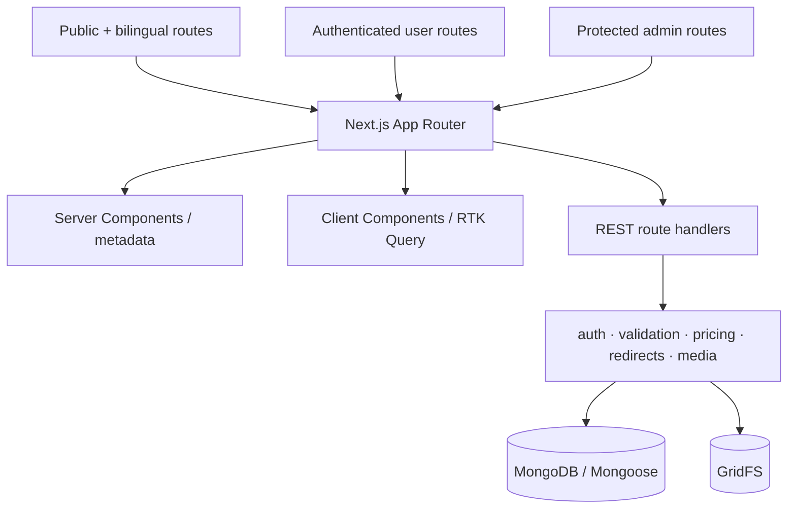

# Care Bangla — Application Architecture & Upgrade Record

> Developer-facing documentation for the private implementation. [Return to the technical overview](README.md).

## Current architecture

Care Bangla evolved from a front-end-oriented template shape into a full **Next.js 16 App Router** application. One deployment boundary now owns page rendering, REST handlers, session protection, business validation, MongoDB persistence, GridFS media, and the staff CMS.



### Private source layout

```text
src/
├── app/                         # Route segments, layouts, loading states, REST handlers
│   ├── admin/                   # CMS: content, bookings, applicants, catalog, SEO, media
│   ├── user/                    # Dashboard, messages, orders, services, profile
│   ├── medical-shop/            # Catalog, categories, product route, cart, checkout
│   ├── nurses/ caregivers/ nanies/ physiotherapy/ doctors/
│   └── api/                     # 140 route handlers partitioned by audience/domain
├── Components/                  # 149 reusable components
│   ├── Admin/{Bookings,Cms,ServiceEditor}/
│   ├── MedicalShop/, Messaging/, UserPortal/
│   └── ServicePageSections/, Header/, Footer/, …
├── views/                       # Page-level composition
├── store/{store,StoreProvider,api}/
├── context/                     # CartContext
├── i18n/                        # Contexts, hook, EN/BN dictionaries
├── lib/                         # Auth, DB, media, validation, pricing, redirects, SEO
├── models/                      # 40 Mongoose schemas
├── data/                        # Seed and safe editorial fallback datasets
└── sass/{default,common,shortcode}/
```

## Rendering, state, and data access

| Requirement | Implementation |
|---|---|
| Initial metadata, canonical URL, redirect, or not-found decision | Server Component reads MongoDB directly through the server data layer. |
| Interactive list/detail data | RTK Query endpoint modules call route handlers and own cached state. |
| Browser-only cart | `CartContext` + `localStorage`, intentionally separate from Redux/MongoDB. |
| Language selection | Public/customer and staff language contexts persist independently. |
| Long-lived records | Accounts, bookings, orders, and messages are database-authoritative—never demo fallbacks. |

`baseApi.js` is extended by `teamApi`, `servicesApi`, `blogApi`, `shopApi`, and `messageApi`. The design uses RTK Query tag invalidation, request de-duplication, focus/reconnect refetching, and conditional `skip` behavior rather than page-level `useEffect` fetch chains.

```ts
// Architectural pseudocode; not copied production source.
const { data, isLoading } = useGetShopProductsQuery(filters, {
  skip: !filters.category,
});

dispatch(api.util.invalidateTags(['ShopProduct']));
```

## Domain service layer

The `lib/` layer separates HTTP concerns from reusable domain behavior.

| Area | Representative responsibilities |
|---|---|
| Authentication | Session creation/verification, server guards, protected route behavior, temporary passwords. |
| Persistence | Pooled Mongoose connections and native MongoDB support where appropriate. |
| Validation | Zod request schemas and field-level failure responses. |
| Booking domain | Tier pricing, availability/conflict checks, documents, applicant services, lifecycle restrictions. |
| Content | Safe inline links, image metadata normalization, slugification, redirect target resolution. |
| Commerce | Canonical product URLs, product redirect recovery, revalidation. |
| Communications | Email, internal-message attachments, chat utilities, meeting-link normalization. |
| SEO | Content analysis and structured media input. |

## Security boundary

1. A JWT session is stored in an httpOnly, `SameSite=Lax` cookie with a seven-day lifetime.
2. Every staff handler applies server-side session/role validation before database work.
3. The admin layout checks the session for UX, but it is not the authorization authority.
4. `proxy.js` intercepts non-API staff pages, applies security headers, and redirects unauthenticated visitors before CMS rendering.
5. Mutations validate request bodies with Zod; ownership checks protect user-private data and attachments.

The response-header baseline includes CSP, HSTS, frame protection, content-type protection, referrer policy, and an XSS-related header. Secrets and credentials are private runtime configuration—not source-controlled models or public documentation.

## Media, styling, and delivery

GridFS stores staff-managed images and controlled attachments. The media layer separates public image delivery from private internal-message files through a stored scope and authorization-aware delivery path. Image values support legacy URLs or `{ src, alt, title?, fileName? }` objects, allowing backward-compatible content migration.

```text
src/sass/
├── default/       typography, fonts, variables
├── common/        preloader, sidebar, slider, spacing, modal utilities
├── shortcode/     banner, cards, hero, counters, pricing, tabs, CTA
└── style.scss     application entry point
```

Bootstrap handles grid/utility foundations; custom Sass carries the public system. Ant Design is restricted to staff routes. Poppins, Rubik, and Hind Siliguri are loaded through `next/font/google` for Latin/Bengali support.

| Decision | Rationale |
|---|---|
| App Router + Server Components | Server-side metadata/data decisions with interactive client islands. |
| `loading.js` boundaries | Immediate feedback for data-dependent blog, service, doctor, and shop routes. |
| RTK Query cache | Centralized loading/error state and fewer unnecessary interactive re-fetches. |
| Modern image configuration | Constrained remote patterns and AVIF/WebP support. |
| `serverExternalPackages` | Keeps `mongoose` out of the client bundle. |
| Turbopack | Faster development feedback. |
| Retired service worker | Avoids unreliable legacy Workbox behavior; manifest remains but offline caching is not active. |

## Upgrade backlog

| Priority | Technical upgrade | Reason |
|---|---|---|
| High | Unit/integration tests for pricing, status transitions, redirects, and auth guards | These are high-value domain rules. |
| High | CI gates for linting, accessibility, production smoke tests, and dependency review | Safens the large route surface as it evolves. |
| High | Granular staff roles and audit history | Separate editorial, dispatch, finance, and super-admin responsibilities. |
| Medium | Observability, error tracking, and performance budgets | Converts architecture intent into production evidence. |
| Medium | Payment, inventory, calendar, and notification adapters | Keeps external integrations behind domain-service seams. |
| Longer term | Offline strategy and mobile worker/clinician experiences | Needs explicit privacy, conflict, and synchronisation design. |

## Public boundary

Folder names, module responsibilities, and patterns are documented to demonstrate engineering capability. Source implementation, private configuration, deployment workflows, data, and credentials remain closed.
