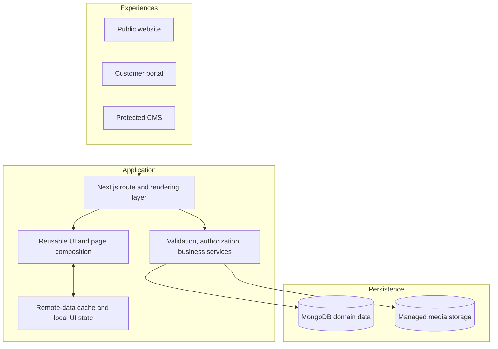

# Care Bangla — Architecture & Evolution

> Public documentation edition · [Return to the project overview](../README.md)

## Architecture in brief

Care Bangla is a private Next.js application that joins public healthcare content, transactional service journeys, commerce, customer self-service, and staff operations. Its architecture separates presentation, domain data, media, and operational controls so a change to one service line does not require a rewrite of the whole platform.

## Private application structure

The source code is not part of this repository. The following high-level map communicates its maintainable boundaries:

| Area | Responsibility |
|---|---|
| Routing & rendering | Public, customer, and staff route segments, layouts, server rendering, and request handling. |
| Component library | Reusable public-site, commerce, account, content-editor, and administrative interface building blocks. |
| Page composition | Page-level assembly of shared components into coherent user journeys. |
| Data access & state | Typed remote-data caching, mutation invalidation, and intentionally limited client-only state. |
| Domain services | Authentication, validation, media, redirects, messaging, translation, and data utilities. |
| Models & content | Healthcare services, care bookings, applicants, users, products, orders, content, messages, and SEO settings. |
| Styling & assets | Shared Sass foundations, component styling, fonts, and visual assets. |

## Design qualities

| Quality | Approach |
|---|---|
| Maintainability | Domain-oriented models and service flows; reusable UI rather than duplicated page logic. |
| Security | Protected staff access, server-side authorization, validation, secure session handling, and secret-free public documentation. |
| Performance | Modern Next.js rendering, image optimization strategy, remote data caching, progressive loading states, and build tooling. |
| Content velocity | Staff-editable structured content and media remove routine engineering work from common editorial changes. |
| Resilience | Defined public-content fallback where appropriate; durable operational data remains database-authoritative. |
| Discoverability | Metadata, canonical content identity, redirect continuity, structured data, and monitoring-oriented SEO workspace. |
| Localization | English and Bengali experience with separated language preferences for public and staff contexts. |

## Evolution opportunities

The platform has a strong modular base for incremental delivery. The following opportunities are intentionally presented as a roadmap, not as features already enabled in every deployment.

| Horizon | Opportunity | Value |
|---|---|---|
| Near term | Performance budgets, automated accessibility tests, and routine dependency review | Protect quality as content and traffic grow. |
| Near term | More granular roles and audit history | Strengthen accountability for operational changes. |
| Mid term | Capacity-aware scheduling and staff rostering | Improve the match between service demand and available care teams. |
| Mid term | Payment, invoice, inventory, and fulfillment integrations | Complete more transactional journeys end to end. |
| Longer term | Clinical systems integrations and analytics warehouse | Enable deeper operational insight after appropriate compliance design. |
| Longer term | Additional language packs and editorial review workflow | Extend access beyond the current bilingual audience. |

## Upgrade guardrails

Future development should preserve the existing boundaries:

- New care services should own their booking rules, lifecycle, and data model while reusing shared presentation primitives.
- New public URLs should define canonical and retirement behavior before launch.
- New integrations should be isolated behind server-side services and monitored for failure.
- Security, privacy, accessibility, localization, and SEO need acceptance criteria—not post-launch cleanup.
- Any healthcare-data integration requires a separate compliance, consent, and retention assessment.

## Public scope

This repository explains the architecture and product direction. It does not provide source code, local setup instructions, environment variables, database exports, private endpoints, or production infrastructure details.
