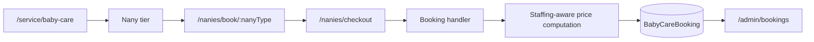

# Care Bangla — Baby & Newborn Care Module Specification

> Developer-facing module reference. [Return to the technical overview](README.md).

## Naming and domain boundary

The service domain is **Baby & Newborn Care** (`BabyCare…` / `baby-care` in the private application). The care role is **Nany** (`Nany…` / `nany`). The terminology split makes models, routes, CMS content, and applicant labels precise without introducing a public roster.

This is a category booking flow. There is no `BabyCareMember`/`NanyMember` roster model; care-team assignment is coordinated outside public person selection.

## Model and content family

| Model | Responsibility |
|---|---|
| `BabyCareBooking` | Customer-owned date-range booking, shift/staffing choice, price snapshot, lifecycle/payment state, permitted documents. |
| `BabyCareTier` | Nany tier qualification/presentation, rate, and card data. |
| `BabyCareService` | Service catalogue entries. |
| `BabyCareGalleryTab` | Alternating image/text preview rows. |
| `NanyApplicant` | Recruitment submission data. |
| `PageContent('baby-care')` | Page-level editorial composition. |

## Pricing and scheduling rules

| Input | Server-side rule |
|---|---|
| Shift | 12-hour rate from selected tier; standard 24-hour coverage uses two rotating Nanies. |
| Staffing mode | 24-hour request distinguishes rotating coverage from same-Nany mode; the latter has a configured discounted 24-hour calculation. |
| Duration | Inclusive date-range day calculation. |
| Total | Derived daily rate × days, persisted as a snapshot with the booking. |
| Conflict scope | Active overlap checks run against baby-care bookings rather than conflating care domains. |
| Lifecycle | Payment/status invariants apply: payment only after active/confirmed/completed fulfillment; paid history cannot return to pending/cancelled; completed details lock. |

Client UI can show a live estimate, but the handler recomputes staffing branch, duration, and total before save. A request cannot submit its own trusted price.

## Route and CMS map

| Layer | Route/module family | Responsibility |
|---|---|---|
| Public page | `service/[serviceId]` → `ServiceDetailsBabyCare` | Banner, intro, one tier card, preview rows, service grid, recruitment entry. |
| Booking | `nanies/book/[nanyType]`, `nanies/checkout` | Category booking, staffing selector, authenticated checkout. |
| Applicants | `nanies/apply-as-nany`, unified `admin/applicants` | Public application and staff review tab. |
| Booking API | `api/baby-care-bookings` | Session-gated creation/history, server price recomputation, tier read. |
| Staff console | Unified `admin/bookings`, admin baby-care handlers | Review, manual/phone entry, document append, guarded status/payment updates. |
| Service CMS | `admin/services/baby-care` and tier/service/gallery handlers | Identity, structured images, tier, previews, CTA, catalogue. |
| Fallback data | Baby-care tier/service/gallery data modules | Public rendering fallback only when defined editorial data is unavailable. |

## Shared implementation choices and roadmap

- `PageBreadcrumb`, `SectionHeading`, `TierCard`, and `ServicePreviewGallery` ensure service-page consistency.
- `ImageValue` metadata plus GridFS helpers provide accessible images without raw URL editing.
- Applicant and family booking data are separate collections/workflows.
- The unified booking console composes service tables without removing separate model/validation rules.

Future work requires explicit design for recurring schedules, availability matching, consent-aware care documents, verified payment events, and multilingual family notifications.

## Public boundary

No family/applicant data, rates, staffing assignments, source code, or staff access details are included.
