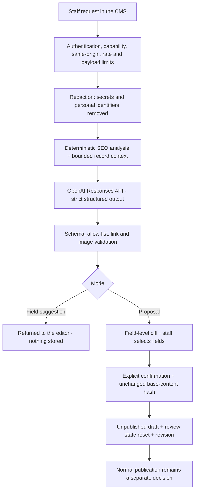

# Care Bangla AI — Supervised Content & SEO Copilot

> A public technical overview of the AI subsystem inside the private application. [Return to the technical overview](README.md).

## What it is

Care Bangla AI is a **supervised** assistant built into the staff CMS. It combines OpenAI's Responses API with the application's own deterministic SEO analyzer, content schemas, permission model, and revision history. The governing principle is deliberately narrow:

> **AI proposes and explains → the application validates → an authorized person decides → publication stays a separate step.**

The model never publishes, never writes directly to a collection, and never operates a tool the server has not explicitly granted for that request.

## Two interaction modes

The subsystem answers two different kinds of request, and the distinction drives everything about review and audit.

| | **Governed proposal** | **Direct field suggestion** |
|---|---|---|
| Question asked | "Improve this page" / "fix this SEO finding" | "Give me a better value for this one field" |
| Scope | Many fields across one record | Exactly one field |
| Server writes content? | Yes — on explicit confirmation | **Never** |
| Stored artefact | Job, proposal, field diff, revision, rollback point | None; the answer returns to the browser |
| Reaches the database via | Apply step, base-hash check, review-state reset | The editor's own Save button and its normal validation |
| Permission | `ai.use` to generate, `ai.apply` to apply | `ai.use` only |

A suggestion is deliberately *not* a proposal. Accepting one is an ordinary manual edit that happens to have been drafted by a model: the value is visible before it enters the form, nothing persists until the editor saves, and the record's existing schema validation and revision history apply exactly as they would to typed text.

Both modes share the same rails: availability and emergency-stop checks, a per-administrator budget guard, model routing, per-minute throttling, secret/PII redaction before the provider call, and a complete job plus usage-ledger entry.

## Capabilities

| Surface | What it does |
|---|---|
| Global command bar | Page-aware assistant on every authenticated staff route, with keyboard access, verified in-app navigation, cancellation, bilingual layout, and an account-owned conversation history |
| Multimodal input | A bounded number of validated images/documents per prompt, stored privately and delivered only through owner-authorized routes |
| Content copilot | Reviewable field-level proposals for products, categories, blogs, services, public static pages, doctors and specialist nurses |
| SEO copilot | Turns a specific failed deterministic check into the smallest patch that resolves it |
| Per-field suggestions | An inline control beside an individual input returns ready-to-use alternatives with a short reason each, plus regenerate |
| Sighted image description | For alternative text the stored image itself is sent, so the description reflects what is actually visible |
| Build from reference | Composes a record's full detail content by following the *structure* of an already-complete sibling in the same category |
| Approved sources | Curated, vetted source excerpts can be supplied deliberately; there is no open web browsing |
| Revision & rollback | Applied changes create immutable history; a rollback is a new audited revision rather than an erasure |
| Control centre | Proposals, jobs, revisions, sources, usage, cost, model settings, quotas and an emergency stop in one protected screen |

## Request lifecycle

## Safety design

Several of these exist because a plausible-looking answer is the failure mode that matters, not an obviously wrong one.

| Guardrail | Implementation |
|---|---|
| Server-only credential | The provider key is read from the server environment; it never reaches the browser or the database |
| Bounded write surface | Page adapters expose explicit editable field paths. Slugs, prices, permissions, payment data and protected identities are outside the proposal surface entirely |
| Structured output | Replies must satisfy closed schemas. Raw HTML, unsafe URLs and malformed inline links are rejected rather than sanitised |
| Structure without facts | A "build from reference" run receives the reference's *shape* — section count, heading style, specification labels — but never its specification values, price or model identifiers, because copying a shown value is the cheapest way for a model to fill an unknown |
| Additive specification merge | Rebuilding a specification table can only ever add rows; a populated row the model omitted is restored server-side and the repair is reported |
| Honest image description | Alternative text is generated only from an image the server could actually load; otherwise the model is told it cannot see the image and returns a warning instead of a guess |
| Output-budget sizing | A bulk repair sizes itself to the configured token budget, reports how many affected items remain, and names the limit when a reply is genuinely truncated |
| Healthcare controls | Medical claims require approved evidence and human medical review; diagnosis, prescription, invented credentials and guaranteed outcomes are prohibited |
| Auditability | Idempotency prevents duplicate billing; a stale proposal returns a conflict instead of overwriting newer content; administrator edits to a proposal are recorded with author and time |

## What it deliberately cannot do

- Publish content, change prices, alter permissions, message customers, or touch payment and booking records.
- Browse the open web or read a source that was not explicitly approved and supplied.
- Apply a Bengali proposal to the database — Bengali output is reviewable, but application stays locked until dedicated localized CMS fields exist.
- Resolve a finding whose only reachable field is the finding's own input. Poor keyword coverage, for example, is manual-only: the model could otherwise "fix" it by deleting the keywords.
- Run at all until a company-owned provider project, billing approval and an explicit server feature flag are in place. The subsystem is **off by default** and does not affect the existing editors or the deterministic SEO tools when disabled.

## Operating model

Three configurable model tiers are used — a fast tier for short interactive work, a balanced default, and a quality tier for the largest structured generations. Routing, output ceiling, retention, daily limits and the monthly budget are governed from server configuration and the control centre. Model pricing and capability should be re-checked before any production rollout rather than treated as settled documentation.

| Cadence | Review focus |
|---|---|
| Every proposal | Accuracy, tone, source support, SEO effect, medical risk, and the exact fields selected |
| Daily during pilot | Failures, refusals, latency, unexpected output, volume, token use, staff feedback |
| Weekly | Acceptance and edit rate, cost per approved page, rollback reasons, recurring SEO problems |
| Monthly | Budget, model choice, prompt version, permissions, source freshness, and whether the pilot is saving measurable time |
| On any model or prompt change | Re-run the evaluation corpus and compare quality, safety, schema success, latency and cost before rollout |

## Status

| Aspect | State |
|---|---|
| Core platform | Implemented and environment-gated |
| Editor coverage | Products, categories, blogs, services, static pages, doctors, specialist nurses |
| Automated checks | Deterministic safety suite plus a golden evaluation corpus spanning every supported content type, Bengali, privacy, prompt injection and medical risk |
| Bengali application | Review only, by design |
| Live-model staging evaluation, retention policy, named medical/editorial reviewers | Organizational launch requirements, not code |
