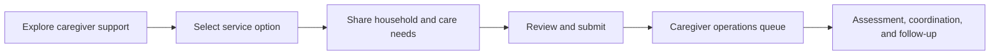

# Care Bangla — Caregiver & Attendant Service Journey

> Public workflow overview · [Return to the project overview](../README.md)

## Purpose

Caregiver and attendant support has its own service workflow because household context, care duration, and matching considerations differ from other healthcare offerings. The private application represents this as a dedicated request and operations path, while still sharing the platform's design, account, and administrative foundations.

## What the journey supports

| Stage | Customer value | Operations value |
|---|---|---|
| Discovery | Clear explanation of caregiver/attendant support and suitable service options. | Consistent service information maintained from the CMS. |
| Request | Context-sensitive intake rather than a generic inquiry. | A structured record ready for review. |
| Review | A clear confirmation/next-step experience. | A dedicated queue for status management and coordination. |
| Follow-up | A durable account-linked service history where applicable. | A basis for service fulfillment and future communication. |

## Engineering approach

- The caregiver flow is modeled separately from nursing, baby-care, physiotherapy, and doctor consultations so its business rules can change independently.
- Shared platform capabilities—authenticated access, validation, media, bilingual UI, notifications, and staff controls—avoid rebuilding foundational behavior per service.
- Staff-managed service content makes it possible to update public explanations and offer details without routine code releases.

## Future potential

The architecture can support caregiver matching, availability windows, compatibility preferences, repeat schedules, staff assignment, digital agreements, and service-quality feedback. These are roadmap opportunities and require appropriate operational controls before activation.

## Public-repository boundary

This page intentionally excludes private intake fields, matching logic, pricing configuration, customer data, staff data, and application source.
