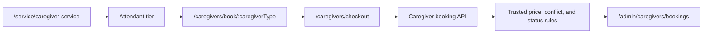

# Care Bangla — Caregiver Service Module Specification

> Developer-facing module reference. [Return to the technical overview](README.md).

## Domain boundary: category booking, not a public roster

Caregiver/attendant service reuses the care-booking architecture without assuming it is nursing. A customer books an **Attendant** category. There is no public caregiver profile route, named-caregiver selection, or `CaregiverMember` model; staff assignment remains an internal operational decision.



## Model family

| Model | Role |
|---|---|
| `CaregiverBooking` | Category-based date-range request, customer ownership, price snapshot, lifecycle, payment, and documents. |
| `CaregiverTier` | Attendant service/presentation attributes and base rate. |
| `CaregiverService` | Admin-managed capability/service catalogue. |
| `CaregiverGalleryTab` | Structured public-page preview rows. |
| `CaregiverApplicant` | Recruitment pipeline record. |
| `PageContent('caregiver-service')` | Intro, CTA, and page-composition content. |

The absence of `CaregiverMember` is intentional. It keeps public selection separate from internal staffing coordination and avoids presenting unavailable employee assignment data as a catalogue.

## Pricing, conflict, and lifecycle

| Concern | Technical rule |
|---|---|
| Shift pricing | 12-hour price comes from the selected published tier; 24-hour coverage equals two shifts. |
| Duration | Inclusive days between submitted start/end dates. |
| Trusted total | Server derives and snapshots total on `CaregiverBooking`; client total is presentation only. |
| Conflict scope | Active caregiver bookings are checked within the caregiver domain; cross-service assumptions are not silently made. |
| Payment lifecycle | Payment may become paid only for confirmed/in-progress/completed work; paid records cannot return to pending/cancelled. |
| Immutability | Completed bookings lock operational detail except payment reconciliation; cancelled bookings are retained. |

```ts
// Architectural intent; not private source.
const total = pricing.forCaregiverTier(tier, request.shift, request.dateRange);
await conflicts.rejectOverlappingActiveCaregiverBooking(request);
return bookings.create({ ...request, total });
```

## Module map

| Layer | Route/module family | Notes |
|---|---|---|
| Discovery | `service/[serviceId]` → `ServiceDetailsCaregiverService` | Banner, intro, one tier card, preview rows, service grid; no roster slider. |
| Booking | `caregivers/book/[caregiverType]`, `caregivers/checkout` | Category route only; no caregiver-details route. |
| Applicant flow | `caregivers/apply-as-caregiver`, unified `admin/applicants` | Public form and service-aware staff review. |
| Public API | `api/caregiver-bookings` | Authenticated creation/history and trusted server computation. |
| Staff booking UI | `admin/caregivers/bookings`, admin caregiver handlers | Status/payment/document management and phone booking with user picker. |
| Service CMS | `admin/services/caregiver-service` and tier/service/gallery handlers | Content, tier, service catalogue, and CTA maintenance. |
| Shared media | GridFS + structured image helpers | Same public/private media rules used across the application. |

## Composition, fallback, and upgrades

`PageBreadcrumb`, `SectionHeading`, `TierCard`, `ServicePreviewGallery`, and shared service cards provide visual consistency with nursing. The service page is database-first with safe bundled fallback only for defined editorial content; booking/identity data never falls back.

Upgrade seams: internal availability/capacity matching, repeat schedules, payment events/invoice reconciliation, customer notifications, internal assignment compliance/document workflow, role-specific staff controls, and rule-engine tests.

## Public boundary

Rates, applicants, customer records, staffing decisions, source files, and operational policy are private. This is a technical pattern reference—not an integration API.
