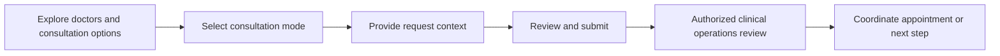

# Care Bangla — Doctor Consultation Service Journey

> Public workflow overview · [Return to the project overview](../README.md)

## Purpose

The doctor-consultation journey provides a dedicated path for people seeking clinical guidance, whether the offered service is coordinated as an in-person/home visit or a remote consultation. It separates consultation requirements from other care-service workflows while keeping the experience coherent with the rest of the platform.

## End-to-end view

| Stage | Patient or family experience | Private-platform capability |
|---|---|---|
| Discover | Browse professional profiles and consultation services. | CMS-managed profiles, service content, and publication controls. |
| Choose | Select an appropriate consultation path. | Mode-aware booking flow with a dedicated domain model. |
| Request | Share the details needed to begin coordination. | Structured validation and protected operational record. |
| Coordinate | Receive the relevant next step. | Staff queue, lifecycle controls, and customer communication surface. |
| Follow up | Return to account history where enabled. | Account-level service visibility and private messaging. |

## Design principles

- **Mode awareness:** consultation mode affects what the journey needs to collect and communicate.
- **Role separation:** public pages help with discovery; protected staff tools coordinate the request.
- **Professional pipeline:** practitioner applications and published profiles are distinct concerns.
- **Extensibility:** schedules, provider availability, appointment reminders, and secure remote-consultation integrations can be introduced without redesigning other care workflows.

## Current boundary and future potential

This is a service-request and coordination platform, not a substitute for emergency services or clinical triage. Future integration with appointment calendars, approved video providers, payment settlement, clinical note systems, and reminder services would need separate workflow, privacy, and regulatory validation.

## Public-repository boundary

The public documentation excludes provider and patient data, consultation notes, calendar details, service rules, private video links, source code, and administrative access procedures.
