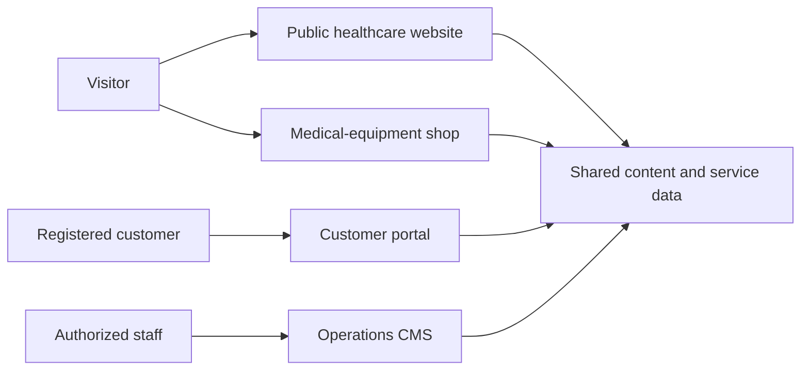
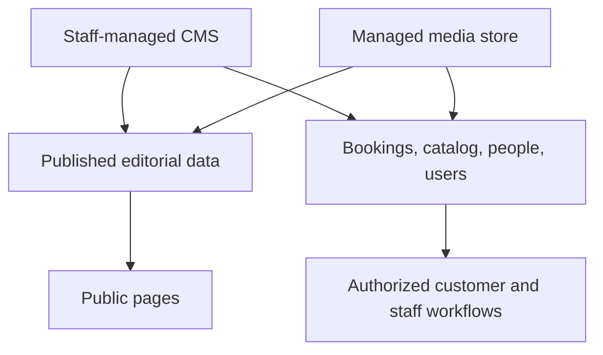

# Care Bangla — Features & Content Architecture

> Public documentation edition · [Return to the project overview](../README.md)

Care Bangla is designed as one connected platform for patients, families, customers, and internal operations teams. This document describes the product architecture without publishing private source files, API contracts, credentials, or customer data.

## Experience map

| Experience | Primary value |
|---|---|
| Public website | Healthcare education, service discovery, professional profiles, FAQs, appointments, and contact routes in English and Bengali. |
| Service journeys | Intent capture and booking workflows tailored to nursing, caregiver, newborn care, physiotherapy, and doctor consultation. |
| Medical shop | Product/category exploration, equipment purchase or rental intent, cart, and checkout experience. |
| Customer portal | Account-level visibility for profile, services, orders, notifications, and private messages. |
| Operations CMS | Staff-only management of published content, catalog, profiles, bookings, applicants, users, media, and discoverability work. |

## Content principles

### Structured, publishable, and reusable

Editorial pages are composed from structured fields and repeatable sections rather than unrestricted markup. This lets the application preserve image descriptions, link behavior, publication state, SEO fields, and presentation consistency across pages.

| Content type | Examples of managed data |
|---|---|
| Pages | Hero areas, calls to action, service explanations, contact information, content sections |
| People and services | Profile, qualifications, descriptions, imagery, pricing context, visibility status |
| Editorial | Article metadata, content sections, galleries, takeaways, category, tags, canonical identity |
| Commerce | Category, product details, images, availability, pricing/rental configuration, display order |
| Help | FAQ categories, question/answer pairs, publication and ordering controls |

### Published content and safe fallback

Public-facing editorial collections are designed to favor published, staff-managed data. For selected evergreen areas, curated bilingual fallback content can keep the user experience useful if editorial records are absent. Customer, booking, order, and private-message records always rely on authoritative operational data; they never fall back to demonstration records.

### URLs that survive change

Catalog and article content use a canonical identity with a history-aware approach to changed slugs. When an editor changes a public address or retires a record, the platform can guide visitors toward the appropriate current content or listing. This protects discoverability and avoids treating every content change as a broken link.

## Operational capabilities

| Workspace | Representative capabilities |
|---|---|
| Dashboard | Cross-module counts, distribution views, recent records, and staff shortcuts. |
| Page content | Managed public-page sections without routine application redeployment. |
| Services & professionals | Service, doctor, nurse, and related profile administration with publication control. |
| Bookings & applicants | Service-specific queues for requests, applications, review, and workflow status. |
| Medical shop | Product and category management, image handling, availability, display order, and bulk actions. |
| Content & FAQ | Blog publishing, structured images, safe links, FAQ organization, and staged publishing. |
| Conversations | Customer-support threads, statuses, priorities, and private attachments. |
| Media | Central managed media storage with descriptive metadata. |
| SEO | Content quality checks, search visibility connection, and web-vitals monitoring when configured. |

## Data ownership at a high level

- **Editorial data** supports public rendering and must be explicitly published.
- **Operational data** supports authenticated workflows and is visible only to the appropriate customer or staff role.
- **Media** is managed centrally; public and private file access follow different authorization rules.
- **Local interface state** such as a cart is intentionally separate from durable server records.

## Quality and extensibility

The design intentionally keeps service types, content sections, profiles, product categories, and reporting surfaces modular. That provides practical paths to add new care offerings, content templates, payment integrations, scheduling rules, fulfillment logic, languages, or reporting without collapsing the product into one shared workflow.

Future extensions should preserve these principles:

1. Model the new domain separately before reusing shared UI.
2. Make publication, visibility, and access rules explicit.
3. Use structured content and descriptive media metadata.
4. Preserve or redirect public URLs when records change.
5. Treat healthcare, customer, and payment data as sensitive by default.

## Public-repository boundary

This document is a capability reference, not a specification for consuming an API or reproducing the product. Private code, schema definitions, route internals, credentials, customer data, operational thresholds, and deployment settings are intentionally excluded.
