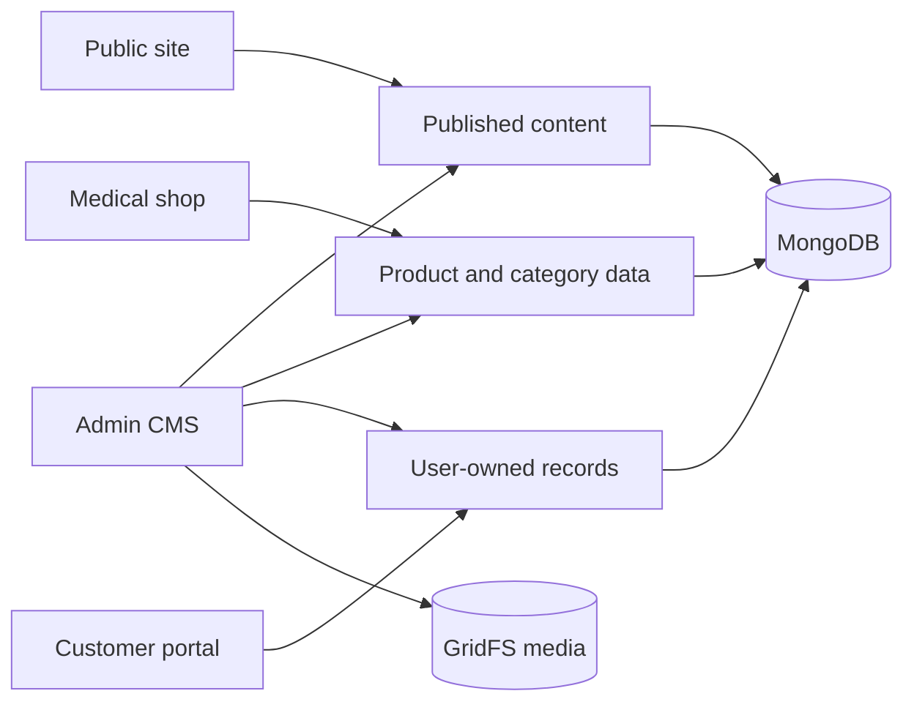

# Care Bangla — Features & Content Architecture

> Developer-facing architecture reference. [Return to the technical overview](README.md).

## Experience and ownership map



| Surface | Read path | Write authority | Fallback rule |
|---|---|---|---|
| Public editorial content | Server Component or RTK Query by route | Authorized CMS | Selected evergreen content may use static/i18n fallback. |
| Catalog and blog | Dynamic route/model lookup plus RTK Query lists | Authorized CMS | Redirect/recovery behavior is used if an item moves or is unavailable. |
| Cart | `CartContext` + local storage | Browser | Never MongoDB data until a durable flow requires it. |
| Accounts, orders, bookings, conversations | Authenticated route handlers | Owned user or staff role | No demo/static fallback. |
| Media | Public stream or protected attachment route | Authorized staff/user | Structured metadata is normalized at rendering boundaries. |

## Route and API families

The API layer has 140 `route.js` handlers and is separated by audience/domain—not one generic CRUD namespace.

| Family | Examples | Notes |
|---|---|---|
| Public reads | `/api/services`, `/api/team`, `/api/blog`, `/api/content`, `/api/media` | Published content/media; list endpoints support filter/pagination where appropriate. |
| Commerce | `/api/shop/categories`, `/api/shop/products` | Categories, list/filter/search, product resolution. |
| Identity/customer | `/api/auth/*`, `/api/user/*`, `/api/orders`, `/api/internal-messages` | Account, order, and conversation actions bound to ownership. |
| Care services | Nursing, caregiver, baby care, physiotherapy, doctor, ambulance booking/applicant families | Server computes trusted values and protects records by session/ownership. |
| Staff | `/api/admin/*` | 99 handlers for content, people, bookings, catalog, FAQ, media, messages, SEO, settings. |
| Utilities | `/api/translate`, `/api/chat` | Scoped support capabilities rather than a public general API. |

This is an engineering map, not a consumption contract; handlers can require a session or be unavailable outside private deployment.

## Canonical URLs and recovery

The canonical product route encodes category and product identity:

```text
/medical-shop/product/:categorySlug/:productSlug
```

`productUrl(product)` is the single URL builder so components do not invent divergent address shapes. Legacy flat URLs, identifier URLs, previous slugs, and category/product mismatches resolve to the current canonical address with permanent redirects where safe.

`BlogPost` and `Product` retain slug history and ordered replacement targets. On deletion, selected recovery targets persist in `RedirectRule`, decoupling recovery preference from the deleted document.

```ts
// Conceptual resolver, not production source.
const target = await redirectRules.firstPublishedTarget(entity, legacySlug);
return target ? permanentRedirect(canonicalUrl(target)) : listingFallback();
```

Resolution order: current record → previous slug redirect → first published approved replacement → relevant listing. Unavailable content is `noindex` before recovery rather than competing as stale search content.

## Content model primitives

### Safe inline links

```ts
type InlineText =
  | string
  | {
      text: string;
      links: Array<{ start: number; end: number; href: string; target?: '_blank' }>;
      marks?: Array<{ start: number; end: number; type: 'strong' | 'em' | ...; value?: string }>;
    };
```

Links and emphasis are both stored as **character ranges over plain text**, never as embedded markup. Approved internal, external, mail and phone destinations render through a single component; validation rejects invalid ranges and unsafe destinations.

The two range sets are independent and may overlap — bold inside a link, or a link inside italics, are both ordinary. The renderer therefore splits a value into runs sharing one link and one set of marks before nesting tags, so the emitted HTML is always well-formed however the author made the selection. Same-type ranges merge; a text edit that runs through a range drops it rather than leaving it attached to the wrong words.

A value collapses back to a plain string whenever it carries no formatting, so simple copy stays simple and every legacy consumer keeps seeing a string.

### Free-form content blocks

Product and blog bodies are an **ordered list of typed blocks** rather than a fixed section/subsection template:

```ts
type ContentBlock =
  | { type: 'heading'; level: 1..6; text: InlineText }
  | { type: 'paragraph'; text: InlineText; style: { align; size; weight; italic; tone } }
  | { type: 'bullets'; ordered: boolean; items: InlineText[] }
  | { type: 'image'; image: ImageValue; caption?: string }
  | { type: 'divider' };
```

The earlier model forced every product into "section → subsection → paragraphs + bullets" and every article into "photo band → paragraphs". That is a layout decision baked into storage: an author wanting two headings in a row, or a list before any prose, had nowhere to put it. A flat ordered list lets the page be whatever the content actually is, while still storing structured data — so links stay validated, text stays searchable and scoreable, and nothing an editor or a model writes can inject markup.

Presentation choices are a **closed set** mapped to stylesheet classes, not free CSS, so an author cannot break the page's typography or hide text.

| Behavior | Design decision |
|---|---|
| Legacy records | Never rewritten in place. An equivalent block list is derived on demand for display, and the editor offers a one-click import that persists only when the author saves. |
| Pasting a document | The clipboard's HTML flavour is parsed into blocks, preserving headings, lists, links and emphasis; a plain paste falls back to the conventions people already type. Scripts, styles and frames are stripped before the tree is read. |
| Unknown input | An unrecognised block type degrades to a paragraph rather than disappearing, so a record written by a newer editor still shows its text on an older deployment. |
| Search health | When a record has blocks, they *are* its body: content depth, keyphrase placement, heading outline and coverage all score against what the page actually renders. |

### Structured images

```ts
type ImageValue =
  | string
  | { src: string; alt: string; title?: string; fileName?: string };
```

`imageSrc()` and `imageAttrs()` normalize values for visual components, metadata, email, JSON-LD, and CSS. This protects against passing a structured object straight into an image `src` or metadata field while preserving accessible alt text and SEO-friendly labels.

## Medical shop, editorial, and messaging

| Area | Technical behavior |
|---|---|
| Shop | Category-aware list/search/filter; buy/rent/refill/contact-for-price modes; browser-persisted cart; dnd-kit category product reordering. |
| Blog | Paginated listing and rich article route with a block-composed body, gallery, takeaways, quote/stats/sidebar structures, SEO, slug history, replacement targets. |
| FAQ | `FaqCategory` + `FaqItem` publication/order data, category-filtered accordion, FAQ structured data. |
| Page composition | `PageContent` flexible JSON for public pages; specialized service models own tier/gallery/service values. |
| Messaging | `InternalConversation` has reference, subject/category, priority/status, messages, and audience unread counts. Attachments have a private GridFS scope and ownership/role check. |

## Maintenance invariants

| Change | Invariant |
|---|---|
| Rename product/post | Retain history; test the canonical route and redirect. |
| Hide/delete product/post | Verify a published recovery target or listing fallback before state change. |
| New narrative field | Use `InlineText` only where links are needed; normalize to plain text for SEO/search/export. |
| New image field | Use `ImageValue`, define `alt` policy, normalize at every non-visual output boundary. |
| New mutation | Validate input, enforce audience/ownership, invalidate correct RTK tags, revalidate server-rendered content if needed. |
| Private attachment | Set private scope, validate type/size/count, enforce delivery ownership. |

## Public boundary

Route implementations, schemas, database indices, rate limits, private operational data, and secret configuration are intentionally excluded. The patterns show real engineering decisions without providing a deployable clone.
