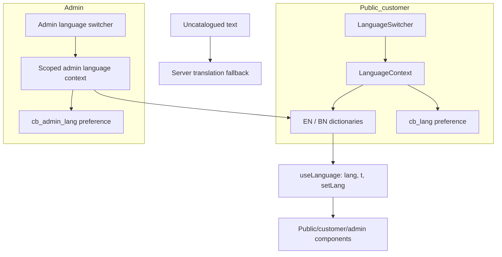

# Care Bangla — English/Bengali Runtime Translation Architecture

> Developer-facing i18n reference. [Return to the technical overview](README.md).

## Architecture goal

Care Bangla supports English and Bengali across three different experiences—public pages, authenticated customer pages, and the internal CMS—without allowing a language change in one context to unexpectedly affect the others. The implementation uses React contexts, translation dictionaries, persistent preference keys, and a server-side fallback path for uncatalogued interface copy.



## Component topology

| Layer | Private module responsibility |
|---|---|
| Root providers | Make Redux, public language, cart, and common browser state available to public/customer routes. |
| `LanguageContext` | Owns current public/customer language, persistent preference, dictionaries, and translation function. |
| `useLanguage()` | Stable component-facing interface: `lang`, `t`, and `setLang`. |
| Translation dictionaries | Nested English/Bengali namespaces for repeated interface content. |
| `LanguageSwitcher` | Presents the language choice without forcing every individual component to manage preference state. |
| Admin scope | Nesting/independent persistent state protects staff preference from public/customer context. |
| Translation route/script | Optional server-supported translation fallback and dictionary-maintenance assistance. |

## Translation decision path

The application distinguishes static interface copy from data/content fields:

1. A component asks `useLanguage()` for the active language and `t(key)`.
2. Static UI copy resolves from the nested dictionary namespace.
3. CMS/database content prefers its localized field or approved presentation fallback.
4. Uncatalogued non-critical interface text may use the server translation fallback where configured.
5. Patient-facing, medical, price, privacy, and action text should be human reviewed; automatic translation is a draft aid, not a publication authority.

```ts
// Illustrative usage, not private source.
const { lang, t } = useLanguage();
const title = t('service.booking.title');
const description = record[`description_${lang}`] ?? record.description;
```

## Coverage model

| Surface | Translation strategy | Persistence |
|---|---|---|
| Public site | Dictionary-based interface + localized/static fallback content | `cb_lang` browser preference. |
| Customer portal | Same public/customer context; account UI uses shared labels and message-facing content rules | `cb_lang` browser preference. |
| CMS | Nested/scoped language state; Ant Design/local UI may need dedicated localization behavior | `cb_admin_lang` browser preference. |
| CMS data | Field-per-language or structured localized content where the content model supports it | Durable database content, publication-controlled. |

## Technical risks and controls

| Risk | Why it matters | Engineering response |
|---|---|---|
| Direct DOM translation | Mutating rendered DOM outside React can conflict with reconciliation and create stale/flash content. | Prefer state/context-driven render output. |
| Missing key | An undefined lookup can silently render a key or broken label. | Namespace conventions, dictionary audit, fallback behavior, development warning path. |
| Context leakage | Shared storage can cause admin choice to modify public experience. | Explicit separate preference keys and provider scope. |
| Machine quality | Bengali health/care language can be semantically unsafe when literal. | Human review for high-intent/clinical content. |
| Flash of source language | Asynchronous translation/cache misses can be visually disruptive. | Keep core labels in local dictionaries; consider client/server cache only after correctness. |
| SEO mismatch | Runtime language state alone does not produce language-specific crawled metadata. | Align metadata, routes, canonical/hreflang policy, and localized content model deliberately. |
| UI library locale gap | Translation dictionaries do not automatically localize date pickers/table semantics. | Wire `bn_BD` or equivalent library locale when the CMS requirement justifies it. |

## Recommended engineering backlog

1. Remove any obsolete/manual translation paths that bypass React rendering.
2. Establish field-per-language conventions for durable CMS content; avoid deep-merging arbitrary database data into UI dictionaries.
3. Add dictionary key coverage/linting and snapshot tests for priority language routes.
4. Introduce reviewed terminology glossary for service, status, payment, and healthcare vocabulary.
5. Decide locale route/metadata policy before adding broad `/bn/*` search targeting.
6. Add translation cache only after privacy, invalidation, and quality ownership are defined.

## Public boundary

Dictionary files, vendor credentials, private translation scripts, source code, and runtime configuration are not included. The implementation topology and trade-offs are documented for technical evaluation.
