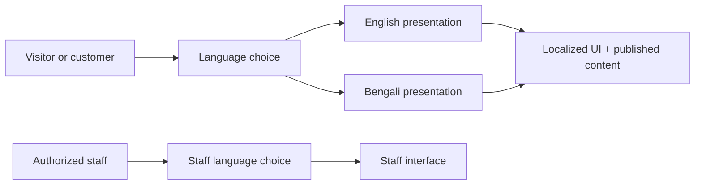

# Care Bangla — English & Bengali Localization Overview

> Public documentation edition · [Return to the project overview](../README.md)

## Product goal

Care Bangla serves a Bangladeshi audience, so language is part of the product architecture rather than a cosmetic afterthought. The private application presents public and customer-facing interface content in **English and Bengali**, with a separately scoped language preference for the staff workspace.

## How it is designed

| Concern | Public-safe description |
|---|---|
| Interface language | Shared translation dictionaries and a language context supply common user-interface text. |
| Published content | CMS-managed content can carry localized fields or follow an editorial translation process. |
| Preference isolation | The public/customer preference and internal staff preference are stored independently so one does not unexpectedly change the other. |
| Typography | Bengali-capable font choices are part of the visual system, not a late fallback. |
| Progressive coverage | High-value journeys can be reviewed and improved without blocking the rest of the platform. |

## Translation quality principles

- Use human-reviewed Bengali for patient-facing clinical, financial, legal, and action-oriented text.
- Keep brand names, product codes, and clinical terminology intentionally consistent rather than translating mechanically.
- Design for text expansion, Bengali script rendering, and mixed-language catalog data.
- Make language and locale part of metadata and search planning—not just visible labels.
- Review changed content in both languages before publishing.

## Known product considerations

Machine translation can accelerate drafting but is not a quality guarantee. It can be especially weak for medical vocabulary, nuanced care instructions, and calls to action. Localization also requires attention to right content hierarchy, font loading, metadata, route strategy, and a consistent fallback when a translation is unavailable.

## Future potential

The current bilingual architecture can support review workflows, translation-memory tooling, locale-aware editorial publishing, additional regional languages, and more formal internationalized route policies. Each extension should be tested with real users and healthcare-content reviewers.

## Public-repository boundary

This overview does not publish translation keys, vendor credentials, private automation, source-file locations, or internal troubleshooting procedures. See [Localization content guide](TRANSLATION_GUIDE.md) for a public-safe editorial process.
