<div align="center">

# Care Bangla

### A private, full-stack healthcare operations platform for Bangladesh

## 🌐 Current Hosted Website

[https://care-bangla-official-site.vercel.app/](https://care-bangla-official-site.vercel.app/)

> This is the initial hosted deployment. Its server or domain may change later.

[](#project-status)
[](#public-repository-boundary)
[](https://nextjs.org/)
[](https://react.dev/)
[](https://mongoosejs.com/)
[](#internationalization)
[](CARE_BANGLA_AI.md)

**Public technical showcase** · architecture, product scope, and engineering decisions for a closed-source production project.

</div>

---

## Overview

Care Bangla is a single **Next.js 16 App Router** application that combines a bilingual public healthcare website, specialized service bookings, medical-equipment commerce, a customer portal, and a self-built staff CMS. It is not a template or a collection of unrelated pages: the experiences share a domain model, media system, content architecture, authentication boundary, and operational data layer.

| Experience | Audience | Primary capabilities |
|---|---|---|
| Public website | Patients and families | Services, professionals, nursing, blogs, FAQs, appointments, contact, and search in English/Bengali |
| Care-service booking | Patients and families | Dedicated workflows for nursing, caregiver, baby/newborn care, physiotherapy, doctor consultation, and ambulance coordination |
| Medical shop | Customers | Category/product discovery, buy/rent/refill configurations, cart, and checkout |
| Customer portal | Registered users | Profile, service and order history, notifications, and private support messages |
| Operations CMS | Authorized staff | Content, profiles, booking queues, applicants, catalog, users, chat, media, SEO, and settings |
| Supervised AI copilot | Authorized staff | Field-level content and SEO proposals, per-field rewrites, and a page-aware assistant — reviewed by a person before anything is saved |

### Implementation scale

| Measure | Private application |
|---|---:|
| JavaScript/JSX application files | ~699 |
| Reusable component files | 164 |
| Mongoose domain models | 50 |
| Next.js `route.js` handlers | 166 |
| Routes in a production build | 283 |
| First-class application audiences | 3: public, customer, staff |

## Technical stack

| Layer | Technologies and versions | How they are used |
|---|---|---|
| Framework | Next.js `16.3.0`, React `18.3.1` | App Router, server/client component composition, layouts, dynamic metadata, REST route handlers |
| Public UI | Bootstrap `5.3.3`, React-Bootstrap `2.10.4`, Sass `1.77.8` | Responsive grid, shared visual tokens, section and component styling |
| CMS UI | Ant Design `6.4.4`, Recharts `3.8.1`, dnd-kit | Data-dense management screens, charts, sortable and drag-reorder interactions |
| State and fetching | Redux Toolkit `2.12.0`, RTK Query, React Context | Cached server data with tag invalidation; focused client-local cart and language state |
| Persistence | MongoDB `7.3.0`, Mongoose `9.9.2`, GridFS | Document models, pooled database access, managed image/attachment binaries |
| Forms and validation | React Hook Form `7.78.0`, Zod `4.4.3` | Form ergonomics, schema validation, field-level server feedback |
| Assisted authoring | OpenAI `7.4.0` Responses API, Zod structured outputs | Server-only provider calls, closed response schemas, proposal/apply governance, usage and cost ledger |
| Security | jose `6.2.3`, bcryptjs `3.0.3` | JWT sessions, secure cookies, password hashing, protected server actions/routes |
| Supporting tooling | AOS, React Slick, React Icons, React Markdown, Resend, Google Maps, ExcelJS | Public interactions, rich content, communication, maps, exports, and operations support |

## System architecture

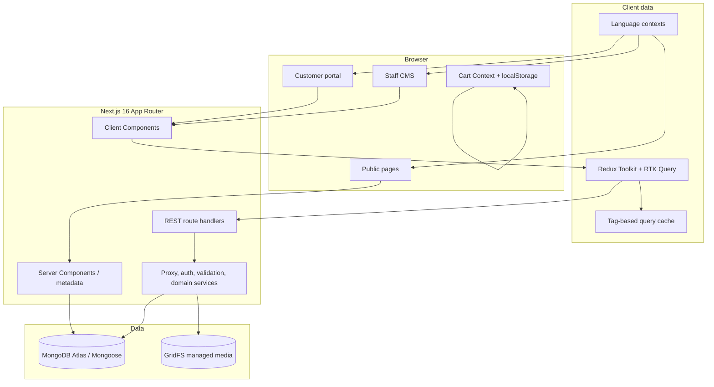
```mermaid
flowchart TB
  subgraph Browser["Browser"]
    P["Public pages"]
    U["Customer portal"]
    A["Staff CMS"]
    Cart["Cart Context + localStorage"]
  end

  subgraph Client_Data["Client data"]
    RTK["Redux Toolkit + RTK Query"]
    Cache["Tag-based query cache"]
    Lang["Language contexts"]
  end

  subgraph NextJS["Next.js 16 App Router"]
    SC["Server Components / metadata"]
    CC["Client Components"]
    API["REST route handlers"]
    Guard["Proxy, auth, validation, domain services"]
  end

  subgraph Data["Data"]
    Mongo[("MongoDB Atlas / Mongoose")]
    GridFS[("GridFS managed media")]
  end

  P --> SC
  U --> CC
  A --> CC
  CC --> RTK --> Cache
  Cart --> Cart
  RTK --> API
  SC --> Mongo
  API --> Guard --> Mongo
  Guard --> GridFS
  Lang --> P
  Lang --> U
  Lang --> A
```

### Rendering and request model

The project intentionally uses two read paths:

- **Server Components** query MongoDB when a route must decide metadata, canonical URLs, redirect behavior, or initial rendering before the client runs.
- **Client Components** read interactive, MongoDB-backed lists through RTK Query endpoint modules such as `teamApi`, `servicesApi`, `blogApi`, `shopApi`, and `messageApi`.
- **Client-only state** stays outside the remote-data cache: `CartContext` owns cart quantities/modes and persists to `localStorage`; language contexts own UI preference.
- **Operational data has no demo fallback.** Accounts, bookings, orders, messages, and staff actions remain database-authoritative. Defined public/editorial surfaces can use safe static/i18n fallback content.

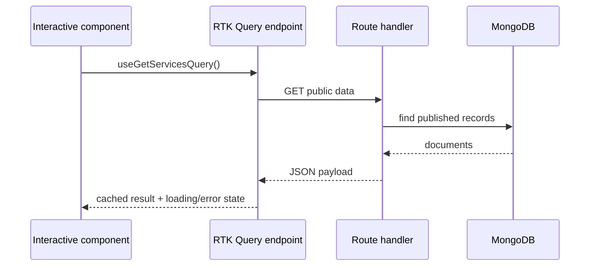
```mermaid
sequenceDiagram
  participant UI as Interactive component
  participant Q as RTK Query endpoint
  participant R as Route handler
  participant D as MongoDB

  UI->>Q: useGetServicesQuery()
  Q->>R: GET public data
  R->>D: find published records
  D-->>R: documents
  R-->>Q: JSON payload
  Q-->>UI: cached result + loading/error state
```

Illustrative architecture pseudocode—not private source:

```ts
const result = await servicesRepository.list({ published: true });

return result.length > 0
  ? render(result)
  : render(curatedBilingualFallback);

// Mutations stay on the protected server boundary.
requireStaffSession(session);
const command = bookingSchema.parse(input);
return bookingService.apply(command);
```

## Private codebase structure

The following is the actual architectural organization of the private application, shared as a map rather than a source dump.

```text
medilo-react/
├── src/
│   ├── app/                    # App Router pages, layouts, loading states, API route handlers
│   │   ├── admin/              # Protected CMS: content, bookings, people, shop, SEO, media
│   │   ├── user/               # Customer dashboard, messages, orders, services, profile
│   │   ├── medical-shop/       # Shop, categories, product catch-all route, cart, checkout
│   │   ├── nurses/ caregivers/ nanies/ physiotherapy/ doctors/
│   │   └── api/                # Public, customer, staff, media, booking, auth, and utility APIs
│   ├── Components/
│   │   ├── Admin/              # CMS layout, editors, booking surfaces, content primitives
│   │   ├── MedicalShop/        # Catalog, product, cart and checkout UI
│   │   ├── Messaging/          # Private customer/staff conversations and attachments
│   │   ├── ServicePageSections/# Reusable service-page compositions
│   │   └── Header/ Footer/ ... # Shared public and account experience UI
│   ├── views/                  # Page-level composition components
│   ├── store/                  # Redux store, provider, baseApi, RTK Query endpoint injection
│   ├── context/                # CartContext
│   ├── i18n/                   # LanguageContext, hooks, English/Bengali dictionaries
│   ├── lib/                    # Auth, database, GridFS, validation, pricing, redirects, SEO, email
│   │   └── ai/                 # Provider boundary, prompt policy, content adapters, redaction, usage/budget
│   ├── models/                 # 50 Mongoose domain schemas
│   ├── data/                   # Seed data and safe editorial fallback datasets
│   └── sass/                   # Default, common, and shortcode Sass layers
├── public/                     # Static assets, fonts, manifest, media-related browser assets
├── scripts/                    # Content/translation support scripts
├── next.config.mjs             # Image, Sass, package, and build configuration
└── package.json
```

### Route families

| Family | Examples | Engineering purpose |
|---|---|---|
| Public content | `/`, `/about`, `/service/[serviceId]`, `/blog/[blogId]`, `/faq`, `/contact` | Content discovery, dynamic metadata, static fallback where defined |
| Professionals | `/doctors/[doctorId]`, `/nurses/[nurseId]` | Published profile and service discovery |
| Care workflows | `/nurses/book/[nurseType]`, `/caregivers/book/[caregiverType]`, `/nanies/book/[nanyType]`, `/physiotherapy/book/[type]`, `/doctors/book/[doctorType]` | Service-specific request, pricing, validation, and checkout paths |
| Commerce | `/medical-shop/category/[categorySlug]`, `/medical-shop/product/[...slug]`, `/cart`, `/checkout` | Category-aware canonical URLs and cart/checkout state |
| Customer account | `/auth/*`, `/user/dashboard`, `/user/messages`, `/user/orders`, `/user/services`, `/user/profile` | Owned records, user preferences, and communication |
| Staff operations | `/admin/*`, `/admin/bookings`, `/admin/content/*`, `/admin/shop/*`, `/admin/seo/*` | Protected administrative capabilities |
| API surface | `/api/services`, `/api/team`, `/api/blog`, `/api/content`, `/api/shop/*`, `/api/user/*`, `/api/admin/*` | REST reads/mutations partitioned by audience and authorization |
| Assisted authoring | `/api/admin/ai/*` — proposals, apply/reject, revisions, conversations, field suggestions, sources, usage, settings | Capability-gated; generating and applying are separate permissions |

## State and data-access design

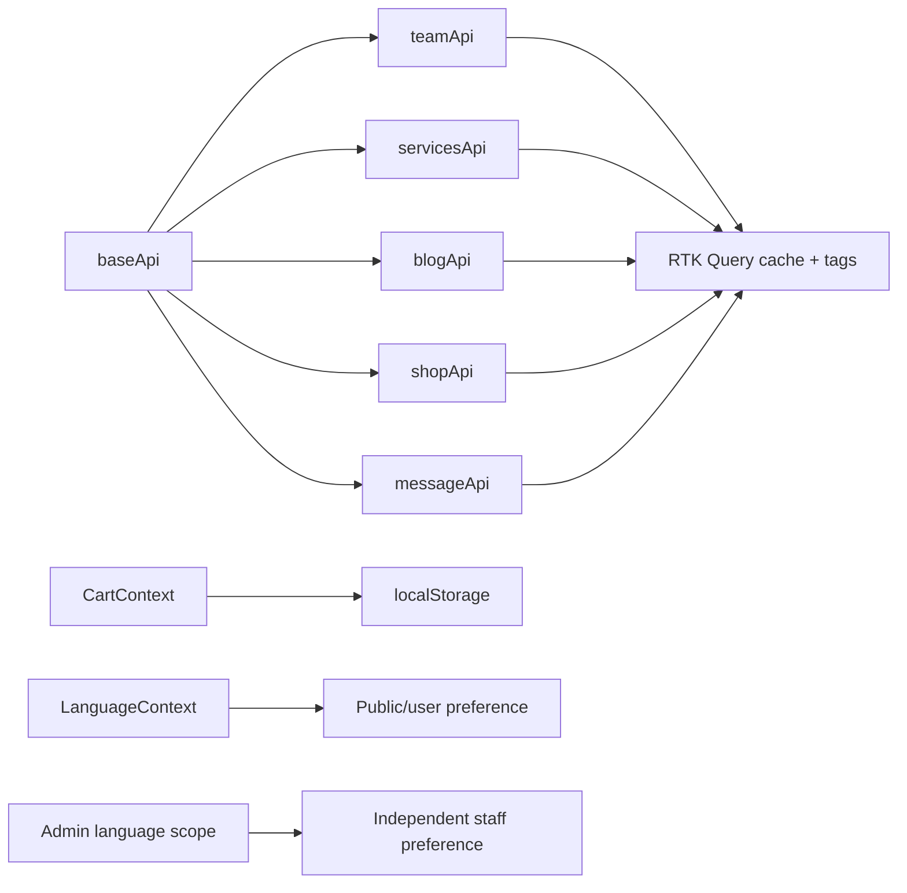
```mermaid
flowchart LR
  B["baseApi"] --> T["teamApi"]
  B --> S["servicesApi"]
  B --> BL["blogApi"]
  B --> SH["shopApi"]
  B --> M["messageApi"]
  T --> C["RTK Query cache + tags"]
  S --> C
  BL --> C
  SH --> C
  M --> C
  Cart["CartContext"] --> L["localStorage"]
  PublicLang["LanguageContext"] --> LP["Public/user preference"]
  AdminLang["Admin language scope"] --> AP["Independent staff preference"]
```

| Concern | Implementation choice | Why |
|---|---|---|
| Remote data | RTK Query with `fetchBaseQuery`, tags, invalidation, focus/reconnect refetching, and conditional `skip` | Removes duplicated loading/caching/retry logic from interactive components. |
| Cart | React context + `localStorage` | Synchronous, browser-local state; no MongoDB round-trip or server cache semantics needed. |
| Language | Nested React language contexts | Public/customer and CMS language selections do not overwrite each other. |
| Server validation | Zod schemas before mutation reaches Mongoose | Rejects malformed input at the boundary and supports field-level responses. |
| Database access | Pooled, hot-reload-safe Mongoose connection helper | Appropriate for local development and serverless invocation patterns. |

## Domain model map

The private application has 50 Mongoose models. They are intentionally split by operational domain rather than stored as one generic “booking” or “content” collection.

| Domain | Models |
|---|---|
| Identity and administration | `User`, `AdminUser`, `SeoSettings`, `SeedTombstone` |
| Core content | `PageContent`, `Service`, `TeamMember`, `BlogPost`, `FaqCategory`, `FaqItem`, `RedirectRule` |
| Medical commerce | `ProductCategory`, `Product`, `Order` |
| Nursing | `Booking`, `NurseTier`, `NurseMember`, `NursingService`, `NursingGalleryTab`, `NurseApplicant` |
| Caregiver | `CaregiverBooking`, `CaregiverTier`, `CaregiverService`, `CaregiverGalleryTab`, `CaregiverApplicant` |
| Baby/newborn care | `BabyCareBooking`, `BabyCareTier`, `BabyCareService`, `BabyCareGalleryTab`, `NanyApplicant` |
| Physiotherapy | `PhysiotherapyBooking`, `PhysiotherapyApplicant` |
| Doctor consultation | `DoctorBooking`, `DoctorTier`, `DoctorService`, `DoctorApplicant` |
| Ambulance | `AmbulanceBooking`, `AmbulanceType` |
| Communication | `InternalConversation`, `ChatSession` |
| Assisted authoring | `AiJob`, `AiProposal`, `AiConversation`, `AiUsageLedger`, `AiRateLimit`, `AiSettings`, `ApprovedSource`, `ContentRevision` |

### Core relationships and content shapes

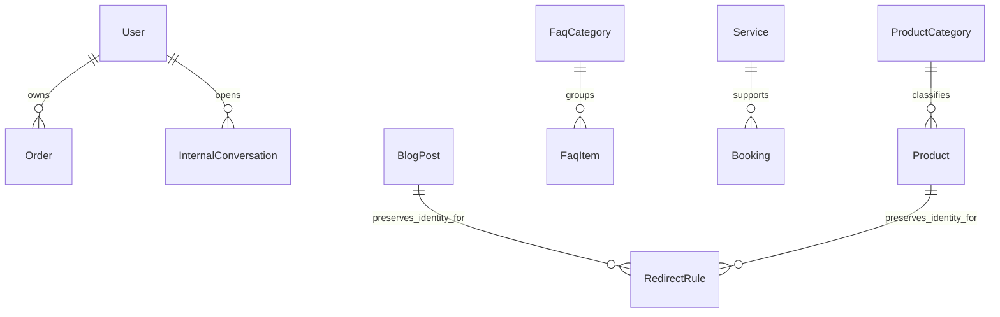
```mermaid
erDiagram
  User ||--o{ Order : owns
  User ||--o{ InternalConversation : opens
  ProductCategory ||--o{ Product : classifies
  FaqCategory ||--o{ FaqItem : groups
  Service ||--o{ Booking : supports
  BlogPost ||--o{ RedirectRule : preserves_identity_for
  Product ||--o{ RedirectRule : preserves_identity_for
```

- Products and posts retain a canonical slug, previous-slug history, and ordered recovery targets.
- Content supports structured image values (`src`, `alt`, optional `title`/file label) and safe inline link ranges instead of raw arbitrary HTML.
- `PageContent` provides flexible JSON-driven editorial composition for page-level content.
- Service bookings snapshot derived pricing and request state at creation; the server remains the pricing authority.

## CMS and authoring architecture

The staff interface is built with Ant Design and uses a responsive, collapsible administration shell. It is more than CRUD tables: it contains product-specific authoring primitives and workflow surfaces.

| Area | Technical implementation highlights |
|---|---|
| Dashboard | Aggregated counts and Recharts bar/pie/line visualizations for live operational overview. |
| CMS pages | Reusable editors for home, about, contact, service pages, and structured page sections. |
| Images | Single/multi-image pickers backed by GridFS; editable alt text, title, and SEO-friendly file labels. |
| Narrative content | Text is stored with link ranges and emphasis ranges rather than markup, so renderers never inject raw HTML. |
| Free-form composition | Product and blog bodies are ordered content blocks — headings H1–H6, paragraphs with a closed set of type choices, bullet and numbered lists, images, dividers — arranged in any order rather than a fixed section template. A pasted document from a word processor is parsed into those blocks. |
| Products | Category-first card grid, stock/publication state, inline ordering, multi-select actions, dnd-kit batch reorder. |
| Blog | Block-composed body, gallery, takeaways, quote/stat/sidebar structures, SEO fields, slug history, and replacement targets. |
| FAQ | Ordered category/question management with live/hidden state and drag ordering. |
| Messaging | Customer/staff thread views, unread state, priority/status controls, rich reply model, protected attachments. |
| SEO | Deterministic per-page content audit, target keyphrases with live coverage, search-data connection, and web-vitals history inside the protected CMS. |
| Assisted authoring | Per-field rewrite controls, targeted repair of a specific SEO finding, and a governed proposal review with field-level diff and rollback. |

### Media pipeline

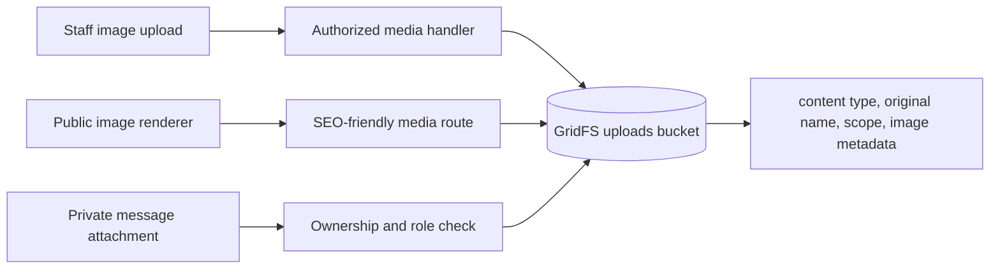
```mermaid
flowchart LR
  Upload["Staff image upload"] --> AdminAPI["Authorized media handler"]
  AdminAPI --> Bucket[("GridFS uploads bucket")]
  Bucket --> Meta["content type, original name, scope, image metadata"]
  Public["Public image renderer"] --> Stream["SEO-friendly media route"]
  Stream --> Bucket
  Message["Private message attachment"] --> Protected["Ownership and role check"] --> Bucket
```

- Shared helpers cover upload, retrieval, deletion, and listing of GridFS files.
- Public media values can be legacy URLs or structured image objects so migrations remain backward compatible.
- Private message files use a separate scope and authorization path from public images.
- Image transformations are handled through a controlled Next.js image configuration, with modern formats where supported.

## Service workflow engineering

| Service domain | Booking shape | Distinct implementation detail |
|---|---|---|
| Nursing | Date-range, 12/24-hour shifts; category or named-nurse path | Nurse roster, tier model, conflict checks, server-snapshotted daily pricing |
| Caregiver | Date-range, category-based attendant path | Dedicated booking/tier/content models; no public named-caregiver roster |
| Baby & newborn | Date-range, category-based “Nany” path | Separate data family; 24-hour staffing mode affects server-side price computation |
| Physiotherapy | Normalized list of date/time visits | 45–60 minute visit schedule, 60-minute spacing rules, course-discount calculation |
| Doctor consultation | Home or virtual appointment slots | Mode-aware required fields, provider schedule conflict guards, validated Google Meet link handling |

Across all care workflows, the server recomputes prices and guards lifecycle transitions. Payment cannot be marked paid for a pending/cancelled record; a paid record cannot be moved back to pending/cancelled; completed records remain operationally locked except for payment reconciliation. See the individual technical workflow documents for models, route families, pricing, conflict rules, and upgrade paths.

## Commerce and URL resilience

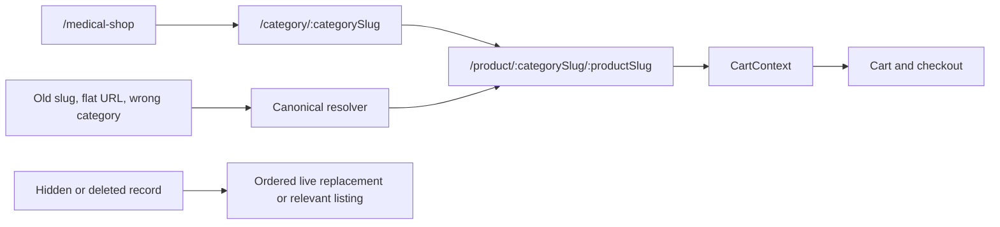
```mermaid
flowchart LR
  A["/medical-shop"] --> B["/category/:categorySlug"]
  B --> C["/product/:categorySlug/:productSlug"]
  C --> D["CartContext"]
  D --> E["Cart and checkout"]
  Old["Old slug, flat URL, wrong category"] --> Redirect["Canonical resolver"]
  Redirect --> C
  Missing["Hidden or deleted record"] --> Recovery["Ordered live replacement or relevant listing"]
```

- Product configuration supports purchase, rental, refill, or contact-for-price experiences.
- Category-aware canonical URLs are constructed from the stored product identity.
- Slug history and `RedirectRule` records preserve recovery preferences after content changes or deletion.
- Search/filter and paginated data routes use the same catalog model as the staff CMS.

## Security and operational safeguards

| Control | Implementation |
|---|---|
| Staff session | JWT signed through `jose`, delivered in an httpOnly, `SameSite=Lax` cookie with a seven-day lifetime. |
| Credential handling | Password hashing plus constant-time comparison; credentials are supplied through private runtime configuration, never the database or this repository. |
| Defense in depth | Admin routes verify authorization server-side; the admin layout also checks the current session; `proxy.js` gates staff pages before CMS rendering. |
| Browser protections | CSP, HSTS, frame, content-type, referrer, and XSS-related response headers are attached at the application boundary. |
| Mutation integrity | Zod validation, ownership checks, publish state, and status-transition rules run before durable writes. |
| Private files | Internal-message attachments have a protected delivery route rather than public media visibility. |
| Assisted authoring | The provider key stays server-side; model output must satisfy closed schemas and an explicit field allow-list; applying requires a separate capability, an unchanged content hash, and explicit confirmation, and writes an immutable revision. |

## Discoverability, performance, and PWA posture

- Public pages use static `metadata` or dynamic `generateMetadata()`; the root layout supplies a shared title template.
- Dynamic product/category and blog routes resolve canonical metadata server-side; changed slugs use permanent redirects and unavailable records are `noindex` before recovery.
- Structured image metadata feeds image attributes, Open Graph/Twitter previews, and JSON-LD without leaking structured objects to DOM attributes.
- Organization, service, article, professional, product, breadcrumb, and FAQ schema patterns are part of the SEO approach.
- A shared deterministic analyzer scores each record against the full industry checklist — heading structure, canonical, social cards, schema prerequisites, breadcrumbs, accessibility and freshness included — and the same function drives the editor panel, AI field targeting, and post-proposal projection. See [SEO review](SEO_CONTENT_HEALTH.md).
- `loading.js` boundaries support progressive feedback for data-dependent public route families.
- Turbopack is used for development. `mongoose` remains server-external. Modern image formats are enabled where supported.
- A web manifest is retained, but offline caching is **not currently enabled**; a legacy worker is deliberately retired rather than presenting unreliable PWA behavior.

## Internationalization

The runtime language system uses English and Bengali translation dictionaries, a `useLanguage()` interface, and a server translation fallback for uncatalogued interface text. Public/customer language state and internal CMS language state are intentionally stored separately. The visual system loads Poppins, Rubik, and Hind Siliguri through `next/font/google` to support Latin and Bengali interfaces.

For developer-level details—translation flow, state boundaries, quality risks, and content modeling—see [Language Translation Process](Language_Translation_Process.md) and [Translation Guide](TRANSLATION_GUIDE.md).

## Project status

| Capability | Status | Technical note |
|---|---|---|
| Public website / CMS / customer portal | Implemented | One shared Next.js application, distinct route and permission boundaries. |
| Specialized care bookings | Implemented | Domain-specific collections and workflow rules—not a generic inquiry form. |
| Medical shop | Implemented | Catalog, category/product routing, cart state, checkout, redirect resilience. |
| SEO workspace | Implemented | Deterministic content audit and optional monitoring integrations are staff-protected. |
| Supervised AI copilot | Implemented, environment-gated | Off by default; requires a company-owned provider project, billing approval and an explicit server flag. |
| Bengali AI application | Review only | Bengali proposals are reviewable; writing them is locked until dedicated localized CMS fields exist. |
| Offline-first mode | Not enabled | Install metadata exists; no active offline caching strategy. |
| Fine-grained staff roles | Future enhancement | Current staff permission model is intentionally simpler than dispatcher/finance/editor role partitioning. |
| Scheduling, payments, clinical integrations | Upgrade opportunities | Require vendor, consent, compliance, and operational design before activation. |

## Technical documentation map

| Document | Developer focus |
|---|---|
| [Features & content architecture](FEATURES_AND_CONTENT_ARCHITECTURE.md) | URL resilience, structured authoring, message/data ownership, API families, page composition |
| [Architecture & evolution](AppStructureUpgrade.md) | App Router organization, infrastructure decisions, performance/security evolution |
| [Nursing workflow](Nursing_Service_Workflow.md) | Tier/date pricing, roster model, conflict and lifecycle rules |
| [Caregiver workflow](Caregiver_Service_Workflow.md) | Category booking, data model, reuse boundaries, lifecycle logic |
| [Baby & newborn workflow](BabyNewBornCare_Service_Workflow.md) | Nany model, staffing-price variants, booking and CMS module map |
| [Physiotherapy workflow](Physiotherapy_Service_Workflow.md) | Visit normalization, gap conflict checks, course pricing, account-owned schedule |
| [Doctor consultation workflow](Doctor_Consultation_Service_Workflow.md) | Home/virtual mode, appointment conflicts, fees, meeting-link handling |
| [Language translation process](Language_Translation_Process.md) | Runtime i18n topology, translation decisions, known technical risks |
| [Translation guide](TRANSLATION_GUIDE.md) | Dictionary/content conventions, localized data, developer checklist |
| [Care Bangla AI](CARE_BANGLA_AI.md) | Supervised copilot: interaction modes, request lifecycle, safety design, operating model |
| [SEO review](SEO_CONTENT_HEALTH.md) | Deterministic per-page content health, checklist coverage, and analyzer design decisions |
| [SEO roadmap](SEO_Optimization_RoadMap.md) | Metadata, JSON-LD, sitemap, canonical, CWV, and monitoring strategy |
| [Project audit](PROJECT_AUDIT.md) | Engineering review, trade-offs, risk posture, and test/upgrade recommendations |

## Public repository boundary

This repository intentionally excludes the application source, package lockfile, `.env` files, secrets, database data, private endpoint code, deployment configuration, and customer/operational records. The documentation names real modules, patterns, contracts, and technical decisions so a developer can evaluate the work, but it is not a self-hosting kit or a substitute for the private codebase.

## Admin-panel screenshots

The complete screenshot set is intentionally placed at the end of this README. It documents protected functionality without exposing access to the CMS. All values, names, and metrics are capture-time examples rather than live operational data.

<table>
  <tr>
    <td width="33%">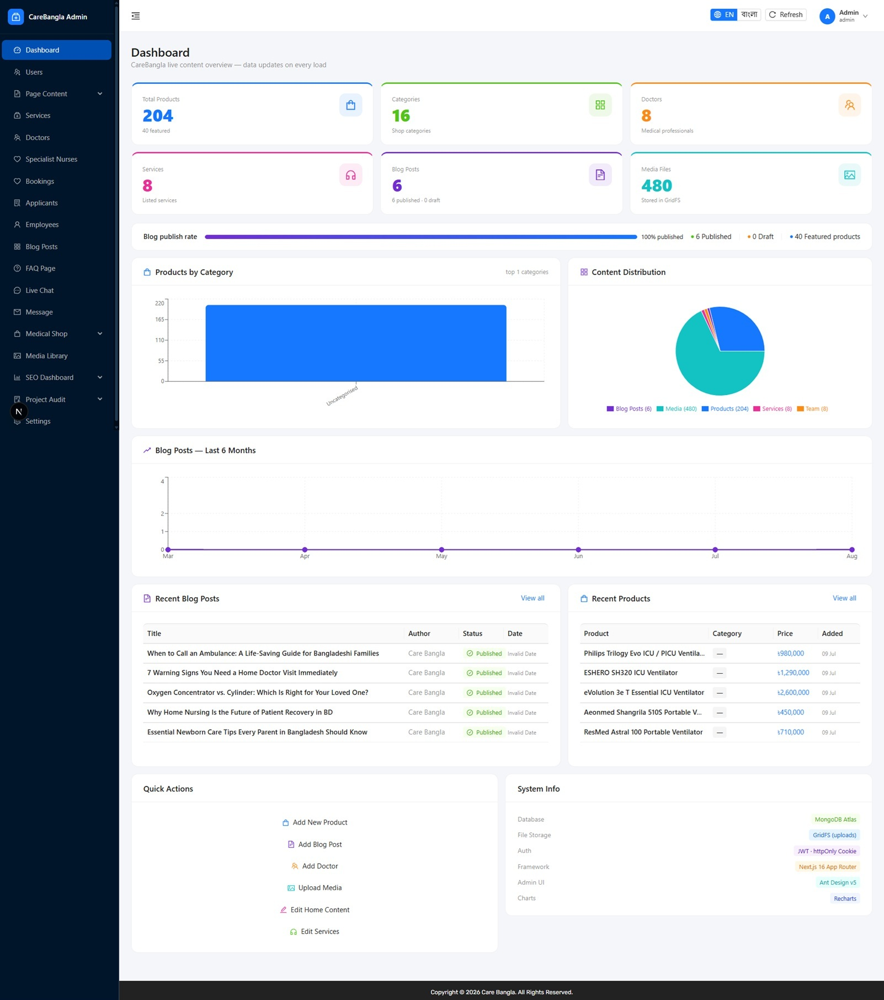<br /><sub><b>Dashboard</b></sub></td>
    <td width="33%">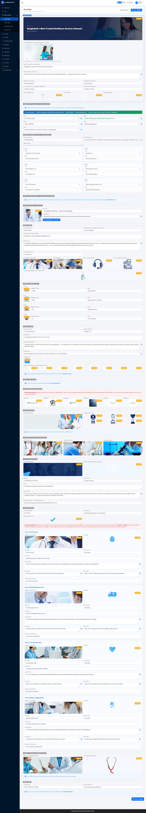<br /><sub><b>Home page content</b></sub></td>
    <td width="33%">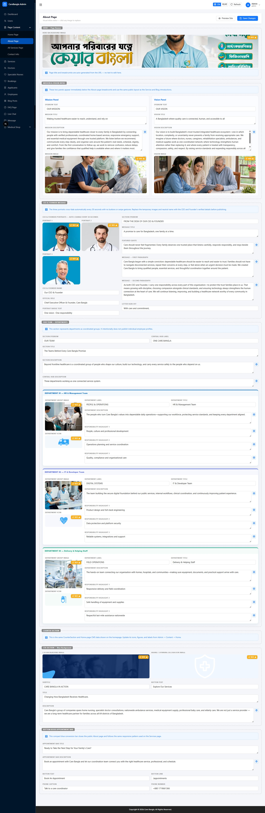<br /><sub><b>About page content</b></sub></td>
  </tr>
  <tr>
    <td>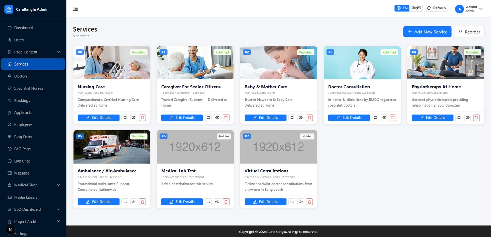<br /><sub><b>All services</b></sub></td>
    <td>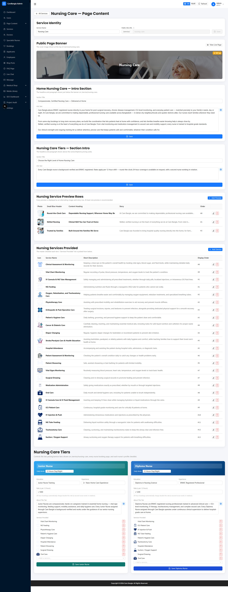<br /><sub><b>Individual service editor</b></sub></td>
    <td>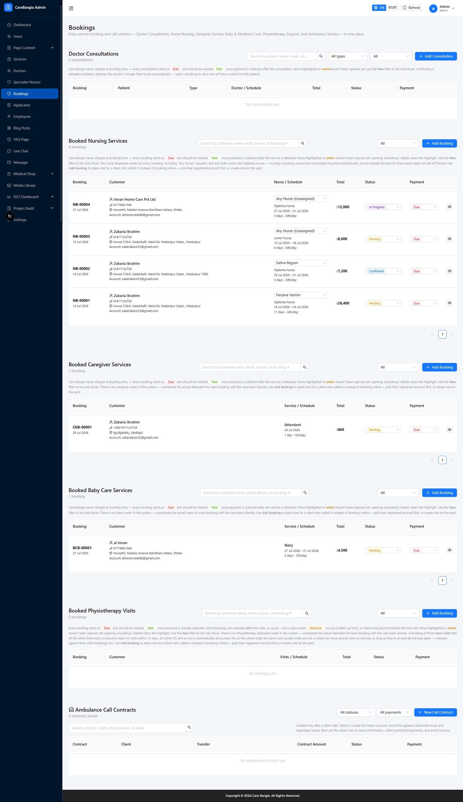<br /><sub><b>Service bookings</b></sub></td>
  </tr>
  <tr>
    <td>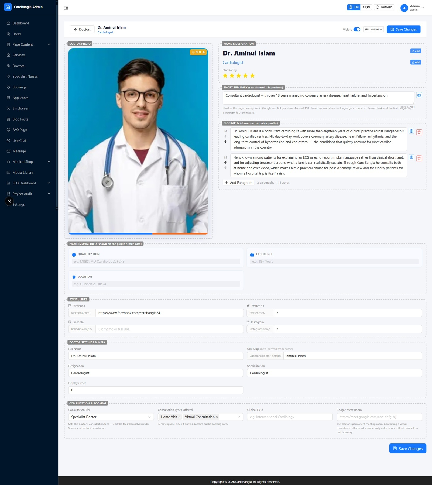<br /><sub><b>Doctor profile</b></sub></td>
    <td>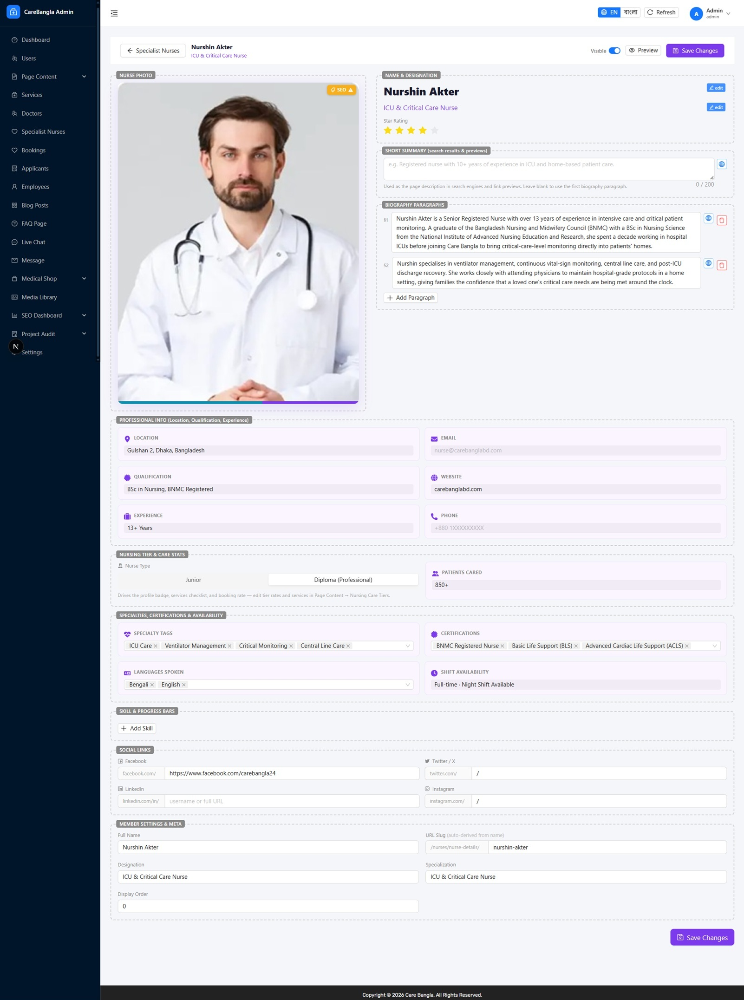<br /><sub><b>Nurse profile</b></sub></td>
    <td>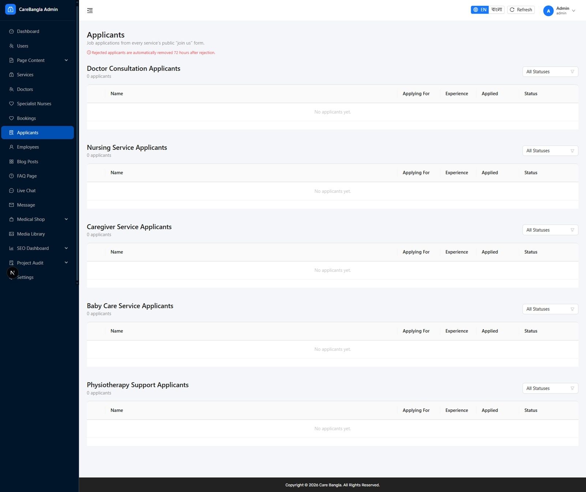<br /><sub><b>Applicants</b></sub></td>
  </tr>
  <tr>
    <td>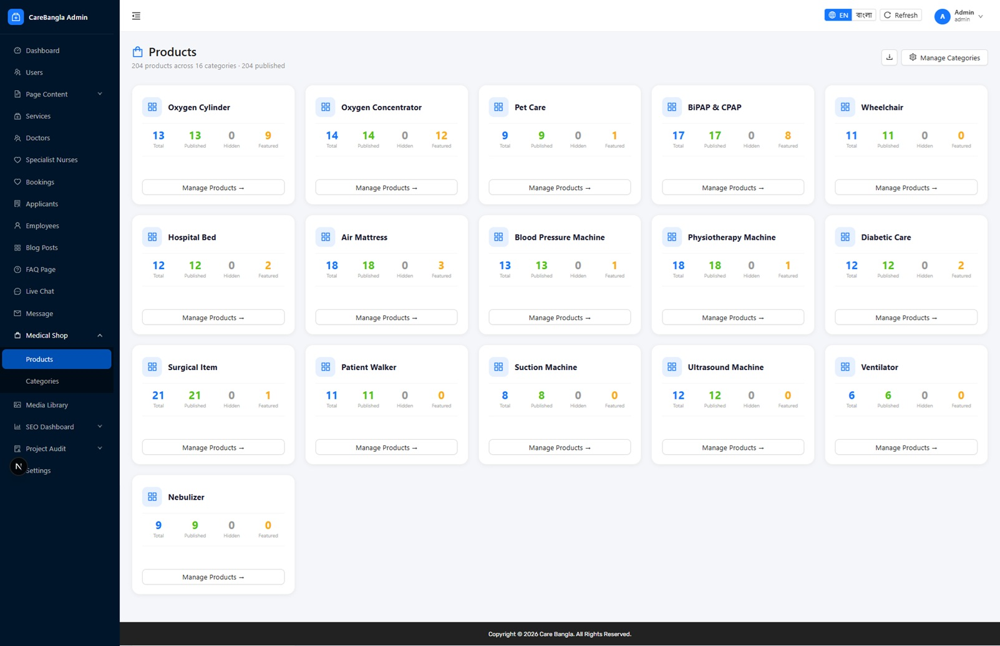<br /><sub><b>Product categories</b></sub></td>
    <td>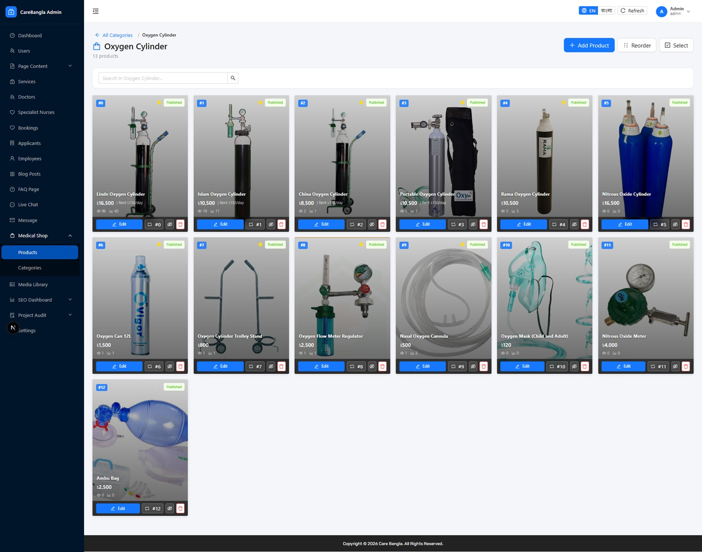<br /><sub><b>Category products</b></sub></td>
    <td>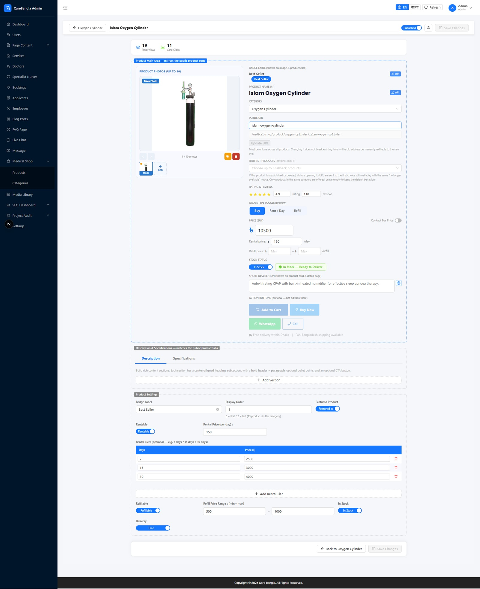<br /><sub><b>Product editor</b></sub></td>
  </tr>
  <tr>
    <td>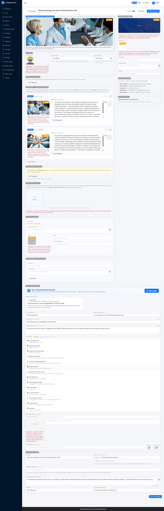<br /><sub><b>Blog editor</b></sub></td>
    <td>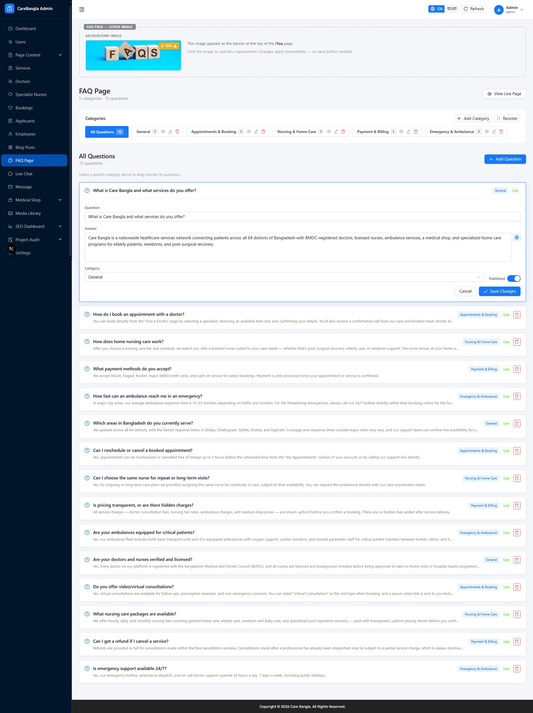<br /><sub><b>FAQ manager</b></sub></td>
    <td>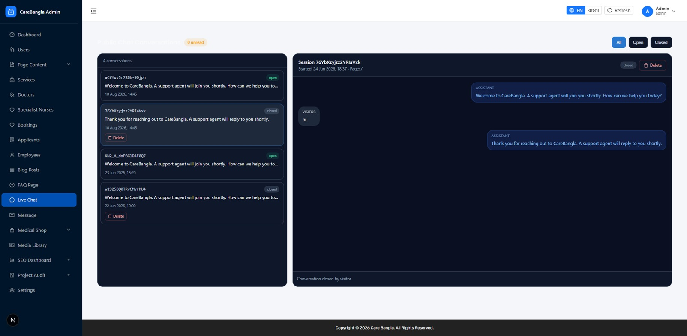<br /><sub><b>Live chat</b></sub></td>
  </tr>
  <tr>
    <td>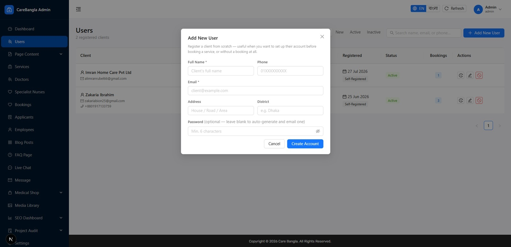<br /><sub><b>User management</b></sub></td>
    <td>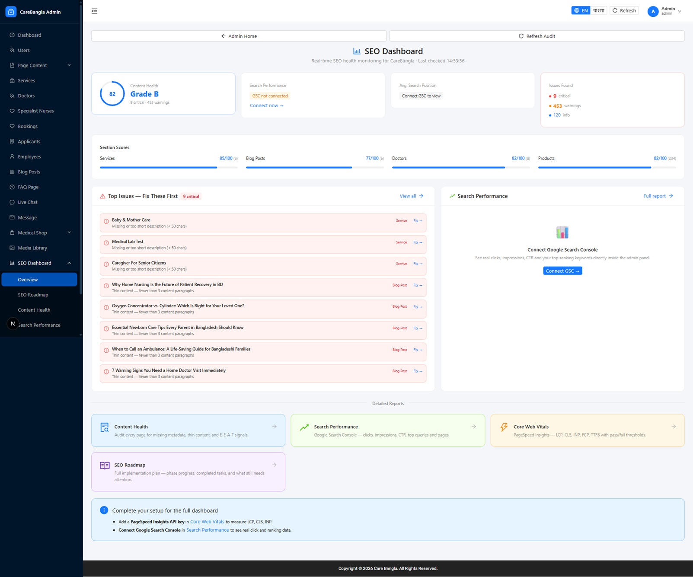<br /><sub><b>SEO dashboard</b></sub></td>
    <td></td>
  </tr>
</table>

---

<div align="center">

Built for accessible healthcare services in Bangladesh · © Care Bangla

</div>
