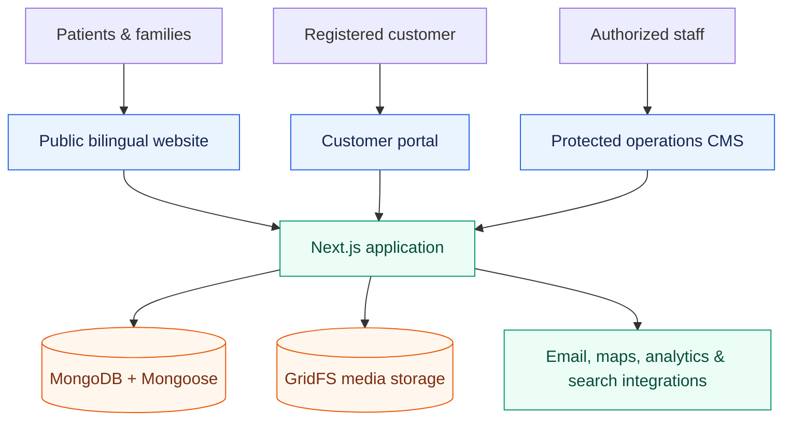

<div align="center">

# Care Bangla

### Healthcare services, medical commerce, and operations—connected in one private web platform

## 🌐 Current Hosted Website

[https://care-bangla-official-site.vercel.app/](https://care-bangla-official-site.vercel.app/)

> This is the initial hosted deployment. Its server or domain may change later.

[](#project-status)
[](#source-code--access)
[](https://nextjs.org/)
[](https://www.mongodb.com/atlas)
[](#localization)

**Public documentation & product showcase** · The production source code is intentionally not included.

</div>

---

## At a glance

Care Bangla is a large, integrated healthcare platform for Bangladesh. It combines a bilingual public website, service-booking journeys, a medical-equipment catalog and cart, customer self-service, and a role-protected internal CMS. The private application is a Next.js 16 product with roughly **630 application files**, **149 reusable components**, **40 data models**, and **140 API route handlers**.

This repository is the public counterpart of the private project. It documents the product, architecture, scope, and future direction so prospective clients and collaborators can assess the work without receiving the deployable codebase.

| Area | What it delivers |
|---|---|
| 🏥 Care discovery | Service, clinician, nursing, caregiver, baby-care, physiotherapy, appointment, FAQ, contact, and health-content experiences |
| 🛒 Medical shop | Category browsing, product detail, buy/rent/refill options, cart, and checkout flow |
| 👤 Customer portal | Account registration, profile, service and order visibility, notifications, and private support messages |
| 🛡️ Operations CMS | Content, team, bookings, applicants, FAQs, catalog, media, users, chat, SEO, and settings management |
| 🌐 Localization | English and Bengali presentation with independent public and admin language preferences |

## Product preview

The following representative screenshots show the private, authenticated operations experience. They are included so visitors can evaluate the breadth of the CMS without being given access to it. Counts, prices, names, and content visible in screenshots are capture-time examples and should not be treated as live operational data.

<table>
  <tr>
    <td width="50%"><br /><sub><b>Operations dashboard</b> — cross-module metrics, content distribution, and quick actions.</sub></td>
    <td width="50%"><br /><sub><b>Page-content editor</b> — structured marketing content managed without a deployment.</sub></td>
  </tr>
  <tr>
    <td width="50%"><br /><sub><b>Service operations</b> — booking records and fulfillment workflows.</sub></td>
    <td width="50%"><br /><sub><b>Commerce management</b> — product data, imagery, pricing, availability, and publishing controls.</sub></td>
  </tr>
  <tr>
    <td width="50%"><br /><sub><b>Editorial publishing</b> — rich health resources with discoverability metadata.</sub></td>
    <td width="50%"><br /><sub><b>SEO workspace</b> — content quality, search visibility, and web-vitals monitoring.</sub></td>
  </tr>
</table>

Additional screens are available in [pages_screenshot_images/admin_panel](pages_screenshot_images/admin_panel), including applicants, live chat, team profiles, FAQs, content, categories, users, and media-oriented views.

## System design



### Technical profile

| Layer | Primary technologies | Purpose |
|---|---|---|
| Application | Next.js 16, React 18, App Router | Server and client rendering, routing, and REST handlers |
| UI | Bootstrap 5, React-Bootstrap, Sass, Ant Design | Public design system plus data-dense internal tooling |
| Data | MongoDB Atlas, Mongoose, GridFS | Operational records, CMS content, and managed media |
| Client state | Redux Toolkit / RTK Query, React Context | Cached server data; focused local state for cart and language |
| Forms & validation | React Hook Form, Zod | Structured input and server-side data validation |
| Security | JWT sessions, httpOnly cookies, password hashing, request protection | Protected administration and trusted server boundaries |
| Product tooling | Recharts, dnd-kit, AOS, React Slick, Google Maps | Reporting, reordering, interaction, and location UX |

### Private implementation shape

The application is organized around separable responsibilities rather than a monolithic page layer:

```text
private application/
├── app/          route segments, layouts, server rendering, API handlers
├── Components/   reusable public, portal, CMS, content, and commerce UI
├── views/        page-level composition
├── store/        Redux Toolkit + RTK Query data access
├── context/      client-local cart state
├── i18n/         English/Bengali language experience
├── models/       MongoDB domain models
├── lib/          validation, auth, data, media, redirect, and utility services
├── data/         safe editorial fallback and seed data
└── sass/         shared visual foundations and component styles
```

The source tree and its private configuration are not mirrored here. This diagram is deliberately architectural: it communicates boundaries and extension points without exposing implementation files, access patterns, or secrets.

## Feature map

### Public and customer experiences

- **Healthcare discovery:** responsive pages for services, clinical professionals, nursing profiles, blogs, FAQs, appointments, contact, and search.
- **Specialist services:** distinct booking flows for nursing, caregiving, baby/newborn care, physiotherapy, and doctor consultations, plus relevant applicant journeys.
- **Medical equipment:** searchable/category-based discovery, product detail, configurable purchase or rental intent, and cart/checkout paths.
- **Self-service:** registration and sign-in, profile updates, service/order history, notifications, and customer-to-team messaging.
- **Content resilience:** managed published content is preferred; defined pages can display curated fallback content when editorial data is unavailable.

### Operations and content capabilities

- **CMS pages:** editable home, about, contact, service, and campaign-style content blocks.
- **Catalog and people:** management surfaces for services, products, categories, clinicians, nurses, and other published profiles.
- **Bookings and applications:** separate operational queues aligned to each care-service workflow.
- **Editorial:** blog publishing, structured images, inline links, FAQ categories, and publication state.
- **Customer operations:** user accounts, private conversations, live-chat workflow, media library, and administrative settings.
- **Visibility:** operational dashboard, content-quality checks, SEO workspace, Search Console connection, and Core Web Vitals history where configured.

## Key engineering decisions

| Decision | Reason and outcome |
|---|---|
| One application, several audiences | Public, customer, and staff experiences share domain data while retaining their own route and permission boundaries. |
| Database-first editorial delivery | Staff can publish content without a redeploy; selected safe fallbacks protect core public pages. |
| Structured content instead of raw HTML | Images, links, sections, and SEO fields are modeled as data so they can be rendered safely and consistently. |
| Durable URL handling | Canonical slugs, URL history, and controlled redirect targets help preserve links when catalog or editorial records change. |
| Split state strategy | RTK Query serves remote data caching; lightweight React context is reserved for purely local user-interface state. |
| Separate admin language preference | Public/customer and internal staff language choices do not overwrite one another in the same browser. |

An illustrative—not production—content-read pattern looks like this:

```ts
// Pseudocode: the public site only renders published content.
const publishedServices = await contentRepository.listPublished('services');

return publishedServices.length > 0
  ? render(publishedServices)
  : render(curatedFallbackServices);
```

```ts
// Pseudocode: authorization and validation remain server-side.
if (!session.hasRole('staff')) return forbidden();

const command = validate(input);
return bookingService.apply(command);
```

The snippets communicate design intent only; they are not copied from, nor sufficient to recreate, the private implementation.

## Project status

| Capability | Status | Notes |
|---|---|---|
| Public website and healthcare content | Active | Available through the hosted link above. |
| Service booking journeys | Implemented | Operational flows differ by care type and can evolve independently. |
| Medical commerce | Implemented | Catalog, cart, and checkout experiences are represented in the private application. |
| Internal CMS | Implemented | Access is restricted to authorized staff; screenshots are provided here instead. |
| EN / BN experience | Implemented | Localization and content process are documented below. |
| Offline-first behavior | Not currently enabled | A web manifest exists; a service-worker caching strategy is not an active product capability. |

## Security, privacy, and access

Healthcare software should be explicit about what a public showcase does *not* expose. The private application uses protected administrative routes, authenticated sessions stored in httpOnly cookies, request validation, password hashing, and server-side authorization checks. Sensitive operational data, credentials, deployment configuration, database access, customer records, and private API implementation are not present in this repository.

The screenshots are informational only. They do not grant access to the CMS, imply a public API, or replace a privacy/security review for a future deployment.

## Extensibility and future potential

The domain separation makes the platform suitable for phased growth, for example:

- online payment-gateway and invoice integrations;
- staff rostering, availability, and capacity-aware scheduling;
- richer order fulfillment and inventory synchronization;
- clinical workflow integrations subject to compliance review;
- role-specific dashboards, audit trails, and reporting;
- more language packs and translation-review workflow;
- performance budgets, automated accessibility checks, and offline-first experiences.

These are product opportunities, not promises or enabled integrations in the public deployment.

## Documentation

| Document | Public focus |
|---|---|
| [Features & content architecture](docs/FEATURES_AND_CONTENT_ARCHITECTURE.md) | Experience map, content model principles, and operational capabilities |
| [Architecture & evolution](docs/AppStructureUpgrade.md) | System boundaries, quality attributes, and upgrade opportunities |
| [Nursing workflow](docs/Nursing_Service_Workflow.md) | Home-nursing discovery-to-fulfillment journey |
| [Caregiver workflow](docs/Caregiver_Service_Workflow.md) | Caregiver/attendant service journey |
| [Baby & newborn care workflow](docs/BabyNewBornCare_Service_Workflow.md) | Family-centered newborn-care journey |
| [Physiotherapy workflow](docs/Physiotherapy_Service_Workflow.md) | Assessment and visit-course journey |
| [Doctor consultation workflow](docs/Doctor_Consultation_Service_Workflow.md) | Home/remote consultation journey |
| [Localization overview](docs/Language_Translation_Process.md) | Bilingual product architecture and quality considerations |
| [Localization content guide](docs/TRANSLATION_GUIDE.md) | Public-safe editorial translation process |
| [SEO roadmap](docs/SEO_Optimization_RoadMap.md) | Discoverability and measurement approach |
| [Public project audit](docs/PROJECT_AUDIT.md) | Scope, review posture, and known boundaries |

## Source code & access

This is a **documentation-only public repository** for a private production project. It is intended for product evaluation, portfolio review, and high-level technical discussion—not local installation, code contribution, self-hosting, or API consumption.

If you need a demonstration, architecture discussion, or scoped implementation engagement, use the hosted public website as the starting point. Requests for private access are evaluated separately; no credentials, environment files, database exports, or application source are published here.

---

<div align="center">

Built for accessible healthcare services in Bangladesh · © Care Bangla

</div>
