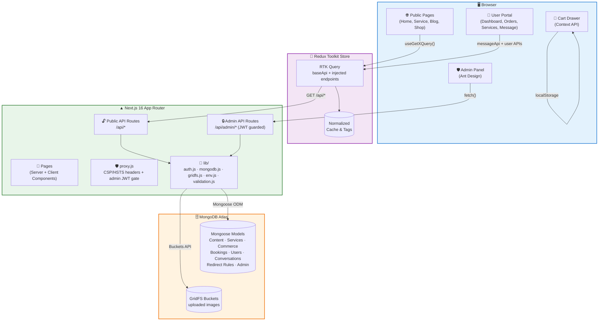
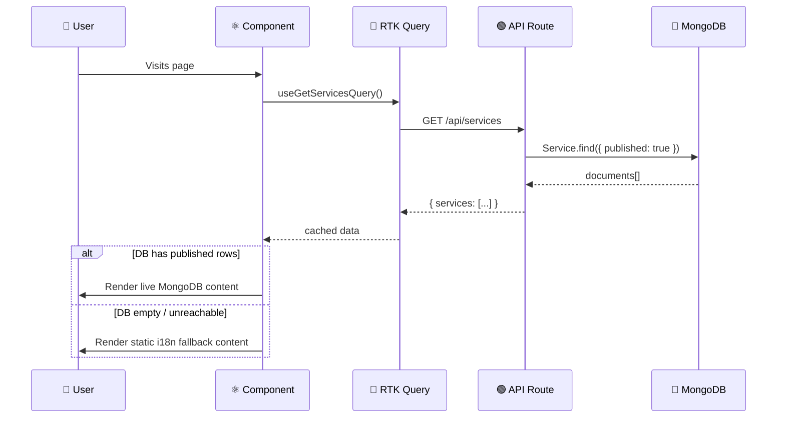
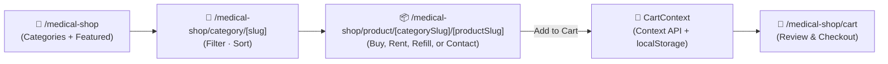
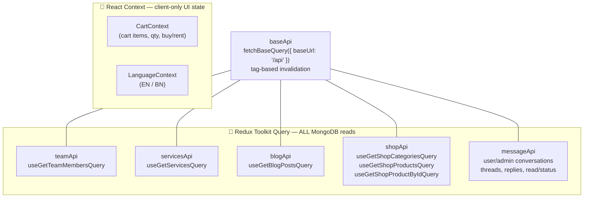
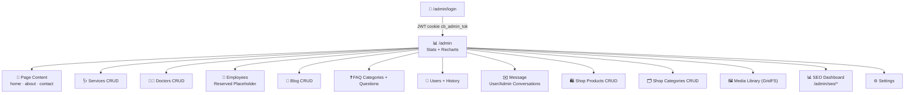
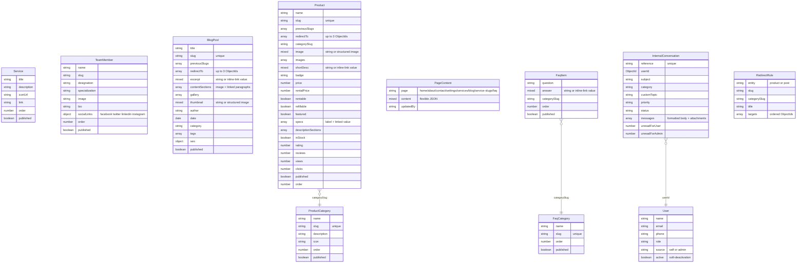
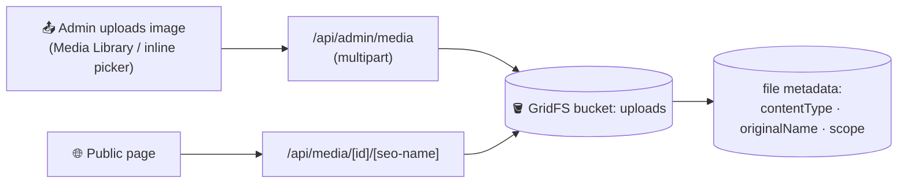

<div align="center">


# 🏥 Care Bangla

**Modern Healthcare, Home Care & Medical Equipment Platform**

**A full-stack Next.js application — bilingual marketing site, medical e-commerce shop, and a self-built admin CMS, all on one MongoDB-backed codebase.**

## 🌐 Current Hosted Website

[https://care-bangla-official-site.vercel.app/](https://care-bangla-official-site.vercel.app/)

> This is the initial hosted deployment. Its server or domain may change later.

[](https://nextjs.org/)
[](https://react.dev/)
[](https://mongoosejs.com/)
[](https://redux-toolkit.js.org/)
[](https://ant.design/)
[](https://getbootstrap.com/)


</div>

---

## 📖 Table of Contents

1. [✨ Overview](#-overview)
2. [🧱 Tech Stack](#-tech-stack)
3. [🗺️ System Architecture](#️-system-architecture)
4. [📁 Project Structure](#-project-structure)
5. [🌐 Public Website](#-public-website)
6. [🛒 Medical Shop & Cart](#-medical-shop--cart)
7. [🌍 Internationalization (EN / BN)](#-internationalization-en--bn)
8. [🔄 State Management — RTK Query + Context API](#-state-management--rtk-query--context-api)
9. [🛡️ Admin Panel (CMS)](#️-admin-panel-cms)
10. [✍️ Content Authoring & URL Resilience](#️-content-authoring--url-resilience)
11. [🔌 API Reference](#-api-reference)
12. [🗄️ Database Schema](#️-database-schema)
13. [🖼️ Media Pipeline (GridFS)](#️-media-pipeline-gridfs)
14. [🔐 Authentication & Security](#-authentication--security)
15. [🎨 Styling System](#-styling-system)
16. [📱 PWA & Performance](#-pwa--performance)
17. [⚙️ Getting Started](#️-getting-started)
18. [🔑 Environment Variables](#-environment-variables)
19. [📜 Available Scripts](#-available-scripts)
20. [📚 Documentation Map](#-documentation-map)
21. [🚀 Deployment](#-deployment)

---

## ✨ Overview

**Care Bangla** is a healthcare services platform for Bangladesh covering home nursing, caregiver support, baby care, physiotherapy, doctor consultation, ambulance coordination, and medical equipment rental/sale. It is built as a **single Next.js 16 App Router application** that serves four connected experiences from one codebase:

| Experience | Audience | Description |
|---|---|---|
| 🌐 **Public Marketing Site** | Patients & families | Home, About, Services, Doctors, Blog, Appointments, Contact — bilingual (English/Bengali) |
| 🛍️ **Medical Equipment Shop** | Customers | Browse categories, buy or rent equipment, cart & checkout flow |
| 👤 **Logged-in User Portal** | Registered customers | Admin-style dashboard shell, orders, service history, profile, and internal Message module |
| 🛡️ **Admin CMS** | Internal staff | Manage every piece of content above — no redeploy required |

Public editorial content renders from **MongoDB** with graceful **static/i18n fallbacks** where defined. Operational records—accounts, bookings, orders, conversations, and admin actions—always remain database-authoritative.

For the detailed implementation of the recently added cross-cutting features, see [FEATURES_AND_CONTENT_ARCHITECTURE.md](docs/FEATURES_AND_CONTENT_ARCHITECTURE.md).

---

## 🧱 Tech Stack

<table>
<tr>
<td valign="top" width="33%">

### 🎨 Frontend
- ⚛️ **React 18** + **Next.js 16** (App Router)
- 🧩 **Bootstrap 5** + **React-Bootstrap**
- 💅 **Sass / SCSS** modular styles
- 🎞️ **AOS** scroll animations
- 🎠 **React Slick** carousels
- ⭐ **@smastrom/react-rating**
- 📊 **Recharts** (admin dashboard charts)
- 🖱️ **@dnd-kit** drag-and-drop (admin product reordering)
- 🌍 Custom **i18n** (EN/BN)

</td>
<td valign="top" width="33%">

### 🔄 State & Data
- 🧰 **Redux Toolkit** + **RTK Query**
  (all MongoDB-backed reads)
- 🛒 **React Context API**
  (shopping cart + language)
- 📡 Auto-caching, tag-based
  invalidation, refetch-on-focus
- ✅ **Zod** schema validation
- 📝 **React Hook Form**

</td>
<td valign="top" width="33%">

### 🛠️ Backend & Data
- 🟢 **Next.js API Routes** (REST)
- 🍃 **MongoDB** + **Mongoose 9**
- 📦 **GridFS** media storage
- 🔐 **jose** (JWT, HS256)
- 🔑 **bcryptjs** password hashing
- 🖥️ **Ant Design v6** (admin UI)
- 📄 Web App Manifest; the incompatible legacy `next-pwa` worker is retired

</td>
</tr>
</table>

---

## 🗺️ System Architecture



### Request lifecycle (DB-first, static-fallback)



---

## 📁 Project Structure

```
medilo-react/
├── 📂 docs/                       # Architecture, workflows, translation, SEO, and audit documents
├── 📂 public/                     # Static assets, manifest.json, legacy-worker retirement script
│   └── assets/{img,icons,fonts}/
│
├── 📂 src/
│   ├── 📂 app/                    # ▲ Next.js App Router
│   │   ├── layout.js               # Root layout — Providers, fonts, Header/Footer
│   │   ├── page.js                 # Home page
│   │   ├── about/ contact/ blog/ faq/ doctors/ service/
│   │   │   appointments/ portfolio/ timetable/ medical-equipment/
│   │   ├── medical-shop/           # Shop home, category, catch-all product, cart, checkout
│   │   ├── user/                   # Logged-in portal shell, Message, orders, services, profile
│   │   ├── admin/                  # 🛡️ Admin CMS (Ant Design)
│   │   │   ├── login/ blog/ services/ doctors/ nurses/ users/ messages/ faq/
│   │   │   ├── bookings/ applicants/ chat/ team/   # team is the reserved Employees placeholder
│   │   │   ├── content/{home,about,contact,services,...}/
│   │   │   ├── shop/{products,categories}/
│   │   │   ├── media/ settings/
│   │   └── api/                    # 🔌 REST API routes
│   │       ├── services/ team/ blog/ content/[page]/ media/[id]/ user/messages/
│   │       ├── shop/{categories,products}/
│   │       └── admin/              # 🔒 JWT-protected CRUD + auth + stats
│   │
│   ├── 📂 Components/              # 36+ reusable UI building blocks
│   │   ├── Admin/                  # Admin shell, CMS editors, image metadata, inline links
│   │   ├── Messaging/ UserPortal/  # Shared threads/editor + logged-in portal shell
│   │   ├── ServicePageSections/    # Shared /service, /blog, /about editorial sections
│   │   ├── HeroSection/ Service/ MedicalTeamSection/ BlogsSection/
│   │   ├── MedicalShop/ CartDrawer/ Header/ Footer/ ...
│   │
│   ├── 📂 views/                   # Page-level composition components
│   ├── 📂 store/                   # 🧰 Redux Toolkit + RTK Query
│   │   ├── store.js · StoreProvider.jsx
│   │   └── api/{baseApi,teamApi,servicesApi,blogApi,shopApi,messageApi}.js
│   │
│   ├── 📂 context/                 # 🛒 CartContext (Context API, by design)
│   ├── 📂 i18n/                    # 🌍 LanguageContext, useLanguage, translations/{en,bn}.js
│   ├── 📄 proxy.js                  # 🛡️ CSP/HSTS headers + server-side admin route JWT gate
│   ├── 📂 lib/                     # auth, DB, GridFS, validation, image/link/message/redirect helpers
│   ├── 📂 models/                  # 🍃 Mongoose schemas
│   ├── 📂 data/                    # Static seed/fallback datasets
│   └── 📂 sass/                    # default/ common/ shortcode/ → style.scss
│
├── next.config.mjs                 # Sass paths, image domains/formats, Turbopack, transpile config
└── package.json
```

---

## 🌐 Public Website

| Route | Purpose |
|---|---|
| `/` | Home — hero, services, team, blog teaser, partners |
| `/about`, `/bn/about` | Mission & Vision, CEO & Founder message, department-level Our Team, shared impact counters, CTAs |
| `/service`, `/service/[serviceId]` | Service catalogue, shared editorial sections, bespoke booking-tier pages, and generic service details |
| `/doctors`, `/doctors/[doctorId]`, `/doctors/doctor-details/[doctorId]` | Medical team directory & profile |
| `/blog`, `/blog/[blogId]` | CMS-managed health-resource listing and rich individual article pages with resilient redirects |
| `/faq` | Category-filtered, DB-backed FAQ accordion with static fallback and FAQPage JSON-LD |
| `/appointments` | Appointment booking form |
| `/contact` | Contact details & map |
| `/portfolio`, `/timetable`, `/medical-equipment` | Supporting content pages |
| `/medical-shop/**` | Medical equipment e-commerce (see below) |
| `/user/**` | Logged-in portal: dashboard, Message, orders, service history, profile, and notifications shell |

Content-bearing pages use one of two read paths: Server Components query MongoDB directly when metadata or redirect decisions must happen before rendering, while interactive client sections use RTK Query. Where a bundled fallback is defined, an empty editorial collection resolves to that static/i18n dataset; operational account, booking, order, and message data never falls back to demo records.

---

## 🛒 Medical Shop & Cart



- **Buy, rent, refill, or contact for price** according to the product configuration
- Cart persists in `localStorage` via `CartContext` — survives refresh, **deliberately kept outside Redux**
- Canonical URLs include both the category and the stored product slug; `productUrl(product)` is the single URL builder
- Legacy flat URLs, ObjectId URLs, former slugs, and wrong category segments permanently redirect to the current canonical address
- Missing, unpublished, or deleted products go to the first admin-selected live replacement, otherwise the relevant category, otherwise All Products; `MissingEntityNotice` explains the move
- Product deletion preserves configured fallback targets in `RedirectRule`, so recovery preferences outlive the removed product document

---

## 🌍 Internationalization (EN / BN)

- 🇬🇧 English & 🇧🇩 Bengali, switchable at runtime
- Public pages and the logged-in user portal persist language to `localStorage['cb_lang']`
- The admin panel uses a nested language scope and the independent key `localStorage['cb_admin_lang']`, so changing admin language never changes the public/user preference in the same browser
- `src/i18n/translations/en.js` & `bn.js` — deeply nested translation dictionaries, supplemented by the server-side `/api/translate` runtime fallback for uncatalogued interface text
- `useLanguage()` hook exposes `{ lang, t, setLang }` to any component
- `scripts/generate-translations.mjs` assists with keeping translation keys in sync

---

## 🔄 State Management — RTK Query + Context API

A deliberate **split-brain state strategy**:



| Why RTK Query for data? | Why Context for cart? |
|---|---|
| ✅ Automatic caching & de-duplication across pages | ✅ Pure client/localStorage state — never touches MongoDB |
| ✅ Tag-based cache invalidation (`providesTags`) | ✅ Zero network overhead for synchronous cart math |
| ✅ `refetchOnFocus` / `refetchOnReconnect` via `setupListeners` | ✅ Simpler mental model for a single, app-wide cart |
| ✅ Built-in loading/error states, no manual `useEffect` | ✅ No caching/invalidation semantics needed |
| ✅ `skip` option replicates old "conditional fetch" logic cleanly | |

Endpoints intentionally return **raw API JSON** (no `transformResponse`) — every component computes its own `dbX = result?.field?.length ? result.field : null` fallback guard, identical to the pre-migration behavior.

---

## 🛡️ Admin Panel (CMS)

<div align="center">



</div>

Built entirely with **Ant Design v6** inside `AdminClientLayout.jsx`:

- 📱 Responsive collapsible sidebar (auto-collapses < 768px)
- 👤 Session check via `/api/admin/auth/me` on mount, redirect-to-login guard
- 📈 Dashboard charts (bar / pie / line) powered by **Recharts**, fed by `/api/admin/stats`
- 🖼️ Shared single/multi-image editors — upload or pick GridFS media, then edit alt text, optional title, and an SEO file name for each image
- 🔗 `InlineLinkTextEditor` — select narrative text, attach a safe internal/external/mail/phone link, and choose same-tab or new-tab behavior without storing raw HTML
- 🧾 **Blog, Doctors, Services, Categories** — paginated, sortable Ant Design management surfaces with publish/draft controls where applicable; `/admin/team` is intentionally reserved for a future internal-employees module
- 🃏 **Shop Products** — per-category card-grid manager; navigate by category from a stats overview, then manage products as image cards with inline display-order editing, multi-select bulk delete, and **drag-and-drop reordering** (powered by `@dnd-kit`); mutations update silently without a full-page reload
- 📰 **Blog publishing studio** — structured image/text article bands, gallery, takeaways, quote, stat bars, sidebar promotion, redirect preferences, and a dedicated SEO analysis panel
- ❓ **FAQ manager** — ordered categories and questions, live/hidden state, linked answer text, and drag-and-drop ordering
- ✉️ **Message** — searchable user conversations with unread counts, status/priority controls, rich replies, and authorized image/document attachments
- 🧑 **User management** — account maintenance plus service/order/history visibility, including records created by admins on behalf of callers
- 🧮 Bulk **Seed** endpoints (`/api/admin/seed-all`, `/api/admin/shop/products/seed`) hydrate MongoDB from the bundled static datasets in `src/data/` for first-run setup
- 📊 **SEO Dashboard** (`/admin/seo/*`) — real-time content health audit, Google Search Console integration, and Core Web Vitals monitoring (see below)

---

## ✍️ Content Authoring & URL Resilience

Two backward-compatible content primitives are used across the admin panel:

| Primitive | Stored shape | Public renderer | Key rule |
|---|---|---|---|
| Inline-linked narrative text | Legacy string or `{ text, links: [{ start, end, href, target }] }` | `InlineLinkedText` | Safe links only; ranges cannot overlap; no arbitrary HTML |
| Image with metadata | Legacy URL string or `{ src, alt, title, fileName }` | `imageAttrs()` / `imageSrc()` | Never pass the structured object directly to `src`, CSS, metadata, email, or JSON-LD |

Narrative paragraphs, bullets, descriptions, biographies, excerpts, FAQ answers, and specification values can contain inline links. Titles, tags, buttons, phone/email/address fields, slugs, and identifiers intentionally remain plain inputs.

Product and blog editors also keep `previousSlugs` automatically and allow up to three ordered replacement records. Admin delete handlers preserve those choices in `RedirectRule`; public routes then send visitors to the first still-published replacement or a relevant listing and display `MissingEntityNotice`.

See [FEATURES_AND_CONTENT_ARCHITECTURE.md](docs/FEATURES_AND_CONTENT_ARCHITECTURE.md) for storage examples, validation rules, page compositions, and maintenance checklists.

---

## 📊 SEO Dashboard

A world-class SEO monitoring dashboard built into the admin portal — no third-party SaaS subscription needed.

### Pages

| Route | What it shows |
| --- | --- |
| `/admin/seo` | Overview: content score, search snapshot, top critical issues, section bars |
| `/admin/seo/content` | Full content health audit — every service, blog post, doctor, and product scored with fix links |
| `/admin/seo/search` | Google Search Console — clicks, impressions, CTR, avg position, top queries/pages, trend chart |
| `/admin/seo/vitals` | Core Web Vitals — LCP, CLS, INP, FCP, TTFB via PageSpeed Insights API with history chart |

### Content health audit (works without any API key)

The `/api/admin/seo/audit` route scans MongoDB and scores every entity:

- **Services** — description length, banner image, content paragraphs, icon boxes
- **Blog posts** — excerpt, featured image, content paragraphs, author name, tags
- **Doctors** — profile photo, bio length (E-E-A-T), medical qualification, experience
- **Products** — product image, short description, description paragraphs, specifications

Each issue is graded **Critical** (−15 pts), **Warning** (−8 pts), or **Info** (−2 pts). Section scores are averaged per entity; overall score is count-weighted across all four sections.

### Google Search Console integration

One-time OAuth 2.0 setup — click "Connect with Google" inside `/admin/seo/search`.

**Required env vars:**

```env
GOOGLE_CLIENT_ID=your_client_id
GOOGLE_CLIENT_SECRET=your_client_secret
NEXT_PUBLIC_SITE_URL=https://carebanglabd.com
```

**Required OAuth redirect URI** (register this in Google Cloud Console):

```text
https://carebanglabd.com/api/admin/seo/gsc/callback
```

Tokens are stored encrypted in MongoDB (`seo_settings` collection). The dashboard auto-refreshes expired access tokens using the stored refresh token.

### Core Web Vitals (PageSpeed Insights)

Add a free API key at `/admin/seo/vitals`. Each audit call proxies through `/api/admin/seo/vitals` and stores results in MongoDB so the history chart updates automatically.

**Required env var (optional — can also be set in the UI):**

```env
PSI_API_KEY=AIzaSy...
```

Thresholds match the Google CWV standard: LCP < 2.5 s (Good), CLS < 0.1 (Good), INP < 200 ms (Good).

---

## 🔌 API Reference

### 🔓 Public (read-only)

| Method | Endpoint | Description |
|---|---|---|
| `GET` | `/api/services` | Published services |
| `GET` | `/api/team` | Published team members |
| `GET` | `/api/blog?page=&limit=` | Published blog posts (paginated) |
| `GET` | `/api/shop/categories` | Shop categories |
| `GET` | `/api/shop/products?category=&search=&featured=&page=&limit=` | Filtered/paginated product list |
| `GET` | `/api/shop/products/[idOrSlug]` | Published product, or a structured 404 containing category/replacement hints |
| `GET` | `/api/content/[page]` | Flexible page content (`home`, `about`, `services`, `blog`, service-specific pages, `faq`, etc.) |
| `GET` | `/api/media/[id]/[[...seo]]` | Stream public GridFS media; optional descriptive SEO suffix |
| `GET` | `/api/internal-messages/attachments/[fileId]` | Authorized message attachment preview/download |
| `GET / POST` | `/api/user/messages` | List/create the signed-in user's conversations |
| `GET / POST / PATCH` | `/api/user/messages/[id]` | Read/reply/mark read on an owned conversation |

### 🔒 Admin (JWT-protected via `withAdmin()`)

| Method | Endpoint | Description |
|---|---|---|
| `POST` | `/api/admin/auth/login` | Authenticate, set `cb_admin_tok` cookie |
| `GET` | `/api/admin/auth/me` | Current session info |
| `POST` | `/api/admin/auth/logout` | Clear session cookie |
| `GET / POST` | `/api/admin/auth/setup` | Disabled legacy setup endpoint (`410`); admin accounts are configured through environment variables |
| `GET` | `/api/admin/stats` | Dashboard metrics & chart datasets |
| `GET / POST / PUT / DELETE` | `/api/admin/services`, `/[id]` | Services CRUD |
| `GET / POST / PUT / DELETE` | `/api/admin/doctors`, `/[id]` | Doctor CRUD backed by `TeamMember` |
| `GET / POST / PUT / DELETE` | `/api/admin/blog`, `/[id]` | Blog CRUD, slug history, redirect preferences, rich article and SEO data |
| `GET / POST / PUT / DELETE` | `/api/admin/shop/products`, `/[id]`, `/seed` | Product CRUD + bulk seed |
| `GET` | `/api/admin/shop/products/counts` | Per-category product stats (total, published, hidden, outOfStock, featured) — powers category selector overview |
| `POST` | `/api/admin/shop/products/batch-reorder` | Bulk re-sequence all products in a category after drag-and-drop reorder |
| `GET / POST / PUT / DELETE` | `/api/admin/shop/categories`, `/[id]` | Category CRUD |
| `GET / POST / PATCH` | `/api/admin/messages`, `/[id]` | Message inbox, thread creation/replies, read state, priority, and status |
| `GET / POST / PUT / DELETE` | `/api/admin/faq/categories`, `/[id]` | FAQ category CRUD and ordering |
| `GET / POST / PUT / DELETE` | `/api/admin/faq/items`, `/[id]`, `/batch-reorder` | FAQ question CRUD, publication, and per-category ordering |
| `GET / POST / PUT` | `/api/admin/users`, `/[id]`, `/[id]/history`, `/[id]/deactivate` | User management and account history operations |
| `GET / POST / DELETE` | `/api/admin/media`, `/[id]` | GridFS upload / list / delete |
| `GET / PUT` | `/api/admin/content/[page]` | Read or update flexible page JSON |
| `POST` | `/api/admin/seed-all` | Seed every collection from `src/data/` |

---

## 🗄️ Database Schema



**Connection:** `src/lib/mongodb.js` — pooled Mongoose connection (`maxPoolSize: 10`), cached across hot-reloads and serverless invocations.

---

## 🖼️ Media Pipeline (GridFS)



- Bucket name: **`uploads`**
- Max size **10 MB** · accepted types: `JPEG`, `PNG`, `WebP`, `GIF`, `SVG`
- Helper functions in `src/lib/gridfs.js`: `uploadToGridFS()`, `getFromGridFS()`, `deleteFromGridFS()`, `listGridFSFiles()`
- Public image values may carry `{ src, alt, title, fileName }`; the descriptive file name is added to GridFS URLs at render time without changing the stored source ID
- Internal Message attachments use the same GridFS bucket but a private `scope: 'internal-message'` and a separate authorization endpoint; maximum five files per message, 8 MB each

---

## 🔐 Authentication & Security

- 🔏 **JWT** signed with `jose` (HS256), stored as an **httpOnly**, `SameSite=Lax` cookie (`cb_admin_tok`), 7-day expiry
- 🧂 Admin credentials live in environment variables (`ADMIN_1_*`, `ADMIN_2_*`) — no plaintext secrets in the database
- ⏱️ Constant-time credential comparison on login to resist timing attacks
- 🚧 Every `/api/admin/**` route wrapped in `withAdmin()` — returns `401` for missing/invalid sessions before touching the database
- 🖥️ Client-side guard in `AdminClientLayout` double-checks the session via `/api/admin/auth/me` and redirects to `/admin/login` if unauthenticated
- 🛡️ **`src/proxy.js`** runs on every non-API request: attaches `Content-Security-Policy`, `Strict-Transport-Security`, `X-Frame-Options`, `X-Content-Type-Options`, `Referrer-Policy`, and `X-XSS-Protection` headers, and verifies the `cb_admin_tok` JWT for any `/admin/**` page (except `/admin/login`) — invalid or missing sessions are redirected server-side before the admin shell ever renders, as defense-in-depth on top of the client-side guard and `withAdmin()`
- 🧪 **`src/lib/env.js`** validates every required environment variable with Zod at startup and fails with a clear, aggregated error instead of a vague crash — there is no hardcoded fallback secret; `JWT_SECRET` must be set
- ✅ Admin write endpoints (`services`, `team`, `blog`, `shop/products`, `shop/categories`, `content`) validate request bodies against Zod schemas in `src/lib/validation.js`, returning a `400` with field-level messages for malformed input instead of letting bad data reach Mongoose

---

## 🎨 Styling System

```
src/sass/
├── default/    → typography, fonts, variables
├── common/     → preloader, sidebar, slider, spacing, video-modal
└── shortcode/  → banner, card, hero, iconbox, counter, pricing, testimonial, tabs, CTA
        └── style.scss   (single entry point, imported in app/layout.js)
```

- **Bootstrap 5** grid & utilities + custom SCSS design system on top
- **Ant Design v6** scoped to `/admin/**` only — no visual bleed into the public site
- Fonts loaded via `next/font/google`: **Poppins**, **Rubik**, **Hind Siliguri** (Bengali script support)

---

## 📱 PWA & Performance

- 📄 `manifest.json` retains install metadata and app shortcuts, but offline PWA caching is **not currently enabled**
- 🧹 `public/sw.js` is a retirement worker: it takes control once, unregisters itself, and `ClientInit` removes legacy Workbox caches left by the former `next-pwa` setup
- 🖼️ `next/image` is restricted to the production Care Bangla hostname and local development, and serves AVIF/WebP where supported
- ⚡ **Turbopack** enabled for fast local dev builds
- 📦 `mongoose` excluded from the client bundle via `serverExternalPackages`

---

## 🔍 SEO

- 🏷️ Every public route exports `metadata` (static pages) or `generateMetadata()` (dynamic routes), inheriting a shared `%s | Care Bangla` title template from the root layout
- 🗄️ `medical-shop/category/[categorySlug]` and `medical-shop/product/[...slug]` resolve metadata through server-side Mongoose lookups and the category-aware canonical URL
- 🔁 Product and blog slug histories use permanent `308` redirects; unavailable/deleted content is `noindex` and is recovered through admin-selected alternatives or relevant listings
- 🖼️ Structured image metadata feeds rendered `alt`/`title`, Open Graph images, Twitter cards, and JSON-LD without leaking JavaScript objects into HTML attributes
- 🔗 Structured inline links render safely in visible content while metadata, search, exports, and JSON-LD use `inlineTextToPlainText()`
- ⏳ `loading.js` skeletons on `blog/`, `medical-shop/`, `service/`, and `doctors/` give instant feedback while their data-dependent pages stream in

---

## ⚙️ Getting Started

```bash
# 1. Install dependencies
npm install

# 2. Configure environment variables
cp .env.local.example .env.local   # then fill in the values below

# 3. Run the dev server
npm run dev

# 4. Open the app
# 🌐 Public site → http://localhost:3000
# 🛡️ Admin panel → http://localhost:3000/admin/login
```

> 💡 **First run:** configure the `ADMIN_1_*` environment values, log in directly at `/admin/login`, then use the admin **Seed** actions to populate MongoDB from the bundled `src/data/` datasets. The old `/api/admin/auth/setup` endpoint is deliberately disabled.

---

## 🔑 Environment Variables

| Variable | Required | Description |
|---|---|---|
| `MONGODB_URI` | ✅ | MongoDB connection string |
| `JWT_SECRET` | ✅ | Secret used to sign admin session JWTs |
| `ADMIN_1_EMAIL` / `ADMIN_1_PASSWORD` / `ADMIN_1_NAME` | ✅ | Primary admin login credentials |
| `ADMIN_2_EMAIL` / `ADMIN_2_PASSWORD` / `ADMIN_2_NAME` | ⬜ | Optional second admin account |
| `NEXT_PUBLIC_GOOGLE_MAPS_API_KEY` | ⬜ | Powers the embedded map on `/contact` |
| `GOOGLE_TRANSLATE_API_KEY` | ⬜ | Server-only Google Cloud Translation key used by `/api/translate` and the translation-generation script |
| `RESEND_API_KEY` | ⬜ | Transactional service/applicant email delivery through Resend |
| `EMAIL_FROM` | ⬜ | Verified sender used for transactional email |
| `NURSE_APPLICANTS_MANAGEMENT_EMAIL` | ⬜ | Optional internal recipient for applicant workflow notifications |

> 🔒 Never commit `.env.local` — it's already covered by `.gitignore`.

---

## 📜 Available Scripts

| Command | Description |
|---|---|
| `npm run dev` | Start the Next.js dev server (Turbopack) |
| `npm run build` | Production build |
| `npm run start` | Run the production build |
| `npm run lint` | Run ESLint across the project |

---

## 📚 Documentation Map

| Document | Use it for |
|---|---|
| [FEATURES_AND_CONTENT_ARCHITECTURE.md](docs/FEATURES_AND_CONTENT_ARCHITECTURE.md) | Current cross-cutting feature behavior, content data shapes, redirects, Message, About/Blog/FAQ/Service compositions, and maintenance rules |
| [Nursing_Service_Workflow.md](docs/Nursing_Service_Workflow.md) | Nursing booking, pricing, conflict, admin, and public-page workflow |
| [Caregiver_Service_Workflow.md](docs/Caregiver_Service_Workflow.md) | Caregiver/Attendant workflow |
| [BabyNewBornCare_Service_Workflow.md](docs/BabyNewBornCare_Service_Workflow.md) | Baby & Newborn Care/Nany workflow |
| [Physiotherapy_Service_Workflow.md](docs/Physiotherapy_Service_Workflow.md) | Visit scheduling, course pricing, and physiotherapy workflow |
| [Doctor_Consultation_Service_Workflow.md](docs/Doctor_Consultation_Service_Workflow.md) | Home/virtual doctor consultation workflow |
| [Language_Translation_Process.md](docs/Language_Translation_Process.md) / [TRANSLATION_GUIDE.md](docs/TRANSLATION_GUIDE.md) | EN/BN architecture and implementation guide |
| [SEO_Optimization_RoadMap.md](docs/SEO_Optimization_RoadMap.md) | SEO implementation status and remaining roadmap |
| [PROJECT_AUDIT.md](docs/PROJECT_AUDIT.md) | Historical audit baseline; re-verify findings against current code before implementation |

---

## 🚀 Deployment

1. Provision a **MongoDB Atlas** cluster and obtain the connection string
2. Set all [environment variables](#-environment-variables) on your hosting platform (Vercel recommended for native Next.js support)
3. `npm run build && npm run start` (or let your platform run the build step)
4. Visit `/admin/login`, sign in, and use the **Seed** actions to populate initial content

---

<div align="center">

Built with ❤️ for accessible healthcare in Bangladesh 🇧🇩

</div>
