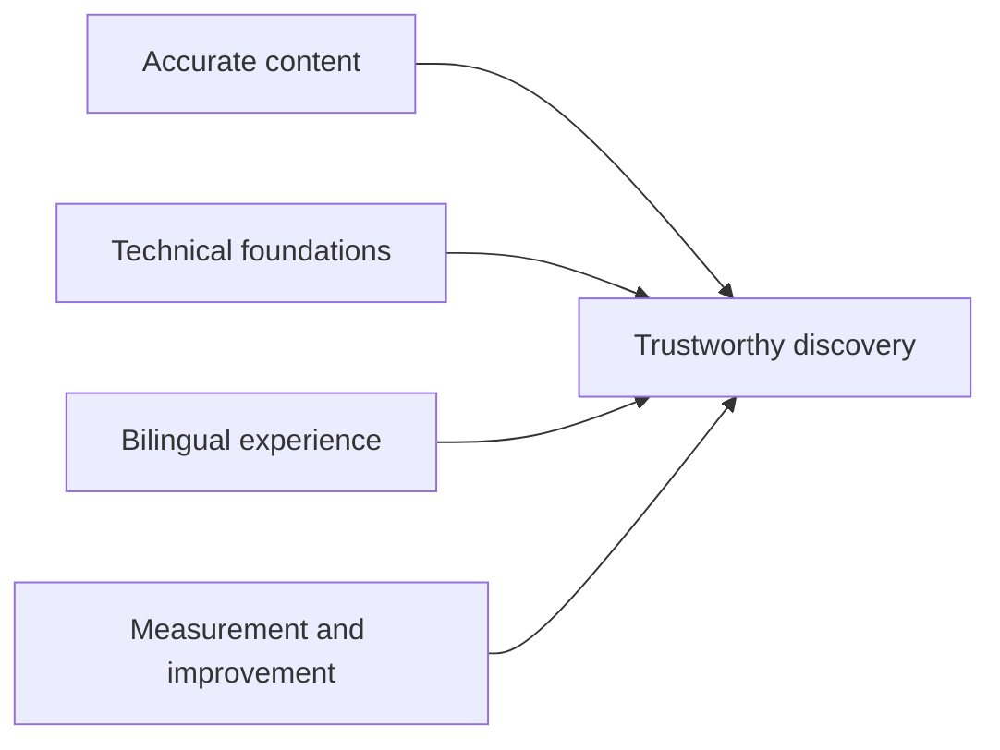

# Care Bangla — SEO & Discoverability Roadmap

> Public documentation edition · [Return to the project overview](../README.md)

## Objective

For a healthcare-services platform, discoverability must be accurate, useful, and trustworthy. Care Bangla's approach connects technical SEO with content quality, bilingual presentation, accessible media, and ongoing measurement rather than treating search ranking as a one-time checklist.

## Current direction

| Area | Product capability or intent |
|---|---|
| Metadata | Shared page metadata plus dynamic metadata for content-driven routes. |
| Canonical identity | Content-oriented URLs, history-aware redirects, and controlled recovery for changed/retired records. |
| Structured data | Organization, FAQ, article, person, service, product, and breadcrumb patterns where relevant. |
| Media | Descriptive image metadata designed to support accessible rendering and richer sharing previews. |
| Content quality | An internal workspace can surface missing or weak content fields for staff review. |
| Monitoring | Search-visibility and Core Web Vitals connections can be enabled in the protected staff environment. |
| Localization | English/Bengali copy and metadata require intentional review rather than automatic duplication. |

## Priority roadmap

### 1. Keep foundations reliable

- Maintain crawl rules, sitemap coverage, canonical URLs, robots directives, and indexability decisions.
- Keep staff-only, account-specific, cart, and transient workflow views out of search results.
- Preserve redirects when public content moves; monitor for broken internal links.

### 2. Publish helpful, accountable content

- Keep service descriptions, clinician/professional profiles, FAQs, and health articles factual, current, and audience-appropriate.
- Use descriptive headings, concise summaries, meaningful image descriptions, and clear calls to action.
- Assign ownership and review cycles for content that can affect patient or family decisions.

### 3. Strengthen technical experience

- Measure real-user and lab performance, with attention to visual stability, loading experience, interaction responsiveness, and image weight.
- Test responsive pages, accessible semantics, keyboard use, contrast, and Bengali typography.
- Treat slow or error-prone third-party integrations as resilience concerns, not just SEO concerns.

### 4. Make bilingual discovery intentional

- Review English and Bengali titles, descriptions, headings, and social previews independently.
- Introduce locale/canonical/hreflang policies only when they match the actual route and content model.
- Prefer human-reviewed Bengali for high-intent health and care-service pages.

### 5. Close the loop with measurement

| Signal | Question it helps answer |
|---|---|
| Search coverage | Are important public pages discovered and indexed as intended? |
| Queries and landing pages | Which care needs bring visitors to the site, and does the content meet them? |
| Core Web Vitals | Does the experience remain fast and stable for real users? |
| Crawl errors and redirects | Are content changes creating dead ends? |
| Content audit | Are high-value pages missing descriptions, media context, or publication quality? |
| Conversion paths | Can a visitor move from useful information to an appropriate service action? |

## What success looks like

Success is not a single ranking number. It is a stable, understandable, fast, bilingual experience where search visitors land on accurate care information, know the appropriate next action, and can reach a human-operated service path without misleading claims or broken links.

## Public-repository boundary

This roadmap does not disclose private service credentials, analytics properties, production measurements, search data, internal URLs, automation configuration, or source code. SEO implementation should always be revalidated against the active deployment.
