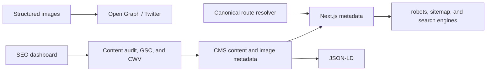

# Care Bangla — Technical SEO & Discoverability Roadmap

> Developer-facing SEO reference. [Return to the technical overview](README.md).

## Architecture overview

SEO in Care Bangla is implemented as a product/runtime concern: route metadata, canonical identity, content modeling, image normalization, structured data, crawl surfaces, and staff quality tooling have to agree.



## Implemented technical foundations

| Area | Implementation |
|---|---|
| Page metadata | Static routes export metadata; dynamic routes use server-side `generateMetadata()`. A root title template provides consistent composition. |
| Dynamic canonical URL | Product/category/blog routes query the required model/server layer before client rendering to choose canonical/noindex/redirect behavior. |
| Crawl control | `robots` and dynamic `sitemap` route support are part of the project’s discoverability foundation. Staff, cart, account, and transient work routes are not search targets. |
| URL continuity | Previous slugs + `RedirectRule` enable permanent redirect to current/replacement records; unavailable records use `noindex` and relevant listing recovery. |
| Media SEO | `ImageValue` feeds `alt`, optional title, Open Graph/Twitter imagery, and JSON-LD-safe values. |
| Structured data | Organization, service/medical procedure, article, person/physician, product, local business, breadcrumb, and FAQ patterns. |
| Loading/performance | Route `loading.js` feedback, Next image formats/configuration, and server-side metadata avoid client-only SEO decisions. |

## Metadata contract

Every public route needs a predictable contract:

```ts
// Conceptual dynamic metadata flow, not private source.
export async function generateMetadata({ params }) {
  const entity = await repository.findPublishedOrRedirect(params.slug);
  if (entity.redirect) return { robots: { index: false } };

  return {
    title: entity.seo.title ?? entity.title,
    description: entity.seo.description ?? toPlainText(entity.summary),
    alternates: { canonical: canonicalUrl(entity) },
    openGraph: { images: [imageSrc(entity.image)] },
  };
}
```

Important implementation rules:

- Metadata never receives raw `InlineText`/`ImageValue` objects; normalize to plain text/URL first.
- Server code decides redirect/not-found/noindex before interactive client components render stale content.
- Canonical output must use the same central URL builder as visible internal links.
- Public alternatives must be real, published records; do not redirect a removed record to an arbitrary unrelated page.

## JSON-LD matrix

| Route/content | Schema pattern | Required data discipline |
|---|---|---|
| Root/site identity | `Organization` | Stable name, URL, logo/contact fields from approved configuration. |
| Service detail | `Service` / relevant medical procedure pattern | Accurate scope; avoid medical claims not supported by content. |
| Blog article | `BlogPosting` / `Article` | Author, date, image, headline, canonical main entity. |
| Professional profile | `Person` / physician pattern | Published credential/profile data only. |
| Product | `Product` / offer | Current availability, pricing context, image, canonical identity. |
| Contact | `LocalBusiness` | Valid local contact/location context. |
| Deep routes | `BreadcrumbList` | Must match the actual user-visible hierarchy. |
| FAQ | `FAQPage` | Only public, visible question/answer content. |

## Content-quality audit

The protected SEO dashboard applies a content-health view to categories such as:

- page metadata completeness and title/description quality;
- public image alternative text and descriptive context;
- service/profile/product/blog field coverage;
- canonical/redirect readiness;
- structured content and publication state;
- optional Search Console and PageSpeed/Core Web Vitals history.

The audit has since been formalised into a **deterministic analyzer** that scores every record against the full industry checklist — heading hierarchy, URL form, canonical, Open Graph and Twitter inputs, structured-data prerequisites, breadcrumb parents, accessibility signals and content freshness alongside the metadata and link checks above. The same function drives the editor panel, the AI copilot's field targeting, and the projection of a proposal's effect, so a score cannot differ between surfaces. Site-wide facts such as robots.txt, mobile responsiveness, page speed and analytics are reported but explicitly not scored per record. See [SEO review](SEO_CONTENT_HEALTH.md).

The audit is a prioritization tool, not a substitute for medical/editorial review or a guarantee of search performance.

## Performance and Core Web Vitals

| Metric | Target | Primary engineering levers |
|---|---|---|
| LCP | < 2.5 s | Hero/image choice, server rendering, font strategy, network weight, caching. |
| CLS | < 0.1 | Image dimensions, stable component layout, font behavior, dynamic content reservations. |
| INP | < 200 ms | Client bundle scope, interaction complexity, list virtualization, mutation/loading UX. |

Review both lab and real-user data. A good desktop report does not prove a good Bangladesh mobile-network experience.

## Bilingual SEO policy

Runtime translation does not by itself create indexable Bengali search surfaces. Before expanding language-targeted routes, define:

1. which routes have reviewed, durable Bengali content;
2. title/description/Open Graph parity policy;
3. canonical and `hreflang` relationship rules;
4. fallback behavior when only one language version exists;
5. human review for health, price, action, and legal text.

## Roadmap

| Priority | Work |
|---|---|
| Delivered | Deterministic per-page analyzer covering the full checklist; target keyphrases with live coverage; page-introduction fallback; inline summary meter; assisted repair of individual findings. |
| Immediate | Verify robots/sitemap coverage, metadata contracts, noindex rules, redirects, structured-data validation, broken-link monitoring. |
| High | Image/alt content governance, mobile CWV budgets, real-user measurement, content ownership/review cadence. |
| Medium | Automated Lighthouse/accessibility checks in CI, route-level metadata tests, trend alerts for search/CWV regressions. |
| Ongoing | Health-content editorial calendar, language-aware keyword research, clinician/profile freshness, product availability hygiene. |

## Public boundary

Private API keys, Search Console properties, analytics data, production measurements, automation scripts, and source code are intentionally excluded. This document describes the deployed design and developer responsibilities, not public operational access.
