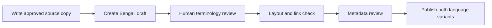

# Care Bangla — Localization Content Guide

> Public-safe editorial guide · [Return to the project overview](../README.md)

This guide explains how bilingual content should be prepared and reviewed conceptually. It is not a developer setup manual and intentionally omits private code, vendor configuration, API credentials, and deployment steps.

## A practical content workflow

1. **Start with approved source content.** Establish the factual, medically appropriate message first.
2. **Create a Bengali draft.** Use a qualified writer or reviewer for patient-facing material; automation may help prepare a draft but should not be the final authority.
3. **Review terminology and tone.** Preserve the intended meaning of care instructions, urgency, eligibility, cost context, and privacy language.
4. **Check the interface.** Confirm font rendering, mobile wrapping, buttons, dates, units, images, and links work in both languages.
5. **Review discoverability.** Keep page titles, descriptions, headings, image descriptions, and canonical content aligned with the language experience.
6. **Publish intentionally.** Do not publish an incomplete or unreviewed translation for critical care journeys merely to achieve nominal coverage.

## Editorial checklist

| Check | Why it matters |
|---|---|
| Meaning is equivalent | Medical and service information must not change meaning between languages. |
| Reading level is appropriate | Families should be able to understand actions and next steps. |
| Bengali text renders correctly | Font and line-height choices directly affect accessibility. |
| Product names are intentional | Brand names, identifiers, and medical terms may need to remain in English. |
| Links and phone actions work | A translated label must still lead to the intended destination. |
| Metadata is localized | Search and social previews should reflect the language the visitor selected. |
| Fallback is graceful | When only one version exists, the product should be clear about the available language. |

## Content patterns

### Interface text

Keep repeated interface labels concise and consistent: navigation, form actions, validation feedback, account states, and status labels should share an approved terminology set.

### Healthcare and care-service content

Prefer direct, respectful language. Avoid absolute claims, ambiguous urgency, or terms that could be interpreted as a diagnosis. Content owners should ensure that care eligibility, pricing, availability, and emergency guidance remain accurate in both languages.

### Commerce and catalog content

Preserve exact product model identifiers, quantities, technical specifications, and currency context. Translate explanatory text while avoiding misleading changes to the product's factual attributes.

## Quality ownership

Product, clinical/content, and engineering owners each have a role: product confirms audience intent; qualified reviewers approve meaning; engineering ensures the experience renders, persists preference correctly, and does not regress across routes.

## Public-repository boundary

The private application contains the implementation details and any optional translation integrations. This public guide deliberately avoids describing secrets, credentials, automation commands, or source-code locations.
