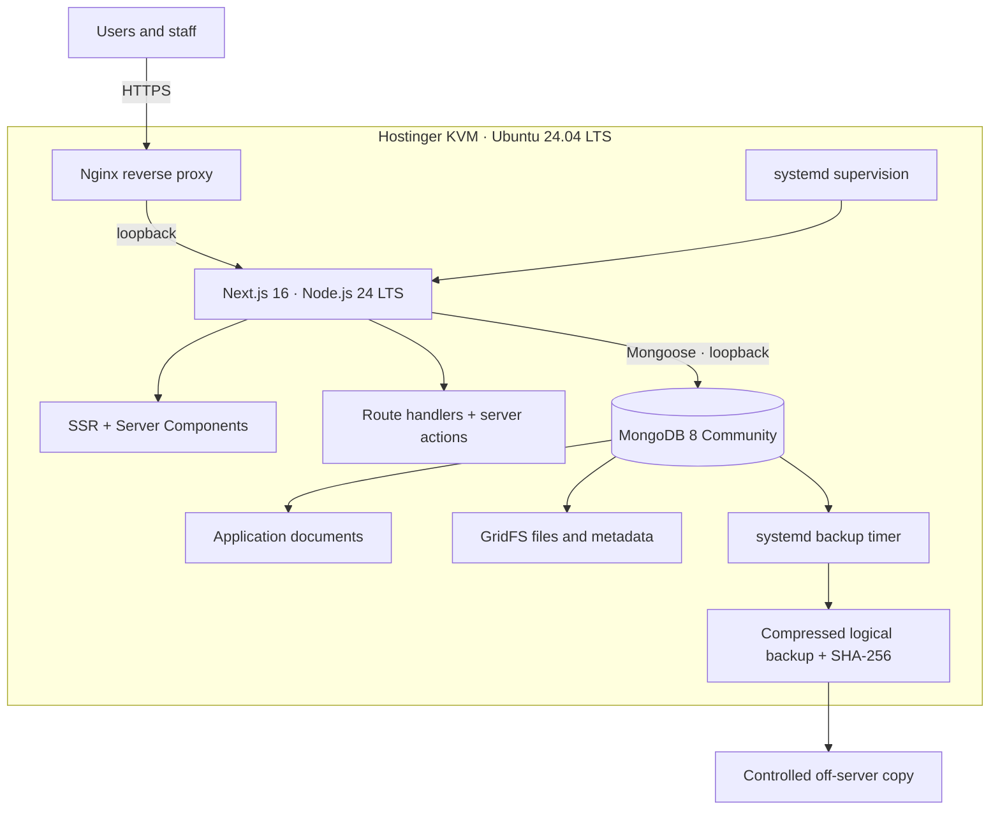
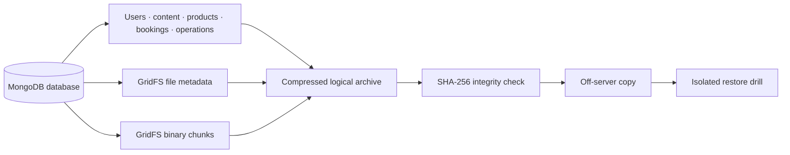

<div align="center">

# 🚀 Care Bangla VPS Deployment & Operational Observation

### Native Ubuntu · Next.js · Nginx · MongoDB architecture

[](#-verified-deployment-status)
[](#-deployed-architecture)
[](#-data-and-media-protection)
[](#-security-and-network-boundary)

**Public technical showcase · Verified 7 September 2026**

[Open the VPS staging website](https://staging.carebanglabd.tech/) · [Return to project overview](README.md)

</div>

---

> [!IMPORTANT]
> The infrastructure deployment is complete and operationally accepted for staging. The host intentionally returns `noindex, nofollow`, so this record must not be interpreted as authorization for production search indexing or as a claim of unrestricted public launch.

## 🎯 Deployment outcome

Care Bangla now operates as one self-hosted full-stack application on a Hostinger KVM VPS. The approved design replaced the former container-oriented proposal with a native Ubuntu 24.04 stack because that operating system is officially compatible with MongoDB 8 Community. This keeps the deployment compact for the initial KVM tier while preserving the application's existing Next.js, Mongoose and GridFS behavior.

| Objective | Implemented result |
|---|---|
| One application boundary | Public website, customer portal, CMS, Server Components and route handlers run in the same Next.js service. |
| Native process management | Ubuntu systemd starts, monitors and recovers the application without PM2. |
| Private database access | MongoDB accepts connections only from the VPS loopback interface. |
| Controlled public ingress | Nginx is the only application-facing listener on ports 80/443 and proxies internally to Next.js. |
| Encrypted transport | Let's Encrypt TLS is active; HTTP redirects to HTTPS and HSTS is returned. |
| Durable media continuity | GridFS remains inside the same MongoDB database model, including images, documents and protected attachments. |
| Recovery readiness | Automated logical backups, checksums, off-server copy and an isolated restore comparison have been exercised. |

## 🏗️ Deployed architecture



### Request path

```text
Browser
  → HTTPS / Nginx
  → Next.js on a private loopback port
  → Server Components, route handlers and application services
  → Mongoose
  → MongoDB 8 on a private loopback port
  → document collections + GridFS media
```

Docker and PM2 are not part of the active design. Nginx handles public ingress, systemd supervises Next.js, and MongoDB uses its official native Ubuntu service and storage conventions.

## ✅ Verified deployment status

The following results were cross-checked through a read-only SSH inspection on **7 September 2026**. Values are deliberately summarized so this public showcase does not disclose private configuration, credentials, database records or reusable deployment secrets.

| Verification area | Successful observation |
|---|---|
| Operating system | Ubuntu 24.04 LTS confirmed. |
| Application runtime | Node.js 24 LTS and the expected npm runtime are available. |
| Database runtime | MongoDB 8 Community is active. |
| Reverse proxy | Nginx is active and serving the HTTPS host. |
| Service recovery | Application, database, Nginx, intrusion protection and backup timer are enabled and active. |
| Application stability | systemd reported a healthy main process and zero application restarts at inspection time. |
| Listener isolation | Next.js and MongoDB are loopback-only; only Nginx exposes web ports. |
| English route | Homepage returned HTTP `200`. |
| Bengali route | A server-rendered Bengali page returned HTTP `200`. |
| Discoverability endpoint | Dynamic sitemap returned HTTP `200`. |
| Data endpoint | A public CMS-backed content endpoint returned HTTP `200`. |
| Certificate | Valid Let's Encrypt certificate observed for the staging hostname. |
| Browser transport policy | HSTS present; staging search exclusion present. |
| Backup scheduling | Native systemd backup timer active with its next run scheduled. |
| Capacity snapshot | Low CPU load, no swap use and substantial free memory/disk headroom at inspection time. |

> [!NOTE]
> A successful snapshot demonstrates that the declared baseline was functioning at inspection time. It is not a substitute for continuous uptime monitoring, alerting, load testing or recurring restore drills.

## 🔐 Security and network boundary

| Layer | Public exposure | Control |
|---|---:|---|
| Nginx | Yes—HTTP/HTTPS only | TLS termination, HTTPS redirect, proxy headers and staging search policy. |
| Next.js | No | Bound to loopback and reached only through Nginx. |
| MongoDB | No | Bound to loopback, authenticated application identity and least-privilege backup identity. |
| SSH administration | Restricted | Key-based deployment account; privileged work requires a separate controlled elevation step. |
| Secrets | Never public | Runtime environment and database credentials remain outside Git and this showcase. |
| CMS/customer data | Never public | No database dump, private log, attachment or operational record is included here. |

The public deployment description intentionally omits the VPS address, usernames, filesystem paths, unit contents, keys, environment values, database credentials and backup destinations. Those belong only in the controlled private runbook.

## 🗄️ Data and media protection

MongoDB stores both structured application records and the GridFS collections used by the media pipeline. A valid recovery set must therefore preserve ordinary collections **and both halves of every GridFS bucket**—file metadata and binary chunks.



The initial acceptance exercise verified a compressed archive, matching checksum, off-server transfer and isolated restore totals. This approach protects against a single-VPS failure more effectively than retaining backups only beside the live database.

## ⚙️ Release and update policy

The current operational policy is **reviewed manual deployment**. A GitHub push does not automatically modify the VPS yet.

1. Review and test the intended source change locally.
2. Commit it and identify the exact immutable Git revision.
3. Verify the VPS working tree contains no uncommitted hotfix that would be overwritten.
4. Build a separate candidate copy rather than rebuilding the live `.next` directory.
5. Activate the candidate during a short controlled switch.
6. Run local and external health checks.
7. Restore the prior release immediately if validation fails.

Database/content migration is never bundled into an ordinary frontend deployment. Any data-affecting operation requires its own fresh backup, approval, verification and rollback plan.

### Planned delivery automation

GitHub Actions–driven atomic deployment is designed as a later phase, not an active claim. Its acceptance gate requires an exact commit SHA, isolated candidate build, deployment lock, health checks, atomic release switch, retained rollback release and tightly scoped SSH/sudo permissions. A custom public webhook is unnecessary when GitHub Actions can securely provide the repository event.

## 🚦Production-readiness boundary

| Gate | Current position |
|---|---|
| Core VPS runtime | 🟢 Verified |
| HTTPS and reverse proxy | 🟢 Verified |
| Native MongoDB and GridFS continuity | 🟢 Verified |
| Reboot recovery and backup timer | 🟢 Verified |
| Off-server backup and isolated restore | 🟢 Verified |
| Public/Bengali/API smoke tests | 🟢 Verified |
| Authenticated CMS, user, mail, AI and protected-file acceptance | 🟡 Requires the formal human workflow checklist |
| VPS-only HTTPS proxy hotfix committed to source | 🟡 Required before the next source deployment |
| Search indexing enabled | 🔵 Intentionally deferred until authorized cutover |
| Continuous monitoring and alert routing | 🟡 Recommended before sustained public traffic |
| Capacity decision for normal production load | 🟡 Measure real traffic; reassess the initial KVM tier before scale-up |

## 📌 Operational conclusion

The deployment demonstrates a coherent full-stack production architecture rather than a static frontend upload: Nginx, Next.js server rendering and APIs, systemd lifecycle management, native MongoDB persistence, GridFS media, HTTPS, backup automation and recovery validation operate as one controlled system.

The remaining work is governance-focused: preserve the deployed HTTPS-aware proxy change in source control, complete authenticated business-flow acceptance, authorize the final domain/indexing state, introduce continuous monitoring, and size the VPS from measured traffic. Until those gates are signed off, the technically successful host remains a staging release by design.

---

<div align="center">

**Care Bangla Full Stack Web Application**<br>
Native VPS deployment · Verified architecture · Controlled production pathway

</div>
