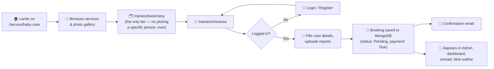
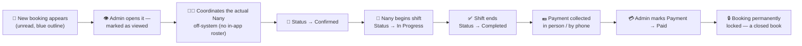
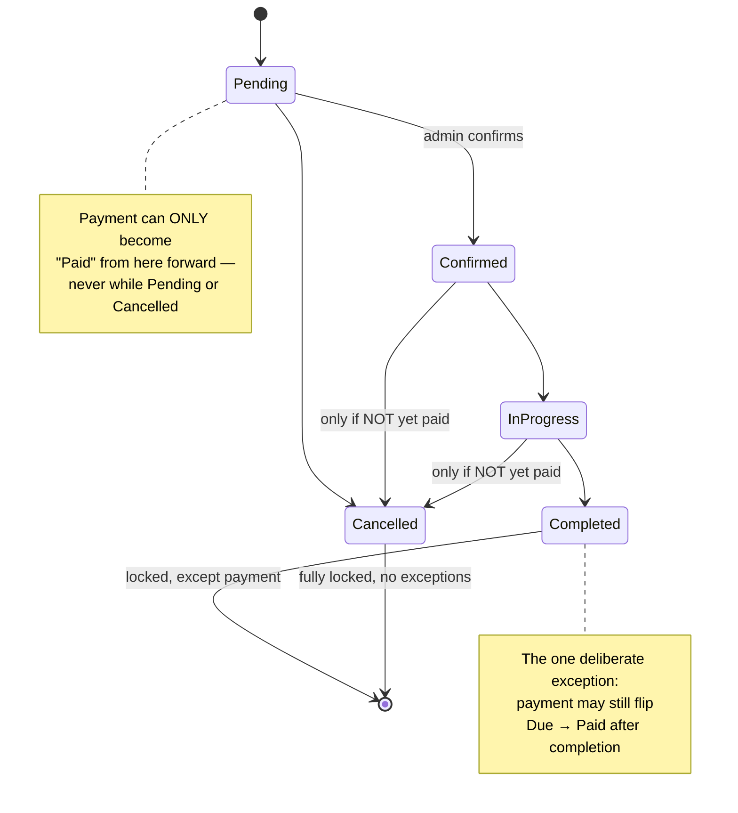
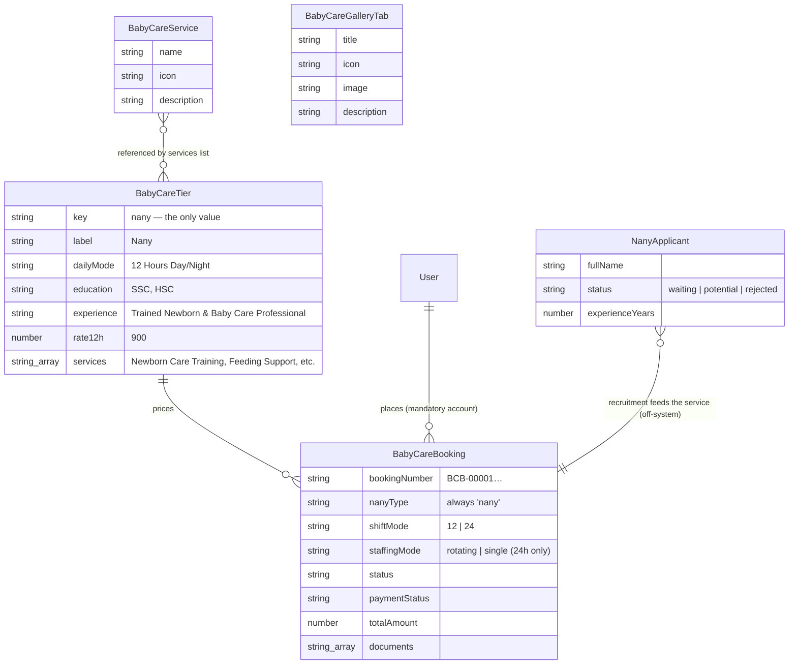
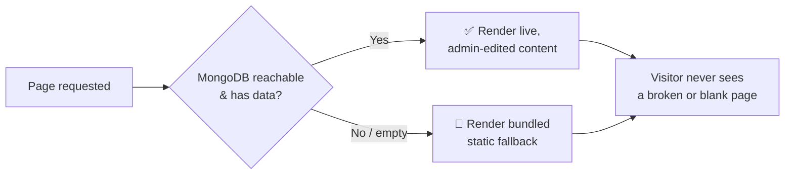

# 👶💙 Care Bangla — Baby & Newborn Care Service Workflow (Build & Module Reference)

*From a family's first click to a Nany standing at the baby's door — and everything the database, the API, and the admin panel do in between.*

  
  
  
  

---

## 📋 Development Status

This document is the **build reference for a module that already exists** — the Baby & Newborn Care service described below is live in the codebase today. It is a deliberate, fully-parallel mirror of the **Caregiver Service** (which is itself a mirror of Home Nursing Care), built so that a third service line follows the exact same proven recipe rather than a fresh invention. Where the Caregiver blueprint in [`Caregiver_Service_Workflow.md`](./Caregiver_Service_Workflow.md) was written *ahead* of its first line of code, this one documents an implemented, verified module — so it speaks in the present tense, about what the system actually does.

> 🧭 **The instruction this module followed:** build Baby & Newborn Care exactly like the Caregiver Service — same content shape, same functionality, same structure, same layout, on both the public site and the admin panel — as a **fully parallel module** with its own models, routes, and collections, sharing no code with the service lines it mirrors.

### 🔑 The Two Differences From Nursing, Stated Once Clearly

The same two deliberate differences that define the Caregiver Service define this one too — both flow from the identical design decision, and both are called out everywhere they apply below.

| # | Nursing does this | Baby & Newborn Care does **not** | Why it still fits the same architecture |
|---|---|---|---|
| 1️⃣ | Publishes a browsable roster of named nurses (`/nurses/[slug]` profile pages, a "Specialist Nurses" slider) so a family can pick *this specific person* | **No Nany roster exists anywhere — not public, and not even admin-internal.** A family can never browse or hand-pick a Nany, and there is no `BabyCareMember`/`NanyMember` model at all | Every booking is structurally the same as Nursing's existing **"Any Nurse" category booking** — there's no other path, because there's no profile to book from. Who actually attends each booking is coordinated **off-system**, by the care team directly |
| 2️⃣ | Offers **two** tiers — Junior and Diploma — each its own rate, card, and eligibility checklist | **Only one tier exists — "Nany,"** one rate, one card | The `BabyCareTier` model and the tier-editing admin UI are unchanged in *shape*; there is just exactly **one** document in the collection, and the tier-picker `Segmented` control the booking form would otherwise show simply isn't rendered — there is nothing to pick between |

Every other page, model, route, admin screen, validation rule, and design pattern below is the **same**, renamed — plus one pricing enhancement (the 24-hour staffing choice, [§Part II.1](#-1-the-pricing-engine--one-tier-one-number-plus-a-24-hour-choice)) that both this module and the Caregiver Service carry.

### 🏷️ The BabyCare / Nany Naming Split — Read This First

One naming quirk runs through the whole module and is worth internalising up front:

- **"Baby & Newborn Care"** (code prefix `BabyCare…`, `baby-care`) is the **service** — the collections, models, routes, and CMS slug.
- **"Nany"** (code prefix `Nany…`, `nany`) is the **role** — Care Bangla's term for the baby/newborn caregiver a family actually books, the applicant a person applies to become, and the booking-number-free label shown on the tier card.

So the public *booking* routes live under `/nanies/**` (the person you book), while the *service* landing page and every admin/data artifact lives under `baby-care` / `BabyCare…` (the service you're buying). Booking numbers are prefixed **`BCB-`** (Baby Care Booking). This split is intentional and consistent — analogous to how the Caregiver Service books an "Attendant."

### 🧾 The Nany Tier — Confirmed Real Content

The single `BabyCareTier` document launches with this real content (from `src/data/babyCareTiers.js`, the static-fallback source of truth):

| Field (maps to `BabyCareTier`) | Value |
|---|---|
| `label` | **Nany** |
| `dailyMode` | 12 Hours Day/Night |
| `education` | SSC, HSC |
| `experience` | Trained Newborn & Baby Care Professional |
| `rate12h` | **৳900** / 12 Hours *(→ ৳1,800 / 24 Hours, via the same `× 2` rule Nursing uses)* |

`services` checklist (the bullet list rendered on the tier card, exactly like Nursing's `NurseTier.services`):

- Newborn Care Training
- Feeding Support
- Baby Bathing
- Diaper Changing
- Sleep Routine Management
- Umbilical Cord Care
- Postnatal Mother Support
- Baby Massage
- Growth Monitoring
- Sterilizing & Hygiene

This is the seed content the CMS/DB integration writes into the single `BabyCareTier` document on first run — and exactly what the admin's bespoke Baby & Newborn Care editor on `/admin/services/baby-care` shows pre-filled, ready to edit like any other admin-managed field.

---

## 📖 Table of Contents

1. [🎯 Executive Summary](#-executive-summary)
2. [🚶 Part I — The Complete Journey](#-part-i--the-complete-journey)
3. [⚙️ Part II — How It Actually Works](#️-part-ii--how-it-actually-works)
4. [🏗️ Part III — System Structure](#️-part-iii--system-structure)
5. [🎨 Part IV — Design System & Public Experience](#-part-iv--design-system--public-experience)
6. [🚀 Part V — Future Aspects To Be Upgraded](#-part-v--future-aspects-to-be-upgraded)
7. [⚖️ Part VI — Pros & Cons, Honestly](#️-part-vi--pros--cons-honestly)
8. [🏁 Closing Word](#-closing-word)

---

## 🎯 Executive Summary

Care Bangla's **Baby & Newborn Care** module lets a family in Bangladesh book a trained home **Nany** — one tier, 12 or 24-hour shifts, ৳900/12h — directly from the website, with **zero payment collected at booking time**, identically to how Home Nursing Care and the Caregiver Service already work. The admin team coordinates the actual Nany off-system, the shift happens, and payment is only marked **Paid** once money has actually changed hands.

Because it's built as a deliberate mirror of two already-proven modules, it inherits every piece of engineering they already earned:

> 🟪 The same **pricing engine** — a single tier as the one source of truth, plus a 24-hour staffing choice that can shave 15% off.
> 🟪 The same **cross-validated status/payment state machine** that makes an invalid combination *structurally impossible to create*.
> 🟪 The same **DB-first, static-fallback architecture**, so the public page never shows a blank screen even if MongoDB hiccups.
> 🟪 The same **fully admin-editable public experience** — banner, tier card, photo gallery, service catalogue — with **zero code deploys** required to change any of it.
> 🟪 The same **server-authoritative pricing** — `dailyRate`/`totalAmount` are never trusted from the client; the server always recomputes them from the DB-first tier.
> 🟪 And the deliberate simplifications running through all of it: **no roster (public or internal), no profile pages, one tier, one base price.**

This document walks through the process, the mechanics, the data, the design, what's future work, and an honest read of the tradeoffs — for the module as it stands live today.

---

## 🚶 Part I — The Complete Journey

### 🧑‍🍼 The Family's Path

**Nothing is charged here** — same pay-after-service model as Nursing and Caregiver. There is **no fork** in this journey: Nursing's customer path branches on "do you know which nurse you want?"; the Baby Care path never branches, because there's no roster to know a name from. Every booking takes the single path Nursing calls its "category booking" — the care team decides who actually goes, always.

The one *added* decision, and only when a family chooses a 24-hour shift, is the **24-hour staffing choice** — two rotating Nanies at the standard rate, or one continuous Nany at a 15% discount (see Part II). For a 12-hour booking there's only ever one shift, so this question never appears.

### 🛠️ The Admin's Path

This is **identical** to Nursing's admin path, field for field — with one simplification: there is no in-app assignment step, because no Nany roster exists in the system at all. The admin moves the booking through the exact same lifecycle; *who* attends is arranged off-system. Every arrow above is enforced by the same real validation as Nursing — see Part II. All three service lines' bookings are managed from **one unified console** (`/admin/bookings`), a Nursing / Caregiver / Baby Care table stack — see Part III.

---

## ⚙️ Part II — How It Actually Works

### 💰 1. The Pricing Engine — one tier, one number, plus a 24-hour choice

Every price on the page traces back to exactly **one number**: `BabyCareTier.rate12h`, on the single seeded `BabyCareTier` document — **৳900** for the Nany tier's 12-hour rate (see "The Nany Tier — Confirmed Real Content" above).

| Input | Formula | Lives in |
|---|---|---|
| Shift mode | 12h → `rate12h` · 24h → `rate12h × 2` (round-the-clock coverage) | `computeBabyCareBookingPricing()` — a direct port of `computeCaregiverBookingPricing()` |
| 24-hour staffing | **Two Nanies (rotating)** → standard 24h rate · **Same Nany (single)** → `24h rate × 0.85` (15% off) | same function, `staffingMode` argument |
| Day count | `dayCountBetween(startDate, endDate)` — the exact same inclusive day math, duplicated so this module depends on no other service's file | `src/data/babyCareTiers.js` |
| Total | `dailyRate × dayCount` | snapshotted onto the `BabyCareBooking` document at creation |

At ৳900/12h that resolves to: **৳900/day** (12h), **৳1,800/day** (24h, two rotating Nanies), or **৳1,530/day** (24h, one continuous Nany — 15% off).

> 🍼 **The 24-hour staffing choice — the one enhancement beyond a pure mirror.** A 24-hour day is normally covered by two different Nanies in rotating shifts (hence the flat `× 2`). A family comfortable with a *single* Nany covering the full 24 hours instead gets a 15% discount off that rate — one person, one continuous engagement, versus coordinating two. `staffingMode` (`'rotating'` | `'single'`) is captured on the booking, but **only ever matters when `shiftMode === '24'`**: for a 12-hour booking it's always normalized to `'rotating'`, so a stray discount flag can never ride along on a shift that has only one slot. The Caregiver Service carries the exact same choice, applied to its Attendant tier.

> 💡 **Same snapshot discipline as Nursing.** If an admin later edits the Nany rate, every *already-placed* booking keeps showing the price the family actually agreed to. `BabyCareBooking.dailyRate` / `totalAmount` are stored values, never live-computed — and never accepted from the client, since with one tier and no reassignment path the server always derives the authoritative figure itself.

> 🎛️ **The one UI simplification:** Nursing's booking form shows a `Segmented` control to choose Junior vs. Diploma. The Baby Care booking form has nothing to segment — the tier is fixed before the page even renders, so that control is simply omitted. One less decision for the family to make, because there genuinely is only one.

### 🔒 2. Scheduling — its own collection, on purpose

`BabyCareBooking` is its own collection, entirely independent of `Booking` (Nursing) and `CaregiverBooking`. A Nany, a caregiver, and a nurse are different people with independent schedules, so the service lines' records must never entangle. Because there is no in-app Nany roster, there is no per-individual availability/conflict check to run (there's no named person to double-book); the isolation is what keeps each service line's booking history clean and independently correct.

> **Deliberately its own collection.** Two small, clean, independently-correct data stores beat one large, ambiguous one — the same reasoning that gives Caregiver its own `CaregiverBooking` collection.

### 🚦 3. The Status ⇄ Payment Rule Engine — reused wholesale

This is the single most valuable piece of Nursing's engineering, reused **exactly**, because the business rule it encodes ("pay after service, and never let the paperwork contradict itself") applies to every Care Bangla service equally.

**The three governing rules — identical to Nursing, in plain English:**

| # | Rule | Why |
|---|---|---|
| 1️⃣ | Payment can only become **Paid** while status is Confirmed, In-Progress, or Completed | Nothing's been delivered yet if it's Pending; nothing to charge for if Cancelled |
| 2️⃣ | Once payment is **Paid**, status can *never* move back to Pending or Cancelled | A paid service was, by definition, delivered |
| 3️⃣ | A **Completed** booking is locked for everything *except* payment | Payment is often collected days after the shift ends |

Same three layers of defense as Nursing: the Status/Payment dropdown options themselves filtered → a `disabled` state as a second guard → the API route (`PUT /api/admin/baby-care/bookings/[id]`) as the final, authoritative judge.

### 🔐 4. Immutability — built in from day one

`BabyCareBooking` has **no `DELETE` route anywhere**, from its very first commit. A booking that shouldn't proceed is cancelled via `status`, never erased — a family's full baby-care history, successful or not, is permanent for as long as their account exists, exactly like every other service line on the site. `bookingNumber` and `customer.name` are schema-level `immutable`; the booking's date range is fixed at creation (rebooking means placing a new booking).

### 📁 5. Document Handling

Prescriptions, growth charts, and care notes ride along at checkout (or get added later by an admin) straight into **MongoDB GridFS**, the same binary store every other module uses. `BabyCareBooking.documents` only ever *grows* by appending (see `POST .../bookings/[id]/documents`).

---

## 🏗️ Part III — System Structure

### 🗄️ The Data Model Family

> Notice this is the **same shape** as Caregiver's ERD, minus one entity: there is **no `BabyCareMember`/`NanyMember`** roster model at all (the real built shape — Caregiver's own blueprint planned an internal roster, but neither built module keeps one). `NurseTier`→`BabyCareTier`, `Booking`→`BabyCareBooking`, `NursingService`→`BabyCareService`, `NursingGalleryTab`→`BabyCareGalleryTab`, `NurseApplicant`→`NanyApplicant`. `BabyCareTier` only ever holds one row.

### 🧩 Module Map

| Layer | Path | Purpose | Caregiver equivalent |
|---|---|---|---|
| 🌍 **Public discovery** | `src/app/service/[serviceId]/page.js` → `src/views/Service/ServiceDetailsBabyCare.jsx` | The `/service/baby-care` landing page: banner, intro, tier card, alternating preview rows, services grid — **no Nany roster slider** | `/service/caregiver-service` |
| 🧭 **Public booking** | `src/app/nanies/book/[nanyType]` (`?nanyType=nany`), `src/app/nanies/checkout` | Category booking only — **no `/nanies/nany-details/[id]` route exists at all** | `src/app/caregivers/book/[caregiverType]`, `.../checkout` |
| 📣 **Recruitment** | `src/app/nanies/apply-as-nany` → unified `/admin/applicants` (Nany tab) | Public "Apply As a Nany" form → shared admin review pipeline | `.../apply-as-caregiver` + `/admin/applicants` |
| 🔌 **Public API** | `src/app/api/baby-care-bookings` | Creates bookings (session-gated), recomputes price server-side, serves the single tier — **no public roster endpoint** | `src/app/api/caregiver-bookings` |
| 🔐 **Admin bookings** | Unified **`/admin/bookings`** (Nursing + Caregiver + Baby Care tables on one page) + `src/app/api/admin/baby-care/bookings/*` | Full booking console — status/payment engine, document uploads, the two-step **"Add Booking" → `UserPickerModal` → booking form** flow with the 24-hour staffing selector | Caregiver section of the same unified console |
| 🔐 **Admin CMS** | Bespoke editor at **`/admin/services/baby-care`** (`/admin/content/baby-care` redirects here) — one tier-card editor | Every editable word, structured image, preview-row heading, and tier/service value on the public page | `/admin/services/caregiver-service` |
| 🔌 **Admin CMS API** | `src/app/api/admin/baby-care-tiers/*`, `.../baby-care-services/*`, `.../baby-care-gallery/*` | CRUD for the tier, services catalogue, and preview rows (the API keeps its legacy `gallery` route name) | `.../caregiver-tiers`, `.../caregiver-services`, `.../caregiver-gallery` |
| 🗃️ **Models** | `BabyCareBooking.js`, `BabyCareTier.js`, `BabyCareService.js`, `BabyCareGalleryTab.js`, `NanyApplicant.js` | The schema layer (no member/roster model) | `CaregiverBooking.js`, `CaregiverTier.js`, `CaregiverService.js`, `CaregiverGalleryTab.js`, `CaregiverApplicant.js` |
| 🛟 **Static fallback** | `src/data/babyCareTiers.js`, `babyCareServices.js`, `babyCareGalleryTabs.js` | Bundled content the public page falls back to if the DB is empty/unreachable | `caregiverTiers.js`, `caregiverServices.js`, `caregiverGalleryTabs.js` |
| 📦 **Media** | `src/lib/gridfs.js`, `/api/media/[id]/[[...seo]]` | Shared binary storage plus alt/title/file-name image metadata | Shared site-wide |

> 🔀 **Legacy route note:** `/admin/baby-care/bookings` still exists but only as a **redirect** to the unified `/admin/bookings` console — the same treatment `/admin/caregivers/bookings` and `/admin/nurses/bookings` get, so old bookmarks keep working after the three separate booking pages were consolidated into one "several tables, one page" module (mirroring the Applicants console).

### 🛡️ The DB-First, Static-Fallback Philosophy — unchanged

Every piece of content on `/service/baby-care` — banner, tier card, preview rows, and services grid — follows this exact defensive pattern, backed by static-fallback files (`babyCareTiers.js`, `babyCareServices.js`, `babyCareGalleryTabs.js`) that mirror Caregiver's and Nursing's one-for-one. Server → Client boundary crossings go through `toPlainBabyCareTier()`, the twin of `toPlainCaregiverTier()`.

---

## 🎨 Part IV — Design System & Public Experience

The `/service/baby-care` page, top to bottom — **admin-editable, DB-backed, identical to Nursing's page minus one row:**

| # | Section | Component | What Makes It Nice |
|---|---|---|---|
| 1 | 🖼️ **Page banner** | `PageBreadcrumb` | Same full-bleed photo, dark overlay, auto-generated breadcrumb — the exact shared component every service page uses, zero changes needed |
| 2 | 📣 **Intro** | `SectionHeading` | Admin-editable headline + description |
| 3 | 💳 **Tier Card** | `TierCard` | **One card, not two** — the Nany card sits immediately below the intro and links straight into category booking |
| 4 | 🖼️ **Service Preview** | `ServicePreviewGallery` | Alternating image/text rows with a blue eyebrow and custom heading; mobile copy uses expand/collapse, with no slider controls or gestures |
| 5 | 🍼 **Services & Solutions** | icon grid | The admin-managed "Baby Care Services Provided" catalogue |
| ~~6~~ | ~~👤 Nany slider~~ | ~~`MedicalTeamSection`~~ | **Deliberately absent** — this is difference #1. No roster, no faces, no names, on the public site, ever |
| 6 | 🧰 **Core Services** | `Service` (photo-card grid) | Same shared component as every other service page — real photo + floating circular "go" button, DB-backed |
| 7 | 📣 **Recruitment CTA** | — | "Join Our Baby Care Team" → `/nanies/apply-as-nany` |

The public booking card (`BabyCareBookingCard`) reuses Nursing's `cs_nurse_*` styling wholesale for visual consistency, and reveals the **24-Hour Staffing** toggle (Two Nanies vs. Same Nany −15%) only once a 24-hour shift is selected. Narrative CMS values support safe inline links and service images support per-image alt/title/SEO file-name metadata; the compatibility contract is documented in [FEATURES_AND_CONTENT_ARCHITECTURE.md](FEATURES_AND_CONTENT_ARCHITECTURE.md).

---

## 🚀 Part V — Future Aspects To Be Upgraded

Since this module is a direct mirror, its future roadmap mirrors Nursing's and Caregiver's too — the same upgrades would benefit all three, likely built once and shared where the underlying engine allows it.

| Priority | Upgrade | Impact | Notes |
|---|---|---|---|
| 🔴 High | **Online payment gateway** (bKash/Nagad/card) | Removes manual "mark as Paid" step entirely | Same deliberate pay-after-service model as Nursing today |
| 🔴 High | **Nany-side mobile app / portal** | Nanies see their own schedule, mark shift start/end themselves | Today only admins move a booking through its lifecycle |
| 🟠 Medium | **SMS notifications** | Confirmations reach families without email | Shared need with the other service lines — likely one shared notification service eventually |
| 🟠 Medium | **Automated review request** post-completion | Builds a trust/ratings layer | No review system exists for any service yet |
| 🟠 Medium | **Recurring / subscription bookings** | "Every day this month" instead of one-off date ranges | `BabyCareBooking` models one fixed date range only, same as `Booking` |
| 🟡 Nice-to-have | **A shared `Booking` abstraction** | One status/payment engine, parameterised by service type, instead of three structurally-identical copies | Worth revisiting now that three parallel modules exist and the duplication is real, not hypothetical |
| 🟡 Nice-to-have | **Granular admin roles** (dispatcher vs. finance vs. super-admin) | Safer multi-person admin teams | Currently a single flat admin role, site-wide |
| 🟢 Polish | **Admin analytics dashboard** across all service lines | Business visibility | Data already lands in `Booking`, `CaregiverBooking`, and `BabyCareBooking` — just needs aggregation views |
| 🟢 Polish | **Automated test suite** for the shared status/payment rule engine | Protects every module's "crown jewel" logic from regressions at once | Currently verified via manual/live curl smoke-testing |

---

## ⚖️ Part VI — Pros & Cons, Honestly

### ✅ What This Design Gets Right

- 🛡️ **Defense-in-depth validation inherited, not reinvented** — the option-list, disabled-state, and API-level guards all carry over proven, not re-designed from scratch.
- 🧩 **Consistent architectural pattern** across every module — Baby Care is the third service line to follow the exact same recipe, and a fourth would too.
- 💾 **Price snapshotting** protects historical bookings from retroactive rate changes, from the first booking ever placed.
- 🔐 **Server-authoritative pricing** — with one tier and no reassignment, the server always recomputes `dailyRate`/`totalAmount` itself; a tampered client total is impossible to persist.
- 🎛️ **Deep admin control with zero deploys**, matching Nursing's editable banner/gallery/tier/catalogue experience exactly, now managed from one unified bookings console.
- 🔒 **Immutable booking history from day one** — no "add it now, remove the delete button later" gap.
- 🙈 **Privacy by design** — no roster anywhere means no accidental exposure of Nany identities, schedules, or contact details through a browsable page that was never meant to exist.
- 💸 **A genuine pricing option families value** — the 24-hour same-Nany discount rewards continuity of care with a real saving, without complicating the 12-hour path at all.

### ⚠️ What's Worth Being Honest About

- 💳 **No payment gateway** — same manual "Paid" toggle as Nursing, by the same deliberate business-model choice.
- 🧑‍🍼 **No roster is also a marketing tradeoff** — families can't build trust in a *specific* Nany's credentials the way Nursing's slider lets them browse real nurse profiles before booking. That trust has to come from Care Bangla's brand and the coordination team's phone/WhatsApp conversation instead.
- 📐 **One tier means one base price point** — no "budget vs. premium" Nany the way Junior/Diploma nursing offers. If Care Bangla later wants tiered Nany pricing, the `BabyCareTier` collection already supports adding a second document — the model was never the limitation, only the initial seed data.
- 🧪 **No automated test suite yet** — same honest gap as the other modules; the rule engine and both staffing modes were verified by manual end-to-end smoke-testing during development.
- 👤 **Single admin role** — same as every other module; no separation of duties yet.
- 🗄️ **The same Mongoose dev-server caching quirk** the other modules documented applies here too — a fresh schema field (e.g. `staffingMode` when it was added) needs a dev-server restart or a direct-driver backfill script to take effect for writes.

---

## 🏁 Closing Word

This document exists so the Baby & Newborn Care module has a **shared, written-down shape** to match the Caregiver and Nursing references it stands beside. Baby Care is, on purpose, not a new invention: it's the Caregiver Service's proven engine, wearing a different name, with its own collections, its roster deliberately switched off entirely, and its tier count deliberately reduced to one — plus a genuine 24-hour same-Nany discount that rewards continuity of care.

The two differences from Nursing are small on paper and real in effect — no browsing, no picking favourites, one simple price — but they sit on top of exactly the same rigorous state machine, the same immutable records, the same admin-editable public experience that already earns its keep everywhere else on the site.

<b>👶 Built for families welcoming a newborn, on the foundation that already works. 💙</b>

