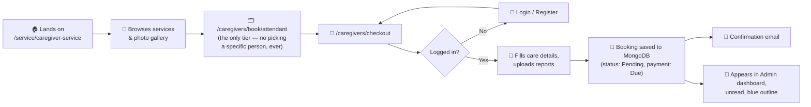
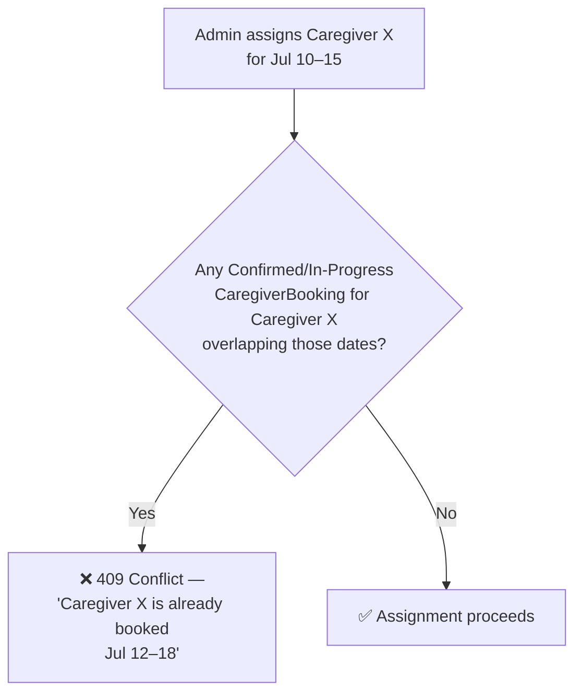
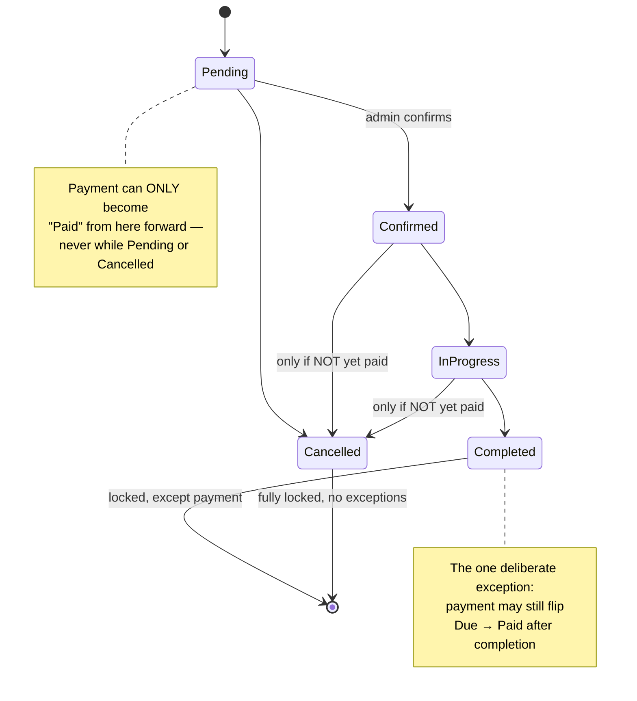
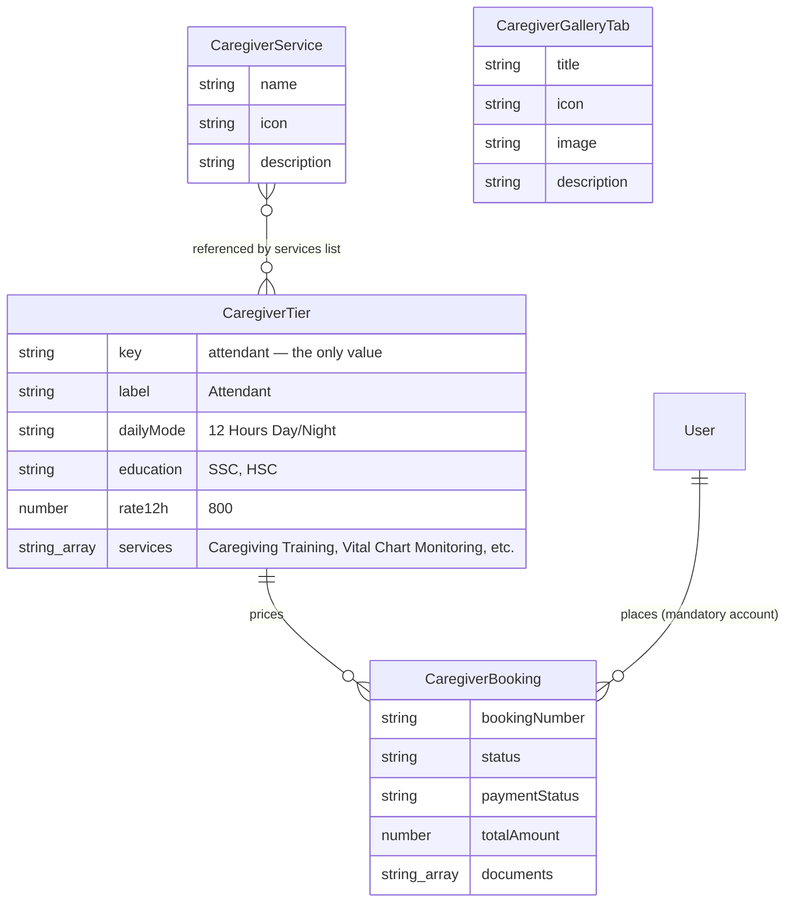
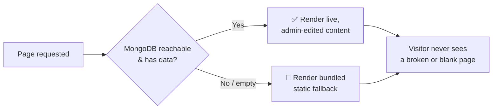

# 🧑‍🤝‍🧑💙 Care Bangla — Caregiver Service Workflow (Implemented Module Reference)

*From a visitor's first click to a caregiver standing at the patient's door — and everything the database, API, user history, and admin panel do in between.*

  
  
  
  

---

## 📋 Development Status

The Caregiver Service module is **implemented**. This document began as a pre-build blueprint, so some narrative sections retain future-tense design rationale; the status, module map, public section order, shared preview component, and persistence notes below have been refreshed against the August 2026 codebase. [`Nursing_Service_Workflow.md`](./Nursing_Service_Workflow.md) remains the closest operational reference.

> 🧭 **The instruction this document follows:** build the Caregiver Service exactly like the Home Nursing Care service — same content shape, same functionality, same structure, same layout, on both the public site and the admin panel — with exactly **two** deliberate differences, called out everywhere they apply below.

### 🔑 The Two Differences, Stated Once Clearly

| # | Nursing does this | Caregiver does **not** | Why it still fits the same architecture |
|---|---|---|---|
| 1️⃣ | Publishes a browsable roster of named nurses and allows a family to choose a specific nurse | **No caregiver roster model, public profile pages, or public roster slider.** A family books the Attendant category, not a named employee | The booking is intentionally category-based. Assignment is an admin operational decision and is not exposed as a public catalogue |
| 2️⃣ | Offers **two** tiers — Junior and Diploma — each its own rate, card, and eligibility checklist | **Only one tier exists — "Attendant,"** one rate, one card | The `CaregiverTier` model and the tier-editing admin UI are unchanged in *shape*; there is just exactly **one** document in the collection instead of two, and the tier-picker `Segmented` control the booking form would otherwise show simply isn't rendered — there is nothing to pick between |

Every other page, model, route, admin screen, validation rule, and design pattern below is the **same**, renamed.

### 🧾 The Attendant Tier — Confirmed Real Content

The client shared the actual pricing-card content the Attendant tier should launch with, so it's captured here verbatim rather than left as a placeholder:

| Field (maps to `CaregiverTier`) | Value |
|---|---|
| `label` | **Attendant** |
| `dailyMode` | 12 Hours Day/Night |
| `education` | SSC, HSC |
| `rate12h` | **৳800** / 12 Hours *(→ ৳1,600 / 24 Hours, via the same `× 2` rule Nursing uses)* |

`services` checklist (the bullet list rendered on the tier card, exactly like Nursing's `NurseTier.services`):

- Caregiving Training
- Vital Chart Monitoring
- Personal Care
- Physiotherapy Care
- Patient's Hygienic Care
- Diaper Changing
- Hospital Attendance
- Patient Showering
- Surgical Dressing
- Oral Care

This is the seed content `/api/admin/seed-all` (or a dedicated Caregiver seed step) will write into the single `CaregiverTier` document on first run — and exactly what the admin's `TierCardEditor` on `/admin/content/caregiver-service` will show pre-filled, ready to edit like any other admin-managed field.

---

## 📖 Table of Contents

1. [🎯 Executive Summary](#-executive-summary)
2. [🚶 Part I — The Complete Journey](#-part-i--the-complete-journey)
3. [⚙️ Part II — How It Works](#️-part-ii--how-it-works)
4. [🏗️ Part III — Implemented System Structure](#️-part-iii--implemented-system-structure)
5. [🎨 Part IV — Design System & Public Experience](#-part-iv--design-system--public-experience)
6. [🚀 Part V — Future Aspects To Be Upgraded](#-part-v--future-aspects-to-be-upgraded)
7. [⚖️ Part VI — Pros & Cons, Honestly](#️-part-vi--pros--cons-honestly)
8. [🏁 Closing Word](#-closing-word)

---

## 🎯 Executive Summary

Care Bangla's **Caregiver Service** module will let a family in Bangladesh book a trained home **Attendant** — one tier, 12 or 24-hour shifts, ৳800/12h — directly from the website, with **zero payment collected at booking time**, identically to how Home Nursing Care already works today. The admin team assigns an internal caregiver, the shift happens, and payment is only marked **Paid** once money has actually changed hands.

Because it's built as a deliberate mirror of an already-proven module, it inherits every piece of engineering that module already earned:

> 🟪 The same **pricing engine** — just with a single tier as the one source of truth instead of two.
> 🟪 The same **conflict-checking engine** — scoped to its own `CaregiverBooking` collection, so a caregiver's schedule is never confused with a nurse's.
> 🟪 The same **cross-validated status/payment state machine** that makes an invalid combination *structurally impossible to create*.
> 🟪 The same **DB-first, static-fallback architecture**, so the public page never shows a blank screen even if MongoDB hiccups.
> 🟪 The same **fully admin-editable public experience** — banner, tier card, photo gallery, service catalogue — with **zero code deploys** required to change any of it.
> 🟪 And the one deliberate simplification running through all of it: **no public roster, no profile pages, one tier, one price.**

This document walks through the process, the mechanics, the data, the design, what's future work, and an honest read of the tradeoffs — all *before* the first file is written.

---

## 🚶 Part I — The Complete Journey

### 🧑‍🦰 The Customer's Path

**Nothing is charged here** — same pay-after-service model as Nursing. The one structural simplification: there is **no fork** in this journey. Nursing's customer path branches on "do you know which nurse you want?"; Caregiver's never branches at all, because there's no roster to know a name from. Every booking takes the same single path Nursing calls its "category booking" — the admin decides who actually goes, always.

### 🛠️ The Admin's Path

```mermaid
flowchart LR
    A["🔔 New booking appears\n(unread, blue outline)"] --> B["👁️ Admin opens it —\nmarked as viewed"]
    B --> C["🧑‍🤝‍🧑 Coordinates the attending\ncaregiver off-system"]
    C --> D["📌 Status → Confirmed"]
    D --> E["🚗 Caregiver begins shift\nStatus → In Progress"]
    E --> F["✅ Shift ends\nStatus → Completed"]
    F --> G["💵 Payment collected\nin person / by phone"]
    G --> H["💳 Admin marks Payment → Paid"]
    H --> I["🔒 Booking permanently\nlocked — a closed book"]
```

The status and payment lifecycle mirrors Nursing, but named-person assignment does not: there is no `CaregiverMember` collection or assignment field. The admin coordinates the attending caregiver operationally while the application records the booked Attendant tier, customer, schedule, pricing snapshot, documents, source, status, and payment state.

---

## ⚙️ Part II — How It Works

### 💰 1. The Pricing Engine — one tier, one number

Every price on the page will trace back to exactly **one number**: `CaregiverTier.rate12h`, on the single seeded `CaregiverTier` document — confirmed at **৳800** for the Attendant tier's 12-hour rate (see "The Attendant Tier — Confirmed Real Content" above).

| Input | Formula | Lives in |
|---|---|---|
| Shift mode | 12h → `rate12h` · 24h → `rate12h × 2` (a second caregiver rotates in) | `computeCaregiverBookingPricing()` — a direct port of `computeNurseBookingPricing()` |
| Day count | `dayCountBetween(startDate, endDate)` — the exact same inclusive day math, reused as-is | `src/data/caregiverTiers.js` |
| Total | `dailyRate × dayCount` | snapshotted onto the `CaregiverBooking` document at creation |

> 💡 **Same snapshot discipline as Nursing.** If an admin later edits the caregiver rate, every *already-placed* booking keeps showing the price the family actually agreed to. `CaregiverBooking.dailyRate` / `totalAmount` are stored values, never live-computed.

> 🎛️ **The one UI simplification:** Nursing's booking form shows a `Segmented` control to choose Junior vs. Diploma. Caregiver's booking form has nothing to segment — the tier is fixed before the page even renders, so that control is simply omitted rather than shown disabled or pre-selected. One less decision for the family to make, because there genuinely is only one.

### 🔒 2. The Conflict-Checking Engine — its own scope, on purpose

Before a caregiver is internally assigned, `findOverlappingLockedCaregiverBooking()` — a direct structural twin of `findOverlappingLockedBooking()` — will check whether that specific caregiver already has a **Confirmed** or **In-Progress** `CaregiverBooking` whose dates overlap.

**Deliberately its own collection, its own check.** A `CaregiverBooking` conflict check must never look at `Booking` (Nursing) rows and vice versa — a nurse and a caregiver are different people with independent schedules, so entangling the two conflict engines would risk a caregiver being falsely blocked (or falsely allowed) based on someone else's booking in an unrelated service line. Two small, clean, independently-correct engines beat one large, ambiguous one.

### 🚦 3. The Status ⇄ Payment Rule Engine — reused wholesale

This is the single most valuable piece of Nursing's engineering, and it will be reused **exactly**, because the business rule it encodes ("pay after service, and never let the paperwork contradict itself") applies to every Care Bangla service equally, not just nursing.

**The three governing rules — identical to Nursing, in plain English:**

| # | Rule | Why |
|---|---|---|
| 1️⃣ | Payment can only become **Paid** while status is Confirmed, In-Progress, or Completed | Nothing's been delivered yet if it's Pending; nothing to charge for if Cancelled |
| 2️⃣ | Once payment is **Paid**, status can *never* move back to Pending or Cancelled | A paid service was, by definition, delivered |
| 3️⃣ | A **Completed** booking is locked for everything *except* payment | Payment is often collected days after the shift ends |

Same three layers of defense as Nursing: the Status/Payment dropdown options themselves filtered → a `disabled` state as a second guard → the API route as the final, authoritative judge.

### 🔐 4. Immutability — built in from day one, not bolted on later

Nursing's booking records only became genuinely immutable after a later upgrade this session (the old "delete a completed/cancelled booking" admin action was removed). Caregiver Service starts with that lesson already learned: **`CaregiverBooking` will have no `DELETE` route anywhere, from the very first commit.** A booking that shouldn't proceed is cancelled via `status`, never erased — a client's full caregiver-service history, successful or not, is permanent for as long as their account exists, exactly like every other service line on the site by now.

### 📁 5. Document Handling

Prescriptions and care notes will ride along at checkout (or get added later by an admin) straight into **MongoDB GridFS**, the same binary store every other module already uses. `CaregiverBooking.documents` only ever *grows* by appending.

---

## 🏗️ Part III — Implemented System Structure

### 🗄️ The Data Model Family

> The built module deliberately has no caregiver roster entity. `CaregiverApplicant` is a separate recruitment record and does not automatically become an assignable member. This is the main persistence difference from the roster-backed Nursing module.

### 🧩 Implemented Module Map

| Layer | Path | Purpose | Nursing equivalent |
|---|---|---|---|
| 🌍 **Public discovery** | `src/app/service/[serviceId]/page.js` → `src/views/Service/ServiceDetailsCaregiverService.jsx` | The `/service/caregiver-service` landing page: banner, intro, tier card, alternating preview rows, and services grid — **no caregiver roster slider** | `ServiceDetailsNursingCare.jsx` |
| 🧭 **Public booking** | `src/app/caregivers/book/[caregiverType]`, `src/app/caregivers/checkout` | Category booking only — **no `/caregivers/caregiver-details/[id]` route exists at all** | `src/app/nurses/book/[nurseType]`, `.../nurse-details/[nurseId]`, `.../checkout` |
| 📣 **Recruitment** | `src/app/caregivers/apply-as-caregiver` + `/admin/applicants` (Caregiver table) | Public "Apply to Become a Caregiver" form → unified service-aware admin review pipeline; details open at `/admin/applicants/caregiver/[id]` | `.../apply-as-nurse` + `/admin/applicants/nursing/[id]` |
| 🔌 **Public API** | `src/app/api/caregiver-bookings` | Creates and returns authenticated caregiver bookings with server-authoritative pricing — **no public roster-listing endpoint** | `src/app/api/bookings`, `src/app/api/nurses/*` |
| 🔐 **Admin bookings** | `src/app/admin/caregivers/bookings/page.js` + `src/app/api/admin/caregivers/bookings/*` | Full booking console — status/payment engine, document uploads, and the same two-step **"Add Booking" → `UserPickerModal` → booking form** flow Nursing now uses | `src/app/admin/nurses/bookings/page.js` |
| 🔐 **Admin CMS** | `/admin/services/caregiver-service` → `CaregiverServiceCms.jsx`; the old `/admin/content/caregiver-service` route redirects here | Banner, intro, tier, preview rows, services catalogue, and CTA content | `/admin/services/nursing-care` |
| 🗃️ **Models** | `CaregiverBooking.js`, `CaregiverTier.js`, `CaregiverService.js`, `CaregiverGalleryTab.js`, `CaregiverApplicant.js`, plus `PageContent('caregiver-service')` | The schema layer; there is deliberately no `CaregiverMember` model | Nursing's roster-backed family |
| 📦 **Media** | `src/lib/gridfs.js`, `/api/media/[id]/[[...seo]]` | Shared binary storage plus structured image metadata and SEO-friendly media paths | Shared site-wide |

### 🛡️ The DB-First, Static-Fallback Philosophy — unchanged

Every piece of content on `/service/caregiver-service` — banner, tier card, preview rows, and services grid — follows this defensive pattern, backed by `src/data/caregiverTiers.js`, `caregiverServices.js`, and `caregiverGalleryTabs.js` when MongoDB content is empty or unavailable.

---

## 🎨 Part IV — Design System & Public Experience

The `/service/caregiver-service` page, top to bottom — **admin-editable, DB-backed, identical to Nursing's page minus one row:**

| # | Section | Component | What Makes It Nice |
|---|---|---|---|
| 1 | 🖼️ **Page banner** | `PageBreadcrumb` | Same full-bleed photo, dark overlay, auto-generated breadcrumb — the exact shared component Nursing uses, zero changes needed |
| 2 | 📣 **Intro** | `SectionHeading` | Admin-editable headline + description |
| 3 | 💳 **Tier Card** | `TierCard` | **One card, not two** — the Attendant card is immediately below the intro and links into category booking |
| 4 | 🖼️ **Service Preview** | `ServicePreviewGallery` | All admin-managed items render as alternating image/text rows; mobile description text expands/collapses, with no slider controls or gestures |
| 5 | 🩹 **Services & Solutions** | icon grid | The admin-managed "Caregiver Services Provided" catalogue |
| ~~6~~ | ~~👤 Specialist Caregivers slider~~ | ~~`MedicalTeamSection`~~ | **Deliberately absent** — this is difference #1. No roster, no faces, no names, on the public site, ever |
| 6 | 🧰 **Core Services** | `Service` (photo-card grid) | Same shared component as every other service page — real photo + floating circular "go" button, DB-backed |
| 7 | 📣 **Recruitment CTA** | — | "Join Our Caregiver Team" → `/caregivers/apply-as-caregiver` |

Everything else about the page's responsive behavior, breakpoint tuning, and content primitives is shared with the Nursing implementation. Narrative content supports safe inline links, and images support per-image alt/title/SEO file-name metadata as documented in [FEATURES_AND_CONTENT_ARCHITECTURE.md](FEATURES_AND_CONTENT_ARCHITECTURE.md).

---

## 🚀 Part V — Future Aspects To Be Upgraded

Since this module is being built as a direct mirror, its future roadmap mirrors Nursing's too — the same upgrades would benefit both, likely built once and shared where the underlying engine allows it.

| Priority | Upgrade | Impact | Notes |
|---|---|---|---|
| 🔴 High | **Online payment gateway** (bKash/Nagad/card) | Removes manual "mark as Paid" step entirely | Same deliberate pay-after-service model as Nursing today |
| 🔴 High | **Caregiver-side mobile app / portal** | Caregivers see their own schedule, mark shift start/end themselves | Today (and at launch) only admins move a booking through its lifecycle |
| 🟠 Medium | **SMS notifications** | Confirmations reach customers without email | Shared need with Nursing — likely one shared notification service eventually |
| 🟠 Medium | **Automated review request** post-completion | Builds a trust/ratings layer | No review system exists for either service yet |
| 🟠 Medium | **Recurring / subscription bookings** | "Every Monday & Thursday" instead of one-off date ranges | `CaregiverBooking` will model one fixed date range only, same as `Booking` |
| 🟡 Nice-to-have | **A shared `Booking` abstraction** | One conflict engine, one status/payment engine, parameterised by service type, instead of two structurally-identical copies | Worth revisiting once *both* modules exist and the duplication is real, not hypothetical — premature to unify before Caregiver even ships |
| 🟡 Nice-to-have | **Granular admin roles** (dispatcher vs. finance vs. super-admin) | Safer multi-person admin teams | Currently a single flat admin role, site-wide |
| 🟢 Polish | **Admin analytics dashboard** across both service lines | Business visibility | Data already lands in both `Booking` and `CaregiverBooking` — just needs aggregation views |
| 🟢 Polish | **Automated test suite** for the shared status/payment rule engine | Protects both modules' "crown jewel" logic from regressions at once | Currently (and at launch) verified via manual/live curl smoke-testing |

---

## ⚖️ Part VI — Pros & Cons, Honestly

### ✅ What This Design Should Get Right From Day One

- 🛡️ **Defense-in-depth validation inherited, not reinvented** — the option-list, disabled-state, and API-level guards all carry over proven, not re-designed from scratch.
- 🧩 **Consistent architectural pattern** across every module continues — a third service line (after Nursing and Caregiver) would follow the exact same recipe.
- 💾 **Price snapshotting** protects historical bookings from retroactive rate changes, from the first booking ever placed.
- 🚫 **Conflict-free scheduling**, correctly scoped to its own collection — never entangled with Nursing's.
- 🎛️ **Deep admin control with zero deploys**, matching Nursing's editable banner/gallery/tier/catalogue experience exactly.
- 🔒 **Immutable booking history from day one** — no "add it now, remove the delete button later" gap this time.
- 🙈 **Privacy by design** — no public roster means no accidental exposure of caregiver identities, schedules, or contact details through a browsable page that was never meant to exist for this service.

### ⚠️ What's Worth Being Honest About, Even Before Building

- 💳 **No payment gateway** — same manual "Paid" toggle as Nursing, by the same deliberate business-model choice.
- 🧑‍🤝‍🧑 **No public roster is also a marketing tradeoff** — families can't build trust in a *specific* caregiver's credentials the way Nursing's slider lets them browse real nurse profiles before booking. That trust has to come from Care Bangla's brand and the admin's phone/WhatsApp conversation instead.
- 📐 **One tier means one price point** — no "budget vs. premium" choice for caregivers the way Junior/Diploma nursing offers one. If Care Bangla later wants tiered caregiver pricing, the `CaregiverTier` collection already supports adding a second document — the model was never the limitation, only the initial seed data.
- 🧪 **No automated test suite currently covers this module** — the rule engine still depends on manual smoke testing and production-build validation.
- 👤 **Single admin role** — same as every other module; no separation of duties yet.
- 🗄️ **The same known Mongoose dev-server caching quirk** Nursing already documented will apply here too — a fresh schema field needs a dev-server restart or a direct-driver backfill script to take effect for writes.

---

## 🏁 Closing Word

The Caregiver Service is intentionally not a separate invention: it reuses Home Nursing Care's proven booking and admin patterns, with no roster entity and one Attendant tier. This document now records both that design rationale and the implemented August 2026 module shape.

The two differences are small on paper and real in effect — no browsing, no picking favourites, one simple price — but they sit on top of exactly the same rigorous state machine, the same immutable records, the same admin-editable public experience that already earns its keep on the Nursing side of the site.

<b>🧑‍🤝‍🧑 Planned for families who need a caregiver at home, built on the foundation that already works. 💙</b>

