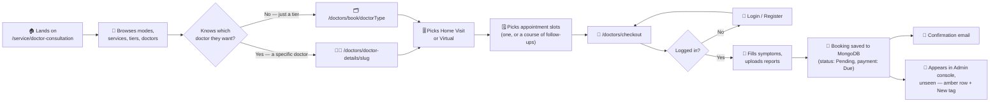
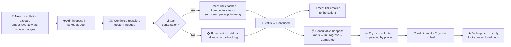
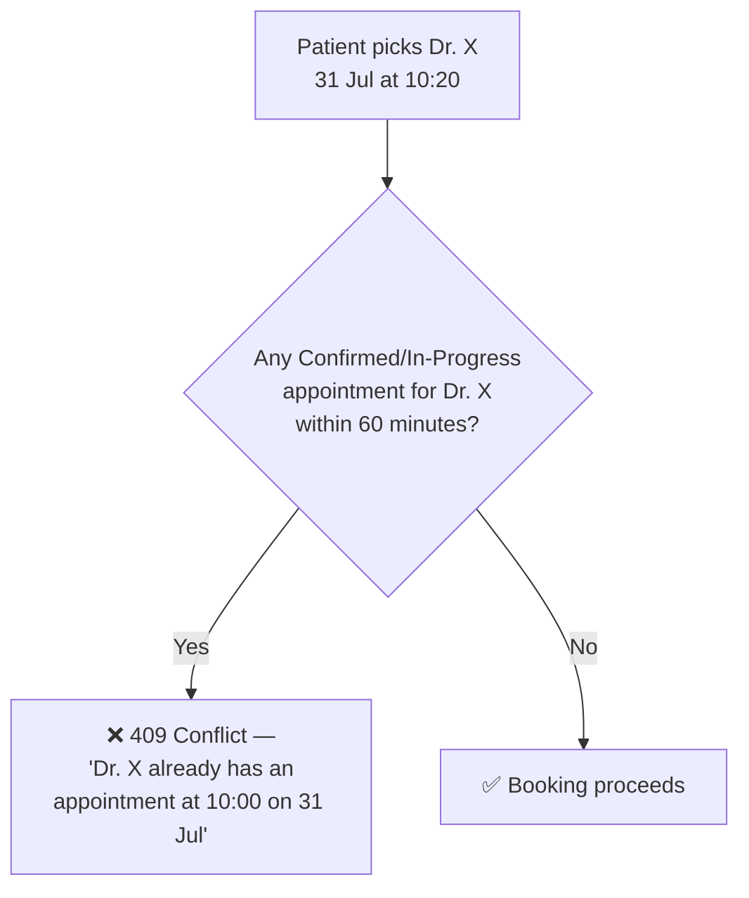
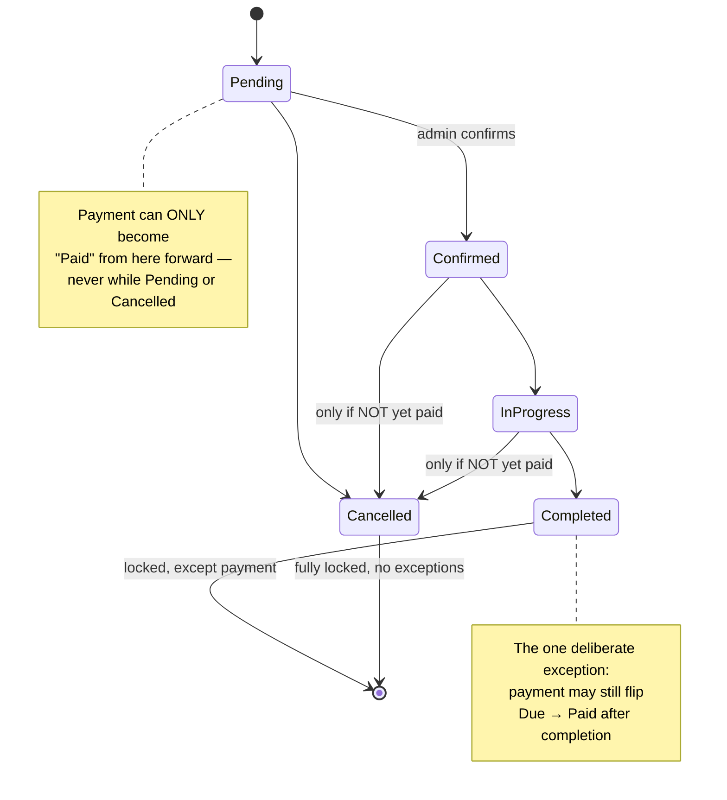
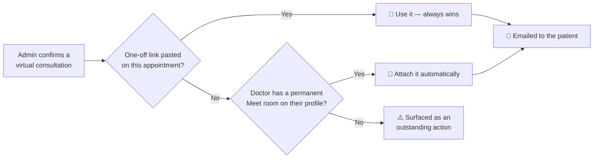
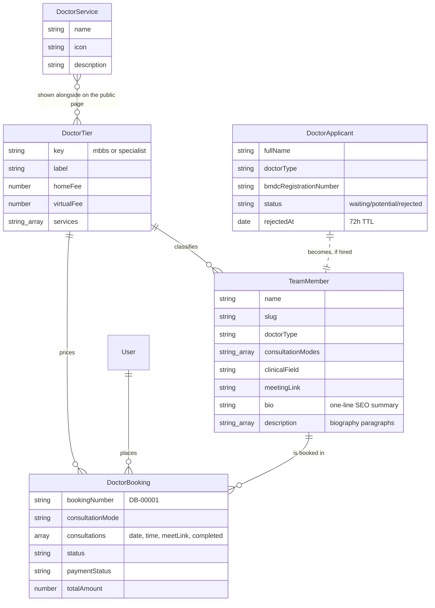
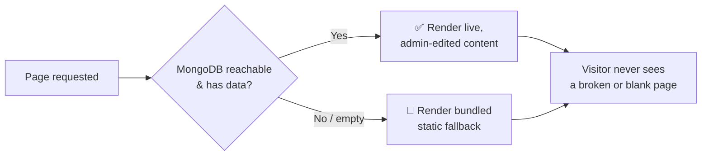
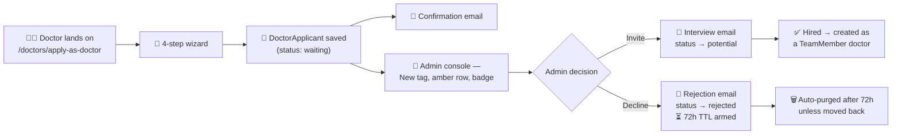

# 🩺👨‍⚕️ Care Bangla — Doctor Consultation Service Workflow

*From a patient's first click to a doctor at the door — or on a Google Meet call — and everything the database, the API, and the admin panel do in between.*

<p align="center">
  
  
  
  
</p>

---

## 📖 Table of Contents

1. [🎯 Executive Summary](#-executive-summary)
2. [🚶 Part I — The Complete Journey](#-part-i--the-complete-journey)
3. [⚙️ Part II — How It Actually Works](#️-part-ii--how-it-actually-works)
4. [🏗️ Part III — System Structure](#️-part-iii--system-structure)
5. [🎨 Part IV — Design System & Public Experience](#-part-iv--design-system--public-experience)
6. [🧑‍⚕️ Part V — The Recruitment Pipeline](#-part-v--the-recruitment-pipeline)
7. [🚀 Part VI — Future Aspects To Be Upgraded](#-part-vi--future-aspects-to-be-upgraded)
8. [⚖️ Part VII — Pros & Cons, Honestly](#️-part-vii--pros--cons-honestly)
9. [🏁 Closing Word](#-closing-word)

---

## 🎯 Executive Summary

Care Bangla's **Doctor Consultation** module lets a patient in Bangladesh book a **BMDC-registered doctor** — MBBS or Specialist tier — either as a **home visit** or as a **virtual consultation over Google Meet**, directly from the website, with **zero payment collected at booking time**. The admin team confirms the doctor, the consultation happens, and payment is only marked **Paid** once money has actually changed hands.

It is a deliberate sibling of the Home Nursing module — same architectural patterns, same admin gestures, same defensive philosophy — with the differences confined to what the service genuinely is:

> 🟦 A **two-axis pricing engine**: the price depends on *which tier* **and** *how the consultation is delivered*, not on shift length.
> 🟦 A **slot-based conflict engine** that keeps a doctor from being double-booked inside a 60-minute window — the appointment analogue of nursing's date-range lock.
> 🟦 The **same cross-validated status/payment state machine** as nursing, so an invalid combination is structurally impossible to create.
> 🟦 **Google Meet integration** for virtual consultations, built around links Google has actually issued rather than fabricated ones — with a documented seam for a future Calendar API upgrade.
> 🟦 A **DB-first, static-fallback architecture** so the public site never shows a blank page, even if MongoDB hiccups.
> 🟦 A **full recruitment pipeline** — public "Apply As a Doctor" wizard, admin review console, 72-hour TTL on rejections.

This document walks through all of it: the process, the mechanics, the data, the design, what's still missing, and what's genuinely good about it.

---

## 🚶 Part I — The Complete Journey

### 🧑‍🦰 The Patient's Path



**Nothing is charged here.** Care Bangla's business model is deliberately *pay-after-service* — the booking is a confirmed commitment, not a transaction.

### 🛠️ The Admin's Path



Every arrow above is **enforced by real validation**, not just UI convention — see Part II.

---

## ⚙️ Part II — How It Actually Works

### 💰 1. The Pricing Engine

Where nursing prices from **one** number per tier, a consultation prices from **two** — because the same doctor costs differently depending on whether they travel to you or meet you on video.

| Input | Formula | Lives in |
|---|---|---|
| Consultation mode | `home` → `DoctorTier.homeFee` · `virtual` → `DoctorTier.virtualFee` | `consultationFee()` |
| Consultation count | One appointment, or a short course of follow-ups booked together | `normaliseConsultations()` |
| Total | `fee × consultationCount` | `computeDoctorBookingPricing()` in `src/data/doctorTiers.js` |

**Shipped defaults:**

| Tier | 🏠 Home Visit | 💻 Virtual (Google Meet) |
|---|---|---|
| MBBS Doctor | ৳1,500 | ৳800 |
| Specialist Doctor | ৳3,000 | ৳1,500 |

> 💡 **Why snapshot the price?** If an admin later changes a tier's fee, every *already-placed* booking must keep showing the price the patient actually agreed to. `DoctorBooking.consultationFee`/`totalAmount` are stored values, never live-computed — the same deliberate choice nursing makes.

> 🔐 **The price is never accepted from the client.** The booking card sends its own preview total, but both the public checkout API and the admin create route recompute from the tier of record. A tampered form cannot buy a Specialist consultation at the MBBS fee.

**Reassignment recalculates automatically.** Moving a booking between tiers *or* between modes re-derives the fee from `DoctorTier` — an automatic recalculation, never a raw price edit. Verified live: switching a Specialist booking from virtual to home repriced ৳1,500 → ৳3,000.

### 🔒 2. The Conflict-Checking Engine

Nursing locks a nurse for a whole date range. A doctor is only committed for the length of one consultation, so conflicts are computed **per slot**.

```
Minimum separation = DOCTOR_CONSULTATION_MINUTES (30) + MIN_CONSULTATION_GAP_MINUTES (30) = 60 minutes
```

That gap is not arbitrary — for a home visit it doubles as the travel allowance between patients.



Three checks run, in order:

| Check | Function | Catches |
|---|---|---|
| Consulting hours | `isWithinConsultingHours()` | Anything outside **08:00–22:00** |
| Internal clash | `findInternalSlotConflict()` | Two appointments *in the same booking* too close together |
| External clash | `findDoctorSlotConflict()` | A slot too close to another booking's committed appointment |

Only **Confirmed** and **In-Progress** bookings lock a doctor's time. `pending` deliberately locks nothing — several patients may request the same popular doctor before an admin picks one to confirm. A category booking (`doctorId: ''`) locks nothing either, since no individual has been chosen yet.

The same engine powers `withUnavailableDoctorIds()` — the admin's reassignment dropdown never even *shows* a doctor already committed near those slots. **Bad states are made unreachable, not just rejected.**

### 🚦 3. The Status ⇄ Payment Rule Engine

Inherited wholesale from nursing, deliberately unchanged — two independent fields cross-validated so an **invalid combination can never exist**.



| # | Rule | Why |
|---|---|---|
| 1️⃣ | Payment can only become **Paid** while status is Confirmed, In-Progress, or Completed | Nothing's been delivered yet if it's Pending; nothing to charge for if Cancelled |
| 2️⃣ | Once payment is **Paid**, status can *never* move back to Pending or Cancelled | A paid consultation was, by definition, delivered |
| 3️⃣ | A **Completed** booking is locked for everything *except* payment | Payment is often collected after the consultation ends |

Enforced **three layers deep**: the dropdown *options themselves* are filtered so an invalid choice is never shown → a `disabled` state as a second guard → the API route as the final, authoritative judge.

### 💻 4. Google Meet Handling — and an honest limitation

A real `meet.google.com/xxx-xxxx-xxx` code **can only be minted by Google**, through the Calendar API with `conferenceDataVersion=1` on an authorised calendar. That needs the `googleapis` package plus a service account or stored refresh token — neither of which this deployment has. (The existing `GOOGLE_CLIENT_ID`/`SECRET` are for sign-in and cannot create events on the clinic's calendar.)

**Generating a random-looking code would produce a URL that simply fails when a patient clicks it — worse than no link at all.** So the shipped flow uses links Google has *already* created:



| Guard | Behaviour |
|---|---|
| Link validation | Only Google's real URL shapes accepted. A Zoom link is **rejected with a clear message** |
| Normalisation | `meet.google.com/abc-defg-hij` → `https://meet.google.com/abc-defg-hij` |
| Per-appointment | A course of follow-ups can carry a different link per appointment |
| Email | Sent only when a link genuinely exists and the patient has an email address |

`createMeetLinkForConsultation()` in `src/lib/googleMeet.js` is the **upgrade seam** — implement its Calendar API branch and every caller starts minting per-appointment links with no other change. The exact steps are documented at the bottom of that file.

### 📁 5. Document Handling

Prescriptions and lab reports ride along at checkout (or get added later by an admin) straight into **MongoDB GridFS**. `DoctorBooking.documents` only ever *grows* by appending; nothing is silently overwritten.

### 📮 6. Mode-Aware Data Collection

The checkout asks for different things depending on the mode — because the two modes genuinely need different things:

| Mode | Required | Why |
|---|---|---|
| 🏠 Home Visit | Visit address | Somewhere to send the doctor |
| 💻 Virtual | Email address | Somewhere to send the Meet link |

A video patient is never asked for their home address. Collecting information the service has no use for is a small thing, but it's the kind of small thing that adds up.

---

## 🏗️ Part III — System Structure

### 🗄️ The Data Model Family



> 🧠 **Why `TeamMember` and not a `DoctorMember`?** Doctors were already stored in `TeamMember` long before this module existed. Reusing it meant **no data migration** — the eight seeded doctors kept their photos, slugs, and ordering. The consultation fields (`doctorType`, `consultationModes`, `clinicalField`, `meetingLink`) were added to that existing schema.

> 🧠 **Why a separate `DoctorBooking` collection?** Rather than another `serviceType` on the nursing `Booking`, matching how Caregiver, Baby Care, Physiotherapy, and Ambulance bookings are each modelled separately in this codebase. The schedule shape genuinely differs — a list of timed appointments, not a date range.

### 🧩 Module Map

| Layer | Path | Purpose |
|---|---|---|
| 🌍 **Public discovery** | `src/app/service/[serviceId]/page.js` → `ServiceDetailsDoctorConsultation.jsx` | The `/service/doctor-consultation` landing page |
| 🧭 **Public booking** | `src/app/doctors/book/[doctorType]`, `src/app/doctors/doctor-details/[doctorId]`, `src/app/doctors/checkout` | Category or specific-doctor booking flow |
| 🧑‍⚕️ **Public recruitment** | `src/app/doctors/apply-as-doctor` → `DoctorApplication.jsx` | The 4-step application wizard |
| 🔌 **Public API** | `src/app/api/doctor-bookings`, `src/app/api/doctor-applicants` | Creates bookings and applications |
| 🔐 **Admin bookings** | `DoctorBookingsSection.jsx` in `/admin/bookings` + `src/app/api/admin/doctors/bookings/*` | The consultation management console |
| 🔐 **Admin roster** | `src/app/admin/doctors` + `src/app/api/admin/doctors/*` | Doctor profile CRUD, slug-based URLs |
| 🔐 **Admin CMS** | `/admin/services/doctor-consultation` → `DoctorConsultationCms.jsx` | Banner, section copy, tiers, services catalogue |
| 🔐 **Admin applicants** | `/admin/applicants` (Doctor section) + `src/lib/applicantServices.js` | Recruitment review pipeline |
| 🗃️ **Models** | `DoctorTier.js`, `DoctorBooking.js`, `DoctorService.js`, `DoctorApplicant.js`, `TeamMember.js` | The schema layer |
| 🧮 **Domain logic** | `src/data/doctorTiers.js`, `src/lib/doctorTiers.js`, `src/lib/doctorAvailability.js`, `src/lib/googleMeet.js` | Pricing, tier resolution, slot conflicts, Meet links |
| 📦 **Media** | `src/lib/gridfs.js`, `/api/media/[id]/[[...seo]]` | Photos with structured metadata/SEO paths, plus CVs and booking documents |

### 🛡️ The DB-First, Static-Fallback Philosophy

Every piece of content on the page — banner, section copy, tier cards, services grid, doctor slider — follows the **same defensive pattern**:



Two collections go further with a **self-healing bootstrap** — `ensureDoctorTiers()` and the `GET /api/admin/doctor-services` guard create their defaults on a genuinely empty collection, so an admin who opens the CMS before ever running "Seed Data" sees editable content rather than an empty screen. Both honour tombstones, so a deliberate deletion is never resurrected.

---

## 🎨 Part IV — Design System & Public Experience

The `/service/doctor-consultation` page, top to bottom:

| # | Section | Component | What Makes It Nice |
|---|---|---|---|
| 1 | 🖼️ **Page banner** | `PageBreadcrumb` | Full-bleed photo, dark overlay, auto-generated breadcrumb — admin-editable |
| 2 | 📣 **Intro** | `SectionHeading` | Admin-editable headline + description |
| 3 | 💳 **Tier Cards** | `TierCard` | MBBS vs Specialist, each showing **both** fees; placed immediately below the intro so the booking choices are never buried |
| 4 | 🩹 **Doctor Services & Solutions** | icon grid | The admin-managed catalogue, first six shown |
| 5 | 🏠💻 **Consultation Modes** | `ModeCard` | Home Visit vs Virtual, side by side |
| 6 | 👨‍⚕️ **Our Doctors** | `MedicalTeamSection` | Horizontal slider of real doctor profiles, live from the roster |
| 7 | 🧰 **Core Services** | `Service` | DB-backed photo-card grid, shared with the homepage |
| 8 | 📣 **Recruitment CTA** | — | "Join Our Medical Team" |

### 📐 A uniform vertical rhythm

Every gap between sections comes from **one constant**, `SECTION_GAP`, spread onto all six sections. No section carries a bottom gap except the last. Measured content-edge to content-edge:

| Width | Gap | Spread |
|---|---|---|
| Desktop ≥992px | 100px | min 100 / max 100 ✓ |
| Tablet 768–991px | 70px | min 70 / max 70 ✓ |
| Mobile ≤767px | 50px | min 50 / max 50 ✓ |

> ⚠️ **A trap worth documenting:** the `Spacing` prop names are the inverse of what they look like. `topSpaceMd` renders `cs_height_{N}` (active **≥992px**, i.e. desktop) and `topSpaceLg` renders `cs_height_lg_{N}` (active **≤991px**). On top of that, `_mobile.scss` halves `cs_height_100` with `!important` below 768px, which wins over `cs_height_lg_70` on the same element — that's where the 50px comes from.

> **August 2026 content update:** Narrative descriptions and tier/service copy may use safe structured inline links, while service and doctor images may carry `{ src, alt, title, fileName }`. The shared authoring and rendering rules are documented in [FEATURES_AND_CONTENT_ARCHITECTURE.md](FEATURES_AND_CONTENT_ARCHITECTURE.md).

### 🔗 Shared, not merely similar

The individual doctor profile and booking pages are built from the **same `cs_nurse_*` stylesheet** as the nursing ones — not a parallel copy. Booking a doctor and booking a nurse are the same task from a patient's point of view, so the two pages are the same page with different copy. Verified identical: 23/23 shared structural classes, 854px booking card, 800px primary button on both.

That choice is deliberate maintenance insurance: a future change to the nurse card's look lands on the doctor card automatically, instead of the two quietly drifting apart.

---

## 🧑‍⚕️ Part V — The Recruitment Pipeline

A direct mirror of the nursing recruitment flow, with the differences tracking the profession.



| | Nurse Applicant | Doctor Applicant |
|---|---|---|
| Regulator | BNMC — **optional** | BMDC — **required** (nobody may lawfully practise medicine without it) |
| Position | Junior / Diploma | MBBS / Specialist |
| Extra field | — | **Consultation modes** — captured at application time, since the booking card hides a mode a doctor doesn't offer |
| Pay expectation | Monthly salary | **Fee per consultation** |

The 72-hour TTL is a real MongoDB `expireAfterSeconds` index on `rejectedAt`. Moving a rejected applicant back to waiting or potential **clears the field and cancels the deletion** — verified live.

---

## 🚀 Part VI — Future Aspects To Be Upgraded

| Priority | Upgrade | Impact | Notes |
|---|---|---|---|
| 🔴 High | **Google Calendar API integration** | Per-appointment Meet links minted automatically, with calendar invitations to both parties | The seam already exists — `createMeetLinkForConsultation()`. Needs `googleapis` + a service account |
| 🔴 High | **Online payment gateway** (bKash/Nagad/card) | Removes the manual "mark as Paid" step | Currently manual by deliberate business-model choice |
| 🔴 High | **Doctor-side portal** | Doctors see their own schedule and mark consultations complete | Today only admins move a booking through its lifecycle |
| 🟠 Medium | **Digital prescription capture** | The prescription lives in the booking rather than on paper or in a chat | `documents[]` currently only holds what the *patient* uploads |
| 🟠 Medium | **SMS notifications** | Reaches patients with no email — critical for virtual, where the link *is* the appointment | Meet links are email-only today |
| 🟠 Medium | **In-app video** as a Meet alternative | Removes the external dependency entirely | Meet was chosen for familiarity and zero install |
| 🟠 Medium | **Automated reminders** (24h / 1h before) | Reduces no-shows, especially for video calls | No scheduled-job infrastructure yet |
| 🟡 Nice-to-have | **Doctor availability calendar** | Patients pick from real free slots instead of proposing a time | Today any in-hours slot can be requested; conflicts are caught at submit |
| 🟡 Nice-to-have | **Automated doctor-matching** by speciality/location | Reduces manual assignment work | Reassignment is manual, dropdown-driven |
| 🟡 Nice-to-have | **Patient review / ratings** after completion | Builds a trust layer | `rating` on `TeamMember` is admin-set, not patient-driven |
| 🟢 Polish | **Analytics dashboard** — consultations by mode, revenue collected vs due, doctor utilisation | Business visibility | Data already exists in `DoctorBooking` |
| 🟢 Polish | **Automated test suite** for pricing + conflict engines | Protects the rules from regressions | Currently verified via live curl smoke-testing |

---

## ⚖️ Part VII — Pros & Cons, Honestly

### ✅ What's Genuinely Strong

- 🧩 **Genuine architectural reuse** — this module shares the nursing module's stylesheet, its status/payment engine, its DB-first pattern, and its admin gestures. It is a sibling, not a copy-paste fork.
- 🛡️ **Server-side price authority** — the client's total is never trusted; every entry point recomputes from the tier of record.
- 🔗 **Honest Google Meet handling** — the system uses links Google actually issued and surfaces a missing one as an outstanding action, rather than fabricating a code that would fail on click.
- 🕐 **Slot-aware conflict prevention** — the 60-minute rule doubles as a travel allowance for home visits, and the reassignment dropdown hides unavailable doctors outright.
- 🎛️ **Deep admin control with zero deploys** — banner, section copy, both tiers' four fees, the services catalogue, doctor profiles, and Meet rooms all editable live.
- 📐 **Measured, uniform layout** — the vertical rhythm is defined once and verified at three breakpoints, not eyeballed.
- 🔁 **Mode-aware data collection** — a virtual patient is never asked for a home address.

### ⚠️ What's Worth Being Honest About

- 💻 **Meet links are not auto-generated** — the single biggest gap. Confirming a virtual booking attaches the doctor's permanent room, which means every consultation with that doctor shares one URL. Workable (many clinics run exactly this way), but a per-appointment link would be better, and a busy room could in principle be joined by the wrong patient.
- 💳 **No payment gateway** — "Paid" is a manual admin toggle backed by trust and a phone call.
- 📅 **No published availability** — a patient proposes a time and finds out at submit whether it clashes, rather than choosing from known-free slots. Fine at current volume; friction as the roster grows.
- 🧪 **No automated test suite** — the pricing and conflict engines are verified by manual, conversation-driven smoke-testing.
- 👤 **Single admin role** — anyone with admin access can do everything, including changing financial state.
- 📝 **No prescription capture** — the clinical *output* of a consultation lives outside the system.
- 🗄️ **The same Mongoose dev-server caching quirk** as nursing — adding a schema field needs a dev-server restart before *writes* take effect. Invisible to end users, a real friction point in development. (It bit this module during the build: writes silently succeeded while dropping the new field.)
- 🧭 **`TeamMember` does double duty** — it is both the public doctor profile and the bookable resource. Convenient and migration-free, but it means a doctor record carries fields two different concerns care about.

---

## 🏁 Closing Word

The Doctor Consultation module is what happens when a second service is built **deliberately in the shape of the first**. Almost every hard problem — pay-after-service state machines, DB-first fallbacks, admin-editable everything, unseen-row tracking — was already solved by the nursing module, and reusing those solutions rather than reinventing them is why this module shipped with a smaller surface of new bugs.

The genuinely new problems were two: **pricing along two axes instead of one**, and **video consultation**. The first is solved cleanly. The second is solved *honestly* — which here meant declining to fake a Google Meet code and instead building the flow that actually works today, with the upgrade path written down rather than implied.

There's real room to grow — Calendar API, payments, a doctor portal, published availability — but the **foundation is exactly the kind you want to build all of that on top of.**

<p align="center"><b>🩺 Built for patients who need a doctor — at their door or on their screen — and the admins who make sure one arrives. 💙</b></p>
