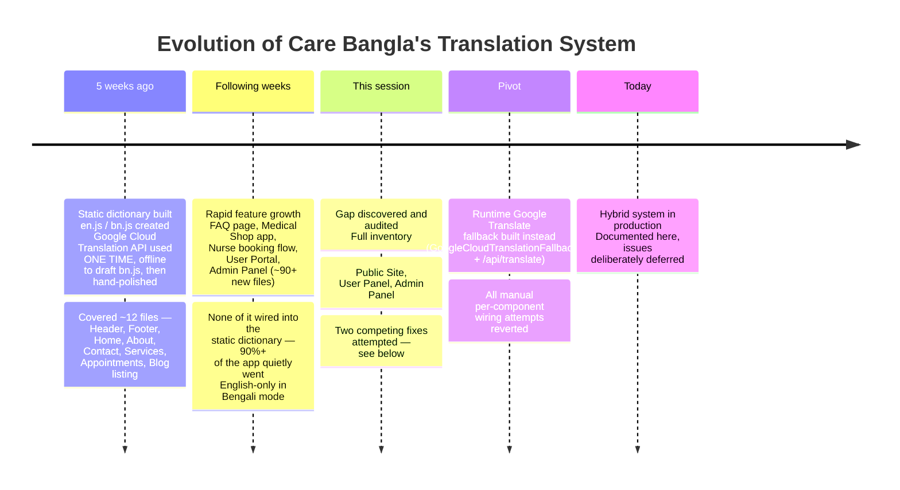
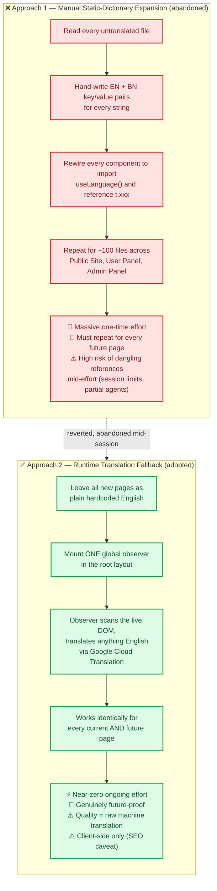
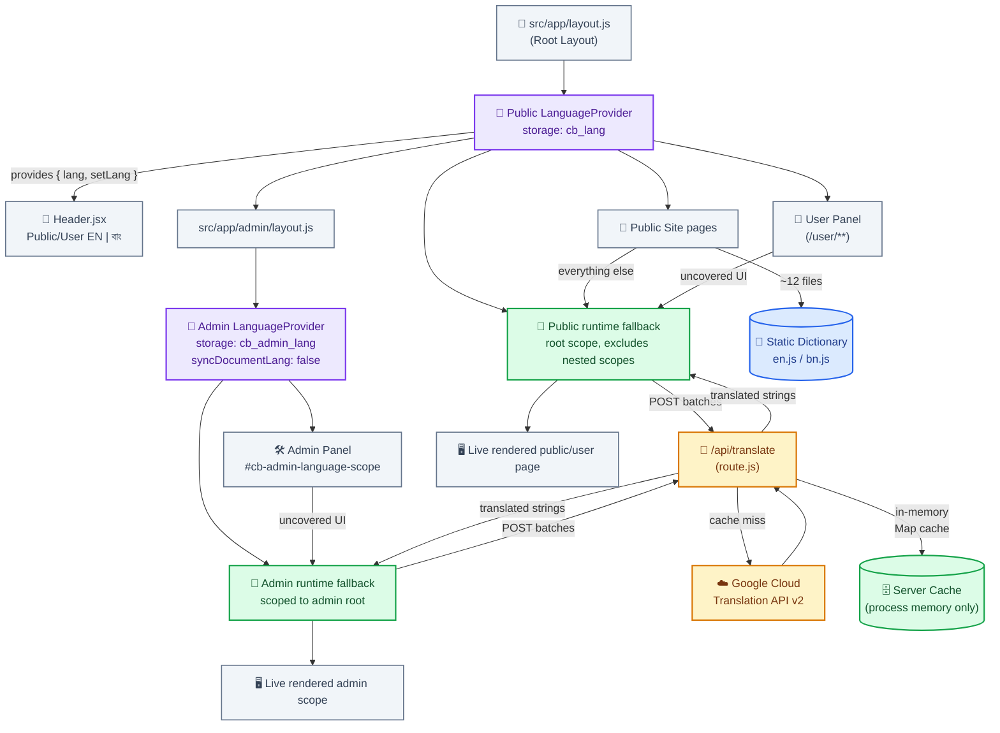
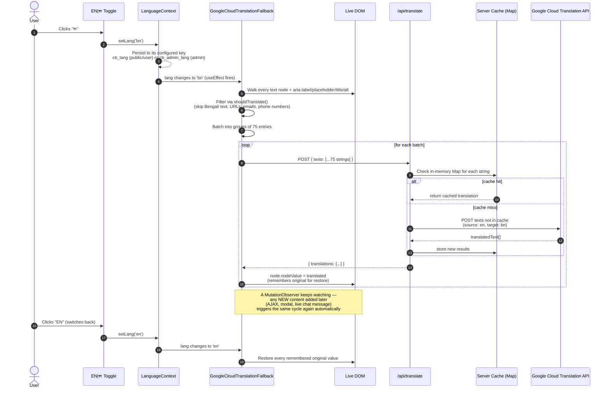
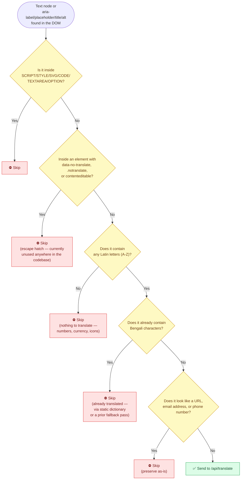
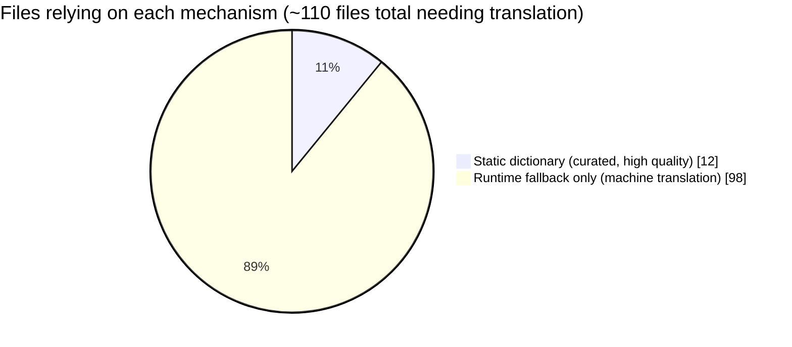
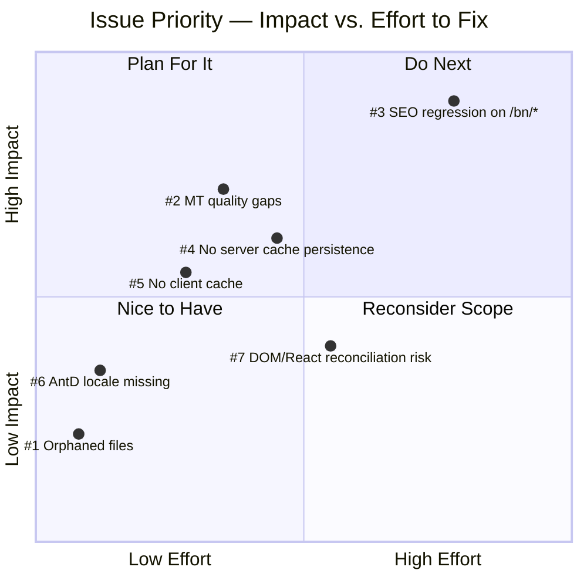
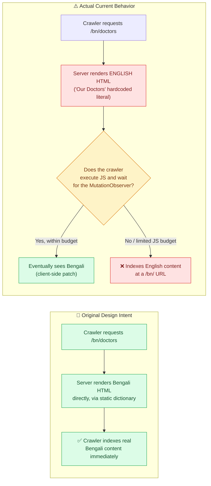

# 🌐🇧🇩 Care Bangla — Language Translation Process (English ⇄ Bengali)

> For the practical workflow for adding and reviewing translated interface text, also see [TRANSLATION_GUIDE.md](TRANSLATION_GUIDE.md).

*How the site speaks two languages today, where that story came from, and — in full, unflinching detail — everything that still needs fixing before this is genuinely production-grade.*

<p align="center">
  
  
  
</p>

> 📌 **Read this first.** This document is a snapshot of the translation system **as it stands today**. It is intentionally being kept in its current, imperfect form — the issues documented in Part IV are known, understood, and deliberately **not being fixed yet**. This file exists so that when development resumes on this feature, nobody has to re-discover any of this from scratch.

---

## 📖 Table of Contents

1. [🎯 Executive Summary](#-executive-summary)
2. [🕰️ Part I — How We Got Here](#️-part-i--how-we-got-here)
3. [🏗️ Part II — The Current Architecture](#️-part-ii--the-current-architecture)
4. [🔍 Part III — File & Component Inventory](#-part-iii--file--component-inventory)
5. [🚨 Part IV — Known Issues & Detailed Solutions](#-part-iv--known-issues--detailed-solutions)
6. [⚙️ Part V — Environment & Configuration Reference](#️-part-v--environment--configuration-reference)
7. [🛣️ Part VI — Recommended Path Forward](#️-part-vi--recommended-path-forward)
8. [🏁 Closing Word](#-closing-word)

---

## 🎯 Executive Summary

Care Bangla is a bilingual site — every page, in both the **public marketing site** and the logged-in **user portal**, and every screen of the **internal admin panel**, is meant to be readable in both English and Bengali via a single toggle (`EN | বাং`).

Two genuinely different systems currently share that one job:

> 🟦 **A hand-written static dictionary** (`en.js` / `bn.js`) — curated, high-quality Bengali, covering roughly a **dozen pages** built in the translation system's first phase five weeks ago (Header, Footer, Home, About, Contact, Services, Appointments, Blog listing).
>
> 🟩 **A live, runtime, machine-translation fallback** — a `MutationObserver` that watches the entire rendered page and calls the **Google Cloud Translation API** on any English text it finds, live, in the browser — covering **everything else**: every page added since, the entire user portal, and the entire admin panel (~100 additional files).

The second system is the important architectural decision documented here. It trades some translation *quality* for a guarantee that **no future page will ever need special translation work** — a brand-new admin screen added next month is bilingual automatically, with zero code changes. That is a genuinely good trade for a fast-growing internal tool and a real strength of the current design.

> **August 2026 scope update:** the public site and logged-in user portal share `cb_lang`, while `/admin/**` is wrapped by a nested `LanguageProvider` using `cb_admin_lang` and `#cb-admin-language-scope`. The two toggles therefore remain independent even in the same browser. The runtime translator also refuses to cross into another `[data-language-scope]`, preventing the root provider from retranslating the admin subtree.

It also comes with **seven concrete, verified issues** — two dead files, two real quality misses (confirmed via live API testing), an SEO regression, and two caching/performance gaps — all catalogued in full technical detail in **[Part IV](#-part-iv--known-issues--detailed-solutions)**, each with multiple solution paths, effort estimates, and trade-offs, ready to act on whenever this feature comes back into active development.

---

## 🕰️ Part I — How We Got Here



### The two competing approaches that were tried

Two fundamentally different strategies were attempted to close the translation gap, and it's worth understanding both, because the current system is really the *second* approach having fully won out over the first.



**Why Approach 2 won**: the moment the audit revealed that Admin Panel alone represented an estimated **900–1,400 distinct UI strings across 52 files**, and Public Site + User Panel added roughly **60 more files** on top of that, it became clear that any manual, per-string approach would need to be *repeated forever* — every new admin screen, every new public page, every new user-panel feature would silently ship untranslated until someone remembered to wire it in. The runtime fallback closes that gap permanently, for a one-time cost of lower (but generally acceptable) translation quality.

---

## 🏗️ Part II — The Current Architecture

### 2.1 — Component Map



### 2.2 — Full Request Lifecycle: What Happens When a User Clicks "বাং"



### 2.3 — The `shouldTranslate()` Decision Logic

Not every piece of text on the page is a candidate for translation. Here's the exact filter every text node and attribute passes through:



### 2.4 — Translation Coverage Across the Three Sides of the App

Based on the full audit performed this session (file-by-file inspection of every route under `src/app/**` and every component it renders):



| Area | Files needing translation | Static dictionary coverage | Runtime fallback coverage |
|---|---|---|---|
| 🌐 **Public Site** | ~41 files | ~11 files (Header, Footer, Home, About, Contact, Services, Appointments, Blog listing, +3 partials) | ~30 files (FAQ, Timetable, Portfolio, Error page, Doctors listing, all 4 static service-detail pages, Nursing Care detail remainder, entire Medical Shop app, Blog/Doctor detail pages, entire Nurse booking/checkout/application flow, Auth forms) |
| 👤 **User Panel** | 17 files | 0 files | **All 17** (Dashboard, Orders, Bookings, Profile, Notifications, Services, Sidebar, both layout wrappers) |
| 🛠️ **Admin Panel** | 52 files (~19,000 lines) | 0 files | **All 52** (Dashboard, Page Content editors, Services, Doctors, Nurses, Nurse Applicants, Team, Blog, Live Chat, Medical Shop, Media Library, SEO Dashboard, Project Audit, Settings, FAQ admin, Login) |

> ⚠️ In other words: **~89% of the files in this application depend entirely on live machine translation** right now. This is precisely why Part IV's quality and reliability issues matter as much as they do — they're not edge cases, they're the *default path* for almost everything a Bengali-speaking user sees.

---

## 🔍 Part III — File & Component Inventory

### Core translation system files

| File | Role |
|---|---|
| `src/i18n/LanguageContext.jsx` | Configurable React Context provider. Holds `{ lang, setLang }`, persists to its `storageKey`, optionally synchronizes `<html lang>`, and mounts a runtime fallback with an optional scope selector. Defaults to public/user `cb_lang`. |
| `src/i18n/useLanguage.js` | Hook: `const { lang, setLang, t } = useLanguage();` — `t` resolves to the static dictionary object for the current language. |
| `src/i18n/translations/en.js` | Static English dictionary. 284 leaf keys across 13 namespaces (`common`, `nav`, `footer`, `counter`, `home`, `about`, `services`, `contact`, `appointments`, `blog`, `medicalShop`, `chat`, `admin`). |
| `src/i18n/translations/bn.js` | Static Bengali dictionary — **verified structurally in sync** with `en.js` (identical 284 leaf keys, zero drift, confirmed programmatically). |
| `src/i18n/translations/bn.generated.js` | Raw, unreviewed machine-translation output from `scripts/generate-translations.mjs` — a scratch file, never imported by the app. |
| `scripts/generate-translations.mjs` | One-time/offline script: flattens `en.js`, batches it through Google Cloud Translation v2, writes `bn.generated.js` for manual review before merging into `bn.js`. **Unrelated to the live runtime fallback** — this only ever ran to help hand-draft the original `bn.js`. |
| `src/i18n/GoogleCloudTranslationFallback.jsx` | **The runtime engine.** `MutationObserver`-driven DOM scanner + translator + restorer. See [2.2](#22--full-request-lifecycle-what-happens-when-a-user-clicks-বাং) and [2.3](#23--the-shouldtranslate-decision-logic). |
| `src/app/api/translate/route.js` | Server-side proxy to Google Cloud Translation API v2. Keeps the API key server-only, batches up to 100 texts/request, caps text length at 5,000 chars, in-memory `Map` cache. |
| `src/app/admin/layout.js` | Creates the independent admin provider with `storageKey="cb_admin_lang"`, `syncDocumentLang={false}`, and `translationScopeSelector="#cb-admin-language-scope"`. |

### Language toggle entry points

| Location | Mechanism |
|---|---|
| `src/Components/Header/Header.jsx` | `cs_lang_toggle` pill buttons (`EN` / `বাং`) — visible on every public page **and** every `/user/**`/`/auth/**` page (Header renders sitewide via the root layout). |
| `src/Components/Admin/AdminClientLayout.jsx` | Globe-button toggle in the admin header. It reads the nested admin Context, so it persists to `cb_admin_lang` and never changes the public/user preference. |
| `src/app/bn/layout.js` | Forces `initialLang="bn"` for the small set of dedicated `/bn/*` SEO routes (`/bn`, `/bn/about`, `/bn/contact`, `/bn/doctors`, `/bn/service`) — these were built assuming **server-rendered** Bengali via the static dictionary (see [Issue #3](#issue-3--seo-regression-on-the-bn-routes)). |

### Known dead/orphaned files (left over from the abandoned manual-wiring attempt)

| File | Status |
|---|---|
| `src/Components/UserPortal/PortalCopyright.jsx` | Not imported anywhere. Contains a **live bug** — calls `t.userPanel.layout.copyright(...)`, but `t.userPanel` does not exist in the dictionary. Harmless only because nothing references this file. |
| `src/views/Pages/DoctorsPageBreadcrumb.jsx` | Not imported anywhere. Code is actually *correct* (reuses the real `t.nav.doctors` key) but `DoctorsPage.jsx` still uses its own hardcoded `'Our Doctors'` literal instead of this component. |

---

## 🚨 Part IV — Known Issues & Detailed Solutions

> Every issue below was **verified against the live running application** this session — not theorized. Each includes the evidence, the root cause, and multiple ranked solution paths with effort estimates, so that whoever picks this back up can choose a path in minutes, not hours.

### 🎯 Issue Priority at a Glance



---

### Issue #1 — Two Orphaned Files, One With a Live Bug

**Severity:** 🟢 Low (currently harmless — neither file is imported anywhere) · **Effort to fix:** 🟢 Trivial (minutes)

**What's happening:** Two files survived the abandoned manual-wiring effort without being cleaned up or finished:

- `src/Components/UserPortal/PortalCopyright.jsx` calls `t.userPanel.layout.copyright(new Date().getFullYear())` — treating a dictionary value as a **function**. Neither the `userPanel` namespace nor any function-valued dictionary entry exists anywhere in `en.js`/`bn.js`. If this component were ever imported, it would throw `TypeError: Cannot read properties of undefined (reading 'layout')` immediately on render.
- `src/views/Pages/DoctorsPageBreadcrumb.jsx` is well-written — it correctly solves a real Server-Component boundary problem (its own comment explains: `DoctorsPage.jsx` is an async Server Component and can't call `useLanguage()` directly, so this small Client Component wrapper exists to compute the translated breadcrumb title). It's simply never wired in; `DoctorsPage.jsx` still hardcodes `'Our Doctors'` directly.

**Why it happened:** Both files were created mid-session by an automated agent that was interrupted (hit a session/rate limit) before it could finish wiring its own output into the pages that were supposed to use it.

**Solution A — Delete both (recommended):** The whole point of the current architecture is that individual pages *don't* need bespoke translation wiring — the runtime fallback already handles `'Our Doctors'` and the copyright text correctly (confirmed: `'Our Doctors'`-style plain strings already translate fine live). Keeping either file around only risks someone importing `PortalCopyright` later and shipping an instant crash. Effort: delete two files.

**Solution B — Finish wiring them in:** Add a real `userPanel.layout.copyright` **string** (not a function — use a template literal on read, `` `Copyright © ${year} ...` `` built inside the component instead) to the dictionary, import `PortalCopyright` into `src/app/user/layout.js` and `src/app/auth/layout.js` in place of their inline hardcoded `<div>`, and import `DoctorsPageBreadcrumb` into `DoctorsPage.jsx` in place of the hardcoded `<PageBreadcrumb title="Our Doctors" />`. This would give those two specific strings guaranteed-correct static translations instead of depending on machine translation — worth doing only if you're also implementing the [glossary approach in Issue #2](#issue-2--machine-translation-quality-gaps-on-high-frequency-terms), since a copyright string and a plain nav word aren't exactly high-risk MT candidates on their own.

---

### Issue #2 — Machine Translation Quality Gaps on High-Frequency Terms

**Severity:** 🟠 Medium-High (affects words users see constantly) · **Effort to fix:** 🟡 Small–Medium

**What's happening:** Raw Google Cloud Translation API v2 (the "Basic" tier, no glossary support) mistranslates a handful of common, ambiguous English words in ways a Bengali speaker would immediately notice. This was **verified live** by calling the production `/api/translate` endpoint directly:

| English (as rendered in the app) | What Google Translate returns | The problem |
|---|---|---|
| `"My Orders"` | `আমার আদেশ` | Translates *"order"* as *command/instruction* — the wrong sense entirely. Needed: purchase-order sense. This exact string appears in the User Portal sidebar and dashboard. |
| `"Pending"` | `বিচারাধীন` | This is a **legal/court term** ("sub judice" — awaiting a judge's ruling), wildly too formal/wrong-register for an order or booking status badge. |
| `"Confirmed"` → `নিশ্চিত` | ✅ fine | — |
| `"Save Changes"` → `পরিবর্তনগুলি সংরক্ষণ করুন` | ✅ fine | — |
| `"Cancelled"` → `বাতিল করা হয়েছে` | ✅ fine | — |
| `"Add New"` → `নতুন যোগ করুন` | ✅ fine | — |

**Why it happens:** Google Translate v2 has no per-term context/glossary control — it picks the single most statistically common translation for a word across all of Google's training data, which for English words like "order" and "pending" is dominated by non-software usage (legal documents, general prose).

**Solution A — In-code glossary override (recommended):** Add a small, hand-curated lookup object *inside* `GoogleCloudTranslationFallback.jsx` (or a new sibling file it imports, e.g. `src/i18n/translationGlossary.js`) mapping exact source strings to guaranteed-correct Bengali:
```js
// conceptual sketch — not yet implemented
export const TRANSLATION_GLOSSARY = {
  'My Orders': 'আমার অর্ডার',
  'Pending': 'অপেক্ষমাণ',
  'Order #': 'অর্ডার #',
  // ...20-30 curated high-frequency terms: order/booking statuses,
  // primary nav labels, key CTAs
};
```
Then, in the translate loop, check this glossary **before** calling `/api/translate` — glossary hits resolve instantly with zero API cost; everything else still falls through to Google Translate exactly as today. This preserves the "any new page just works automatically" guarantee — **zero page components need to change** — while guaranteeing quality for the ~20-30 terms that actually matter most. Effort: one new file + a short-circuit check in the existing fallback loop.

**Solution B — Upgrade to Google Cloud Translation *Advanced* (v3) with a real Glossary:** Google's v3 API has a first-class Glossary feature (a TSV/CSV term list uploaded to Cloud Storage, referenced by `glossaryConfig` in the translate request) that does exactly this at the API level instead of in application code. **Trade-off:** v3 requires a GCP service account + IAM permissions (not just the simple API key currently used), a Cloud Storage bucket for the glossary file, and a materially bigger setup lift. Only worth it if Solution A's override list grows unwieldy (dozens becomes hundreds) or you want glossary management outside of code deploys.

---

### Issue #3 — SEO Regression on the `/bn/*` Routes

**Severity:** 🔴 High (undermines the entire purpose of a dedicated route structure) · **Effort to fix:** 🔴 Medium–Large

**What's happening:** This codebase has dedicated Bengali-language SEO routes (`/bn`, `/bn/about`, `/bn/contact`, `/bn/doctors`, `/bn/service`) that force `initialLang="bn"` from the server via `src/app/bn/layout.js` — a design built entirely around the assumption that Bengali content would be **server-rendered** (so search engines see real Bengali HTML at those URLs, no JavaScript required).

Since most page content across the app was reverted to plain hardcoded English and now only gets translated by `GoogleCloudTranslationFallback` **after hydration, client-side**, anything outside the dozen originally-translated pages will render **English in the raw server-sent HTML** even on a `/bn/*` URL — only flipping to Bengali in the browser, after JavaScript executes and the `MutationObserver`'s 80ms-debounced scan completes.



**Why it happens:** `GoogleCloudTranslationFallback` is a client-only mechanism (`'use client'`, uses `document`/`MutationObserver`) by necessity — it has no way to run during Next.js's server render pass.

**Solution A — Extract a server-safe translate helper, use it on the `/bn/*` routes specifically (recommended):** Factor the actual Google Translate call out of `api/translate/route.js` into a plain, importable async function (e.g. `src/lib/translateServer.js`, `export async function translateTexts(texts) {...}`, sharing the same cache). The handful of server components behind `/bn/*` (home, about, contact, doctors, service — the same ~5 pages that already have a `/bn` variant) call this helper directly on their hardcoded strings *before* rendering, producing real server-rendered Bengali HTML again — **without hand-writing any of it**. Every other route keeps working exactly as it does today; this only touches the routes that actually need to be crawled in Bengali. Effort: one new shared lib function + editing ~5 route/page files to call it for their handful of headline/meta strings.

**Solution B — Translate only the SEO-critical fields server-side:** A lighter version of A — instead of translating the full page body, just run the H1/page-title and `<meta name="description">` through the server-side helper for those 5 routes, and let the client-side fallback handle the rest of the page body as it does now. Faster to implement, covers the metric that actually matters most for search ranking (title tags and meta descriptions), leaves deeper body content as a client-side-only translation (acceptable since crawlers weight title/meta most heavily anyway).

**Solution C — Accept client-side-only and deprioritize:** Modern Googlebot does render JavaScript before indexing in the large majority of cases, just with less certainty and a rendering-budget delay compared to static HTML. If `/bn/*` search traffic isn't currently a measured priority, it may be reasonable to explicitly accept this gap for now — but that should be a **conscious decision**, not an accidental side effect, which is why it's documented here explicitly.

---

### Issue #4 — No Persistent Server-Side Translation Cache

**Severity:** 🟡 Medium (cost + reliability, not correctness) · **Effort to fix:** 🟡 Small–Medium

**What's happening:** `src/app/api/translate/route.js` caches translations in `const cache = new Map()` — plain in-process memory. This cache:
- Is **wiped on every server restart** (a deploy, a crash-recovery, a routine restart).
- In any **serverless/multi-instance deployment**, each function invocation or instance gets its **own separate cache** — meaning the "shared cache" barely functions as one in production, and the same strings get re-translated (and re-billed) repeatedly across different users and instances.

**Why it happens:** It's the simplest possible implementation, and was almost certainly sufficient for local testing/development — but doesn't survive real deployment conditions.

**Solution A — Persist to MongoDB (recommended, matches existing codebase conventions):** This codebase already uses a DB-first pattern everywhere else (Mongoose models, `connectDB()`, GridFS for media). Add a small model:
```js
// conceptual sketch — not yet implemented
// src/models/TranslationCache.js
const schema = new mongoose.Schema({
  sourceHash: { type: String, required: true, unique: true, index: true }, // SHA-256 of the source text
  sourceText: { type: String, required: true },
  translatedText: { type: String, required: true },
}, { timestamps: true });
```
In `/api/translate`, check Mongo (by `sourceHash`) before calling Google Translate; write new results back after. Keep the existing in-memory `Map` in front of it as a fast "L1" cache within a single warm process, with Mongo as the durable "L2" — cheap, and follows the pattern this project already uses for GridFS media caching. Effort: one new model + a handful of lines in the existing route handler.

**Solution B — Redis / external cache:** If this project ever adopts Redis for other reasons (sessions, rate limiting), the same cache could live there instead, with a TTL if you want translations to eventually re-fetch (e.g. if Google improves a translation over time). Not currently justified on its own — Mongo is the lower-friction choice given what's already in this stack.

---

### Issue #5 — No Client-Side Cache (Visible "Flash of English" on Every Navigation)

**Severity:** 🟡 Medium (UX polish, not correctness) · **Effort to fix:** 🟢 Small

**What's happening:** Every page load or client-side navigation re-runs the full scan-and-translate cycle from scratch — nothing translated on a previous page is remembered in the browser. A Bengali-language user sees a brief flash of English content on **every single page**, every time, before the DOM patches over to Bengali a few hundred milliseconds later.

**Why it happens:** `GoogleCloudTranslationFallback`'s `originals` bookkeeping (`useRef(new Map())`) only lives for the lifetime of that mounted component instance/page — nothing persists across a full navigation or reload.

**Solution — Cache translated strings in `localStorage` (recommended):** Before calling `/api/translate`, check a `localStorage`-backed map (keyed by the exact source string, or a short hash of it if storage size becomes a concern) for a previously-seen translation, and use it immediately, synchronously, with zero network round-trip. Only strings genuinely never seen before need to hit the API. Since translations are effectively static (the same English string always means the same Bengali string), there's no need for an expiry — though it would be sensible to version the cache key (e.g. prefix with a version string) so a future glossary change ([Issue #2](#issue-2--machine-translation-quality-gaps-on-high-frequency-terms)) can be forced to re-fetch. This alone would eliminate the vast majority of the repeat-flash problem for returning visitors. Effort: a few lines added to the existing `translate()` function in `GoogleCloudTranslationFallback.jsx`.

---

### Issue #6 — Ant Design's Own Bengali Locale (`bn_BD`) Isn't Wired In

**Severity:** 🟢 Low-Medium (admin-only, cosmetic) · **Effort to fix:** 🟢 Trivial

**What's happening:** Ant Design (the admin panel's UI library) ships an official, professionally-localized Bengali locale pack (`antd/locale/bn_BD.js` — confirmed present in the installed `antd` package). It was wired in at one point via `<ConfigProvider locale={lang === 'bn' ? bnBD : enUS}>` in `AdminClientLayout.jsx`, but that wiring was removed along with the rest of the manual translation work.

Its absence isn't a functional gap — the generic `GoogleCloudTranslationFallback` DOM-scanner doesn't care what framework rendered a string, so it still catches and translates AntD's built-in chrome (pagination text, Popconfirm default buttons, date-picker labels, etc.) via raw machine translation. The gap is purely **quality**: AntD's own locale pack gives professionally-reviewed phrasing for its own fixed vocabulary, versus generic MT for the same strings.

**Solution (recommended, and cheap):**
```jsx
// conceptual sketch — not yet implemented
import enUS from 'antd/locale/en_US';
import bnBD from 'antd/locale/bn_BD';
// ...
<ConfigProvider locale={lang === 'bn' ? bnBD : enUS} theme={{ /* unchanged */ }}>
```
One import pair + one prop, in one file (`AdminClientLayout.jsx`). Doesn't conflict with anything else in the current architecture — it simply pre-empts the runtime fallback for AntD's own built-in strings specifically, while everything else keeps working exactly as it does now.

---

### Issue #7 — Direct DOM Mutation Bypassing React (Reconciliation Risk)

**Severity:** 🟠 Medium (architectural risk, not a confirmed bug) · **Effort to fix:** 🟢 Small (monitoring) → 🔴 Large (re-architecture, likely unnecessary)

**What's happening:** `GoogleCloudTranslationFallback` translates text by directly setting `node.nodeValue` / `element.setAttribute(...)` on the live DOM — bypassing React's virtual DOM entirely. This is architecturally the same category of technique behind the well-known class of bugs where **browser translation extensions and grammar-checking tools crash React apps** (React expects to be the sole owner of the DOM subtrees it manages; when an external script mutates a text node React still holds a reference to, a later re-render of that exact component can throw `NotFoundError: Failed to execute 'removeChild' on 'Node'` or a hydration-mismatch warning).

**Why the current implementation is *lower* risk than the typical case (but not risk-free):**
- It only mutates `nodeValue` (a leaf value), never the DOM tree structure itself (no node insertion/removal) — much gentler than a general-purpose browser translator.
- Once a node is translated, it's remembered in `originals` and the `shouldTranslate()` check (`!BENGALI_TEXT.test(text)`) naturally skips it on subsequent scans — no infinite mutation loop, verified by code review.
- `entry.node.isConnected` is checked before every mutation, guarding against acting on since-removed nodes.

**Where it could still bite:** Pages that re-render the *same* text frequently while translated — the live chat panel (new messages appending every few seconds), the cart drawer, checkout forms with real-time validation feedback, or admin tables with inline editing — are the highest-risk surfaces, since that's where React is most likely to reconcile against a DOM node whose `nodeValue` no longer matches what React last set.

**Solution A — Targeted manual testing (recommended first step, near-zero cost):** Before any code changes, walk through the highest-interaction pages (Cart, Checkout, Live Chat — both public and admin sides, Admin CRUD tables with inline editing) with Bengali toggled on, actively triggering re-renders (add/remove cart items, send chat messages, edit table rows), watching the browser console for React errors. This alone will confirm whether the theoretical risk is a practical problem on *this specific app* or not.

**Solution B — Defensive error boundaries:** If testing does surface real errors, wrap just the affected high-churn components in a `React.ErrorBoundary` that can recover gracefully (re-mount the subtree) rather than crashing the whole page. Cheap, localized, doesn't require touching the translation mechanism itself.

**Solution C — Re-architect to avoid direct mutation (last resort):** Only worth considering if B proves insufficient — e.g., switching to a CSS-overlay technique (translated text rendered via a `::after` pseudo-element driven by a `data-translated` attribute, with the original text visually hidden rather than replaced) avoids touching the text node React owns at all. Meaningfully more complex to implement correctly (especially for inline text flow) and very likely unnecessary given the safeguards already in place — listed here for completeness, not as a real recommendation at this time.

---

## ⚙️ Part V — Environment & Configuration Reference

| Variable | Where it's read | Purpose |
|---|---|---|
| `GOOGLE_TRANSLATE_API_KEY` | `src/app/api/translate/route.js`, `scripts/generate-translations.mjs` | Google Cloud Translation API v2 key. **Correctly kept server-only** — not prefixed with `NEXT_PUBLIC_`, confirmed never exposed to the client bundle. Configured in `.env.local`. |
| `NEXT_PUBLIC_GOOGLE_TRANSLATE_API_KEY` | Same two files, as a fallback | Present as a fallback lookup in code but **not actually set** in this environment — the private key above is what's really in use. |
| `cb_lang` (localStorage key) | Root `LanguageProvider` | Persists the public site and logged-in user portal language. |
| `cb_admin_lang` (localStorage key) | Admin `LanguageProvider` | Persists the admin language independently in the same browser. |

**API constraints currently enforced** (`api/translate/route.js`):
- Max **100 texts** per request (`MAX_TEXTS_PER_REQUEST`)
- Max **5,000 characters** per individual text (`MAX_TEXT_LENGTH`)
- Client batches in groups of **75** entries per request (`GoogleCloudTranslationFallback.jsx`), safely under the server's 100-item ceiling.
- **No rate limiting or per-user/per-IP quota** currently exists beyond these per-request caps — worth keeping in mind alongside [Issue #4](#issue-4--no-persistent-server-side-translation-cache), since uncached, unbounded translation calls have a real, ongoing Google Cloud billing cost (Cloud Translation is billed per character).

---

## 🛣️ Part VI — Recommended Path Forward

*This is a suggested order of operations for "when development resumes on this feature" — not a request to act now.*

```mermaid
flowchart LR
    P1["1️⃣ Delete the 2\norphaned files\n(Issue #1)"] --> P2["2️⃣ Add localStorage\nclient cache\n(Issue #5)"]
    P2 --> P3["3️⃣ Re-wire AntD\nbn_BD locale\n(Issue #6)"]
    P3 --> P4["4️⃣ Build the glossary\noverride map\n(Issue #2)"]
    P4 --> P5["5️⃣ Persist server cache\nto MongoDB\n(Issue #4)"]
    P5 --> P6["6️⃣ Manual test pass on\nhigh-churn pages\n(Issue #7)"]
    P6 --> P7["7️⃣ Server-side translate\nfor /bn/* SEO routes\n(Issue #3)"]

    classDef quick fill:#dcfce7,stroke:#16a34a,color:#14532d
    classDef medium fill:#fef9c3,stroke:#ca8a04,color:#713f12
    classDef big fill:#fee2e2,stroke:#dc2626,color:#7f1d1d
    class P1,P2,P3 quick
    class P4,P5,P6 medium
    class P7 big
```



The first three steps are all small, independent, low-risk changes that could each be done in isolation in well under an hour combined. Issues #2 and #4 are contained to one or two files each but deserve a bit more care (curating a good glossary list; getting the cache-key hashing right). Issue #7 is really a testing task before it's anything else. Issue #3 is the biggest and most architecturally significant piece — it's the one genuinely worth scheduling as its own focused piece of work rather than squeezing in alongside the others.

---

## 🏁 Closing Word

The system as it stands is a real, considered trade-off, not an oversight: it deliberately gives up some translation polish in exchange for a guarantee that this application can keep growing — new pages, new admin screens, new features — without translation coverage ever silently falling behind again. That guarantee is valuable and worth keeping.

What's documented in Part IV is the honest gap between "this technically works" and "this is genuinely production-grade" — two dead files, two confirmed quality misses, one real SEO tension, and two caching gaps, every one of them with a clear, scoped, low-drama path to closing it. None of it is fixed here, by design. When it's time, this document is the starting point.
