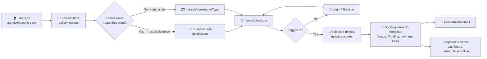
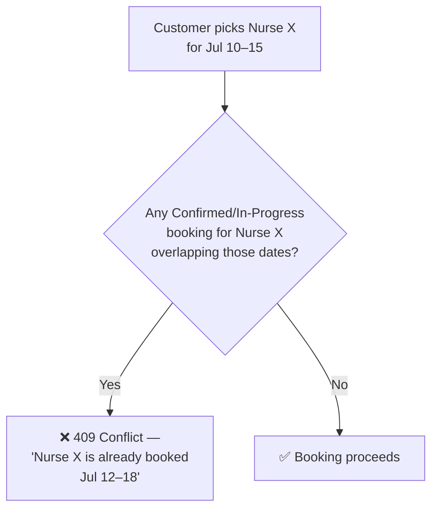
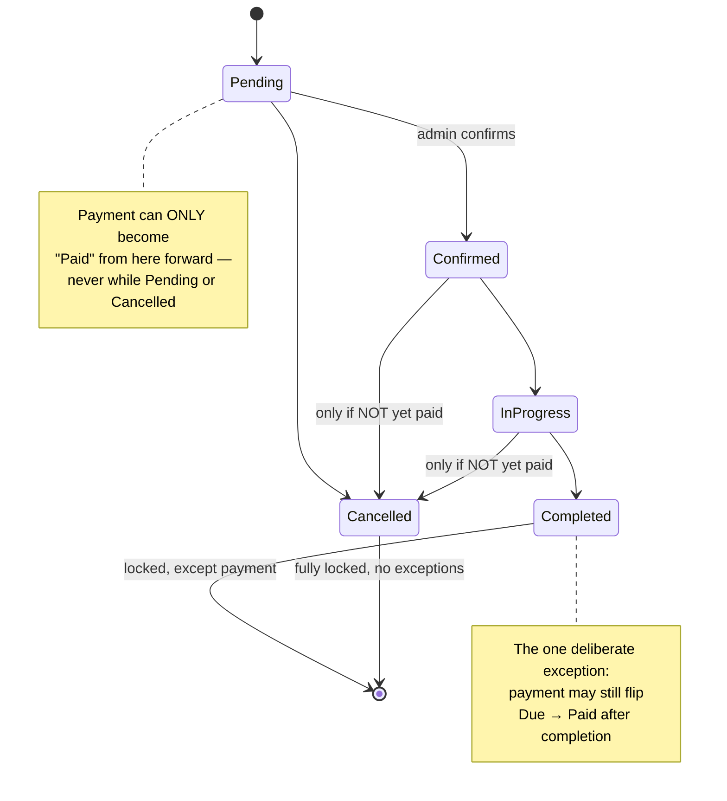
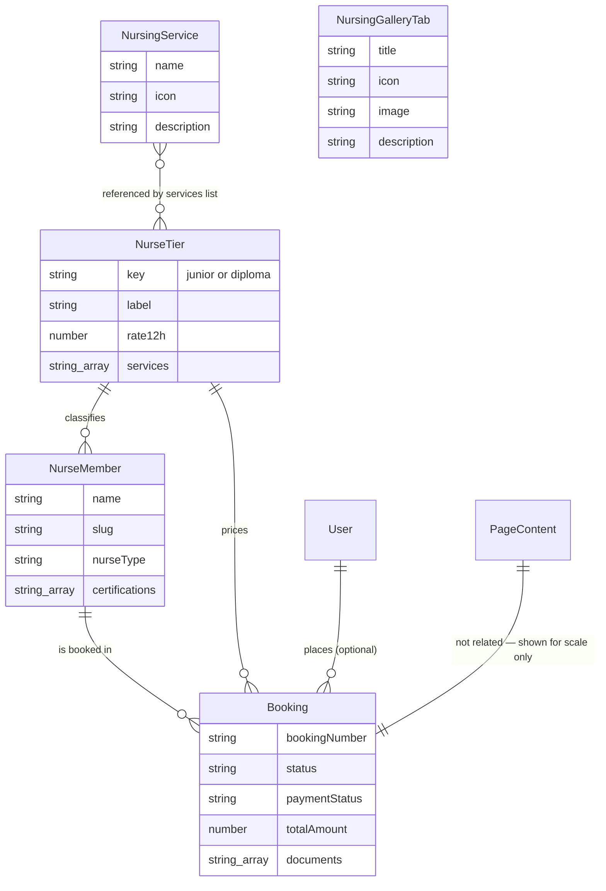
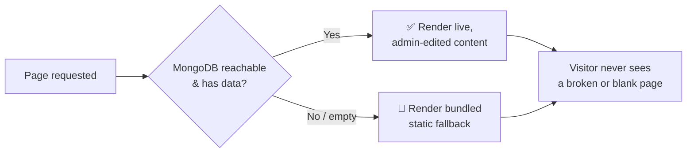

# 🩺💙 Care Bangla — Home Nursing Service Workflow

*From a visitor's first click to a nurse standing at the patient's door — and everything the database, the API, and the admin panel do in between.*

  
  
  

---

## 📖 Table of Contents

1. [🎯 Executive Summary](#-executive-summary)
2. [🚶 Part I — The Complete Journey](#-part-i--the-complete-journey)
3. [⚙️ Part II — How It Actually Works](#️-part-ii--how-it-actually-works)
4. [🏗️ Part III — System Structure](#️-part-iii--system-structure)
5. [🎨 Part IV — Design System & Public Experience](#-part-iv--design-system--public-experience)
6. [🚀 Part V — Future Aspects To Be Upgraded](#-part-v--future-aspects-to-be-upgraded)
7. [⚖️ Part VI — Pros & Cons, Honestly](#️-part-vi--pros--cons-honestly)
8. [🏁 Closing Word](#-closing-word)

---

## 🎯 Executive Summary

Care Bangla's **Home Nursing Care** module lets a family in Bangladesh book a **BNMC-registered nurse** — Junior or Diploma tier, for 12 or 24-hour shifts — directly from the website, with **zero payment collected at booking time**. The admin team confirms the nurse, the shift happens, and payment is only marked **Paid** once money has actually changed hands, days or weeks later.

That one sentence hides a surprisingly rich system:

> 🟦 A **pricing engine** that prices every booking from a single source of truth (the nurse's tier).
> 🟦 A **conflict-checking engine** that stops two families from double-booking the same nurse.
> 🟦 A **cross-validated status/payment state machine** that makes an invalid combination *structurally impossible to create* — not just rejected after the fact.
> 🟦 A **DB-first, static-fallback architecture** so the public site never shows a blank page, even if MongoDB hiccups.
> 🟦 A **fully admin-editable public experience** — banners, tiers, photo galleries, service catalogues, even the hero background video — with **zero code deploys** required to change any of it.

This document walks through all of it: the process, the mechanics, the data, the design, what's still missing, and what's genuinely good about it.

---

## 🚶 Part I — The Complete Journey

### 🧑‍🦰 The Customer's Path

**Nothing is charged here.** Care Bangla's business model is deliberately *pay-after-service* — the booking is a confirmed commitment, not a transaction.

### 🛠️ The Admin's Path

```mermaid
flowchart LR
    A["🔔 New booking appears\n(unread, blue outline)"] --> B["👁️ Admin opens it —\nmarked as viewed"]
    B --> C["👩‍⚕️ Confirms / reassigns\nnurse if needed"]
    C --> D["📌 Status → Confirmed"]
    D --> E["🚗 Nurse begins shift\nStatus → In Progress"]
    E --> F["✅ Shift ends\nStatus → Completed"]
    F --> G["💵 Payment collected\nin person / by phone"]
    G --> H["💳 Admin marks Payment → Paid"]
    H --> I["🔒 Booking permanently\nlocked — a closed book"]
```

Every arrow above is **enforced by real validation**, not just UI convention — see Part II.

---

## ⚙️ Part II — How It Actually Works

### 💰 1. The Pricing Engine

Every price on the site traces back to exactly **one number per tier**: `NurseTier.rate12h`.

| Input | Formula | Lives in |
|---|---|---|
| Shift mode | 12h → `rate12h` · 24h → `rate12h × 2` (a second nurse rotates in) | `computeNurseBookingPricing()` |
| Day count | `dayCountBetween(startDate, endDate)` — inclusive day math | `src/data/nurseTiers.js` |
| Total | `dailyRate × dayCount` | snapshotted onto the `Booking` document at creation |

> 💡 **Why snapshot the price?** If an admin later changes a tier's rate, every *already-placed* booking must keep showing the price the customer actually agreed to. `Booking.dailyRate`/`totalAmount` are stored values, never live-computed — a deliberate, important design choice.

### 🔒 2. The Conflict-Checking Engine

Before a specific nurse can be booked, `findOverlappingLockedBooking()` checks whether that nurse already has a **Confirmed** or **In-Progress** booking whose dates overlap. If so — booking rejected with a clear reason, not a silent double-booking.

The same engine also powers `withUnavailableNurseIds()` — the admin's nurse-reassignment dropdown never even *shows* a nurse who's already committed elsewhere for those dates. **Bad states are made unreachable, not just rejected.**

### 🚦 3. The Status ⇄ Payment Rule Engine — the crown jewel

This was one of the most carefully-built pieces of the whole system. Two independent fields — `status` and `paymentStatus` — are cross-validated so an **invalid combination can never exist**, enforced identically on the frontend *and* the backend.

**The three governing rules, in plain English:**

| # | Rule | Why |
|---|---|---|
| 1️⃣ | Payment can only become **Paid** while status is Confirmed, In-Progress, or Completed | Nothing's been delivered yet if it's Pending; nothing to charge for if Cancelled |
| 2️⃣ | Once payment is **Paid**, status can *never* move back to Pending or Cancelled | A paid service was, by definition, delivered — history can't be undone |
| 3️⃣ | A **Completed** booking is locked for everything *except* payment | Payment is often collected days after service ends — the one deliberate crack in an otherwise sealed door |

This isn't just a form validation — it's baked in **three layers deep**: the Status/Payment dropdown *options themselves* are filtered so an invalid choice is never even shown → a `disabled` state as a second guard → the API route as the final, authoritative judge, regardless of what the client sends.

### 📁 4. Document Handling

Prescriptions and lab reports ride along at checkout (or get added later by an admin) straight into **MongoDB GridFS** — the same binary store used for every image and, as of this project's latest upgrade, video on the site. `Booking.documents` only ever *grows* by appending; nothing is silently overwritten.

---

## 🏗️ Part III — System Structure

### 🗄️ The Data Model Family

### 🧩 Module Map

| Layer | Path | Purpose |
|---|---|---|
| 🌍 **Public discovery** | `src/app/service/[serviceId]/page.js` → `src/views/Service/ServiceDetailsNursingCare.jsx` | The `/service/nursing-care` landing page: banner, intro, tiers, alternating preview rows, services grid, and nurse roster slider |
| 🧭 **Public booking** | `src/app/nurses/book/[nurseType]`, `src/app/nurses/nurse-details/[nurseId]`, `src/app/nurses/checkout` | Category or specific-nurse booking flow |
| 🔌 **Public API** | `src/app/api/bookings`, `src/app/api/nurses/*` | Creates bookings, serves nurse/tier data |
| 🔐 **Admin bookings** | `src/app/admin/nurses/bookings/page.js` + `src/app/api/admin/nurses/bookings/*` | The full booking management console |
| 🔐 **Admin roster** | `src/app/admin/nurses` + `src/app/api/admin/nurses/*` | Nurse profile CRUD |
| 🔐 **Admin CMS** | `src/app/admin/content/nursing-care/page.js` + `/api/admin/content/nursing-care`, `/api/admin/nursing-services`, `/api/admin/nursing-gallery` | Every editable word, image, preview-row heading, tier, and service item on the public page |
| 🗃️ **Models** | `src/models/Booking.js`, `NurseTier.js`, `NurseMember.js`, `NursingService.js`, `NursingGalleryTab.js`, `PageContent.js` | The schema layer |
| 📦 **Media** | `src/lib/gridfs.js`, `/api/media/[id]/[[...seo]]` | Binary storage plus SEO-friendly image URLs; video remains Range-request-aware |

### 🛡️ The DB-First, Static-Fallback Philosophy

Every single piece of content on this page — the banner, tier cards, preview rows, and services grid — follows the **same defensive pattern**:

This means a MongoDB outage **degrades gracefully to a still-functional, still-attractive static page** rather than a 500 error — a genuinely resilient piece of architecture.

---

## 🎨 Part IV — Design System & Public Experience

The `/service/nursing-care` page, top to bottom, all **admin-editable, all DB-backed**:

| # | Section | Component | What Makes It Nice |
|---|---|---|---|
| 1 | 🖼️ **Page banner** | `PageBreadcrumb` | Full-bleed photo, dark overlay, auto-generated breadcrumb trail from the URL — reused identically on every page site-wide |
| 2 | 📣 **Intro** | `SectionHeading` | Admin-editable headline + description |
| 3 | 💳 **Tier Cards** | `TierCard` | Junior vs Diploma — rate, education, checklist, and one-click booking; deliberately placed immediately after the intro |
| 4 | 🖼️ **Service Preview** | `ServicePreviewGallery` | All entries render as alternating image/text rows with a blue eyebrow and custom heading; mobile copy uses an accessible expand/collapse panel, with no slider state or gestures |
| 5 | 🩹 **Services & Solutions** | icon grid | The admin-managed "Nursing Services Provided" catalogue, first six shown |
| 6 | 👩‍⚕️ **Specialist Nurses** | `MedicalTeamSection` | Horizontal slider of real nurse profiles |
| 7 | 🧰 **Core Services** | `Service` (photo-card grid) | Real photo + floating circular "go" button per service — **DB-backed**, shared with the homepage and the `/service` listing |
| 8 | 📣 **Recruitment CTA** | — | "Join Our Nursing Team" |

> ✨ **A nice touch worth calling out:** the video hero on the homepage now supports a **real, admin-uploaded MP4/WebM file** stored in GridFS with proper **HTTP Range-request support** — meaning it streams and seeks like a real video CDN would, not a naive full-file download. It falls back to a YouTube embed automatically if no file has been uploaded yet.

> **August 2026 shared-content update:** Narrative service copy may now use the safe `{ text, links }` inline-link value, and every service image may use `{ src, alt, title, fileName }`. See [FEATURES_AND_CONTENT_ARCHITECTURE.md](FEATURES_AND_CONTENT_ARCHITECTURE.md) for the storage and rendering contract.

---

## 🚀 Part V — Future Aspects To Be Upgraded

| Priority | Upgrade | Impact | Notes |
|---|---|---|---|
| 🔴 High | **Online payment gateway** (bKash/Nagad/card) | Removes manual "mark as Paid" step entirely | Currently 100% manual, by deliberate business-model choice — but optional online prepayment could be offered alongside |
| 🔴 High | **Nurse-side mobile app / portal** | Nurses see their own schedule, mark shift start/end themselves | Today, only admins move a booking through its lifecycle |
| 🟠 Medium | **SMS notifications** | Confirmations reach customers without email | Many customers book by phone and may have no email at all |
| 🟠 Medium | **Automated review request** post-completion | Builds a trust/ratings layer | No review system exists yet |
| 🟠 Medium | **Recurring / subscription bookings** | "Every Monday & Thursday" instead of one-off date ranges | `Booking` currently models one fixed date range only |
| 🟡 Nice-to-have | **Real-time nurse GPS/ETA tracking** | Big trust boost for families | Would need a live-location service, currently out of scope |
| 🟡 Nice-to-have | **Granular admin roles** (dispatcher vs. finance vs. super-admin) | Safer multi-person admin teams | Currently a single flat admin role |
| 🟡 Nice-to-have | **Automated nurse-matching** by location/specialty | Reduces manual reassignment work | Reassignment today is manual, dropdown-driven |
| 🟢 Polish | **Admin analytics dashboard** (bookings/week, revenue collected vs. due, nurse utilization) | Business visibility | Data already exists in `Booking` — just needs aggregation views |
| 🟢 Polish | **Automated test suite** for the status/payment rule engine | Protects the "crown jewel" logic from regressions | Currently verified via manual/live curl smoke-testing each change |

---

## ⚖️ Part VI — Pros & Cons, Honestly

### ✅ What's Genuinely Strong

- 🛡️ **Defense-in-depth validation** — every business rule enforced at the option-list level, the disabled-state level, *and* the API level. An invalid state genuinely cannot be created, not merely "usually prevented."
- 🧩 **Consistent architectural pattern** across every module — DB-first with a static fallback — makes the codebase predictable to extend.
- 💾 **Price snapshotting** protects historical bookings from retroactive rate changes.
- 🚫 **Conflict-free scheduling** — a nurse can never be silently double-booked.
- 🎛️ **Deep admin control with zero deploys** — banners, galleries, tiers, catalogues, even the hero video, all editable live.
- 🎥 **Modern media handling** — GridFS + HTTP Range support means video isn't just "stored," it's *served properly*.
- 📱 **Responsive, considered UI** — mobile treatment isn't an afterthought; text hierarchy, button sizing, and layout collapse are deliberately tuned per breakpoint.

### ⚠️ What's Worth Being Honest About

- 💳 **No payment gateway** — "Paid" is a manual admin toggle backed by trust and a phone call, not a transaction record. Fine for the current business model; a ceiling if the business wants online prepayment later.
- 🧪 **No automated test suite** — the intricate status/payment rule engine is currently verified by manual, conversation-driven smoke-testing rather than a regression-proof test file.
- 👤 **Single admin role** — anyone with admin access can do *everything*; no separation between "can view bookings" and "can change financial state."
- 📍 **No live nurse tracking** — a family knows a nurse is confirmed, not exactly when they'll arrive.
- ⏱️ **Fixed-date-range bookings only** — no native support yet for recurring or subscription-style care arrangements.
- 🗄️ **A known Mongoose dev-server caching quirk** — adding a new schema field requires a dev-server restart (or a direct-driver backfill script) to take effect for *writes*; reads are unaffected. A one-time friction point during development, invisible to end users.

---

## 🏁 Closing Word

What started as "let people book a nurse online" grew into a small, well-governed **state machine wrapped in a resilient, admin-controllable content platform** — the kind of system where the *interesting* engineering isn't the CRUD, it's the rules that make bad states impossible and the fallbacks that make outages invisible.

There's real room to grow — payment, mobile, tracking, recurring bookings — but the **foundation is exactly the kind you want to build all of that on top of.**

<b>🩺 Built for families who need care at home, and the admins who make sure it arrives. 💙</b>

