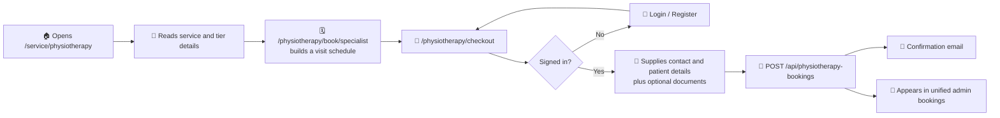
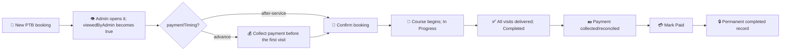
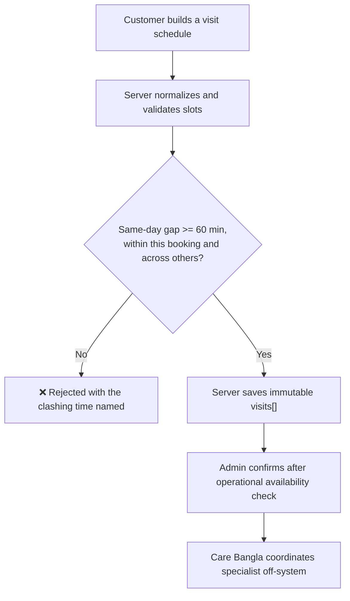
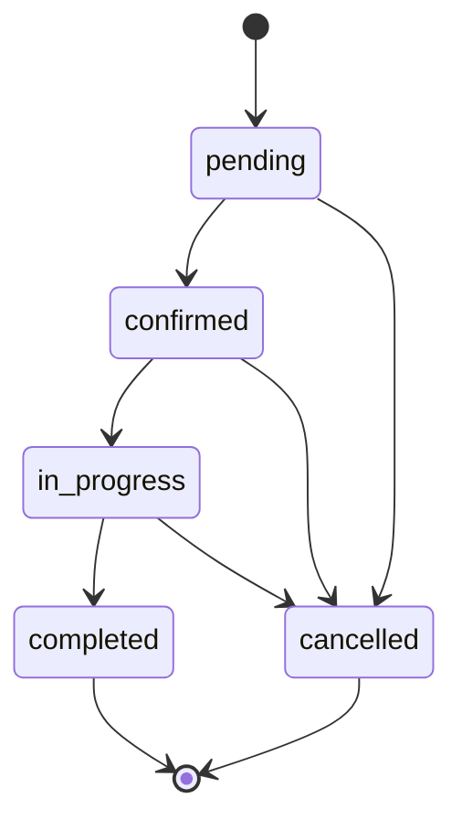
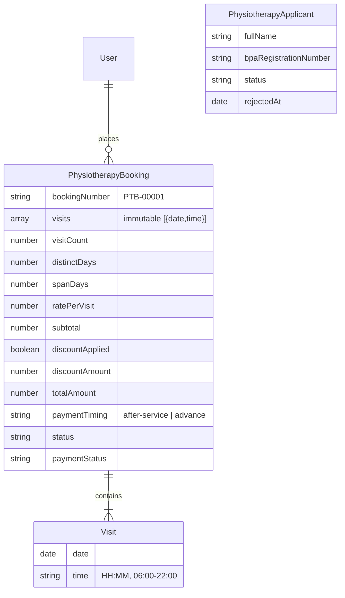
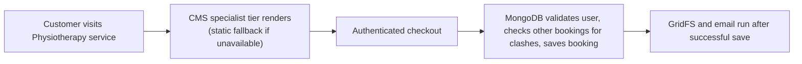

# 🧑‍⚕️💙 Care Bangla — Physiotherapy Service Workflow (Implementation Blueprint)

*From a visitor selecting a home session to the completed visit, post-service payment, recruitment pipeline, and permanent record in MongoDB.*

  
  
  
  

---

## 📋 Development Status

The Physiotherapy Service is **implemented**. It follows the same Care Bangla home-service foundations used by Nursing, Caregiver, and Baby Care—authenticated booking, server-authoritative pricing, admin review, GridFS documents, applicant management, and permanent records—while deliberately using a **single visit-based Physiotherapy Specialist tier** booked as a **course of one or many short sessions**.

### 🔑 The Two Differences, Stated Once Clearly

| # | Shift-based home services do this | Physiotherapy does instead | Reason |
|---|---|---|---|
| 1 | Book a 12/24-hour shift over a start/end date range | Book a list of 45–60 minute visits, each its own `{ date, time }` slot at an exact clock time—several may share one day, at least 60 minutes apart | Physiotherapy is a short bounded clinical session repeated as a course, not continuous care staffing |
| 2 | Assign or expose a nurse/caregiver roster in the application | Has no public or admin specialist roster yet; the actual specialist is coordinated off-system | The service is ready for bookings without exposing or maintaining clinician profiles before that operational process exists |

### 🧾 The Physiotherapy Specialist Tier — Confirmed Real Content

| Field | Current value |
|---|---|
| `key` / `tierType` | `specialist` |
| `label` | Physiotherapy Specialist |
| Session duration | 45–60 Minutes |
| Booking window | 06:00–22:00 (`VISIT_TIME_MIN` / `VISIT_TIME_MAX`) |
| Same-day spacing | Minimum 60 minutes between visits (`MIN_VISIT_GAP_MINUTES`) |
| Eligibility | BPT / MPT; licensed, BPA-registered physiotherapist |
| `ratePerVisit` | ৳1,000 |
| Course discount | 15+ visits (X) that all fall within max(15, X) consecutive days receive 5% off the whole booking, **payable in advance** |

The current services checklist includes post-surgical rehabilitation, stroke recovery, orthopaedic and neurological care, sports injuries, chronic pain, post-fracture rehabilitation, frozen shoulder, back/neck pain, and balance/mobility training. The single source is `src/data/physiotherapyTiers.js`.

> 🧮 **Reading the course rule.** The allowed window grows with the booking: 15 visits must fit inside 15 consecutive days, 20 visits inside 20, and so on. Because several visits can share a day, 20 visits packed into 10 days qualify comfortably—while the same 15 visits spread across two months do not.

---

## 📖 Table of Contents

1. [🎯 Executive Summary](#-executive-summary)
2. [🚶 Part I — The Complete Journey](#-part-i--the-complete-journey)
3. [⚙️ Part II — How It Actually Works](#️-part-ii--how-it-actually-works)
4. [🏗️ Part III — Implemented System Structure](#️-part-iii--implemented-system-structure)
5. [🎨 Part IV — Design System & Public Experience](#-part-iv--design-system--public-experience)
6. [🚀 Part V — Future Aspects To Be Upgraded](#-part-v--future-aspects-to-be-upgraded)
7. [⚖️ Part VI — Pros & Cons, Honestly](#️-part-vi--pros--cons-honestly)
8. [🏁 Closing Word](#-closing-word)

---

## 🎯 Executive Summary

Care Bangla’s Physiotherapy Service lets a signed-in customer build an at-home Physiotherapy Specialist **visit schedule**—one session or a full multi-week course, including more than one session on the same day—then provide patient and referral details, upload supporting documents, and receive a booking confirmation. No online payment is ever taken at booking time: every new booking starts as `pending` with payment `due`.

The application calculates price only on the server. Each visit is ৳1,000. A qualifying intensive course (15+ visits inside a matching consecutive-day window) receives 5% off the whole booking and is flagged **payable in advance**—the single exception to Care Bangla’s usual pay-after-service model, and still collected manually by the team rather than charged online. The rate, visit count, day count, span, discount decision, amount, and payment timing are all snapshotted onto the booking so future tier changes cannot rewrite historical agreements.

---

## 🚶 Part I — The Complete Journey

### 🧑‍🦰 The Customer's Path

The booking page is a **schedule builder**: a Date + Time + Repeat row adds one visit, or spreads that time across a run of consecutive days in a single click (how a 15-day course is realistically booked). Adding again at a different time places a second visit on the same day. Selected visits render grouped by day with per-slot removal, and the running total—including the course discount and its advance-payment flag—updates live. Checkout then collects contact/address details, district, reason for visit, patient condition, and optional reports or referral documents. Neither screen ever sends a price to the server.

### 🛠️ The Admin's Path

Admins work from the Physiotherapy section in `/admin/bookings`. The list shows each booking's visit count, distinct days, and total span, plus an orange **Advance** flag on discounted courses so staff know to chase that payment *before* the first visit rather than after the last. Opening a booking spells out every visit day by day with its times. Admins can also create a phone booking through the shared client-picker flow—using the same Date + Time + Repeat schedule builder and the same live price preview—add documents, update allowed details, and manage the status/payment state. There is intentionally no named-specialist assignment field in the current implementation.

---

## ⚙️ Part II — How It Actually Works

### 💰 1. The Pricing Engine — a course of visits, server authority

| Input | Rule | Source |
|---|---|---|
| Base rate | ৳1,000 per visit | `physiotherapyTiers.specialist.ratePerVisit` |
| Schedule normalization | Sort and de-duplicate the submitted `{ date, time }` slots, dropping anything malformed or outside 06:00–22:00 | `normalizeVisits()` |
| Schedule shape | Derive `visitCount`, `distinctDays`, and the inclusive first→last `spanDays` | `visitScheduleShape()` |
| Course discount | Apply 5% only when `visitCount >= 15` **and** `spanDays <= max(15, visitCount)` | `computePhysiotherapyBookingPricing()` |
| Payment timing | `advance` when the discount applies, otherwise `after-service` | Same function; saved as `paymentTiming` |
| Final total | `subtotal − discountAmount`, snapshotted with the schedule that produced it | Saved on `PhysiotherapyBooking` |

Both the public booking API and the admin phone-booking API re-normalize the schedule and recompute every figure independently on the server. A client cannot submit or alter `totalAmount`, `discountPercent`, `visitCount`, or `paymentTiming`—and because the discount depends only on the schedule (never on stored history), the client-side preview and the server's authoritative result always agree.

### 🔒 2. Scheduling, same-day spacing, and the no-roster boundary

Physiotherapy does not run the Nursing/Caregiver named-person overlap engine because no Physiotherapy Specialist roster exists in the application. It does enforce one real scheduling rule: **a client may hold several visits on the same day, but never closer than 60 minutes apart**—a session runs 45–60 minutes, so anything tighter would overlap the visit itself plus the specialist's travel.

That floor is checked in three places:

| Where | Scope | Purpose |
|---|---|---|
| Booking card / admin modal | Within the schedule being built | Instant feedback before submission |
| `findVisitGapConflict()` in both POST routes | Within the booking being created | Authoritative rejection (`400`) |
| `findConflictWithExistingBookings()` | Against the client's **other** non-cancelled bookings | Stops a second booking quietly overlapping the first (`409`) |

Without that third check a client could book 2:00 PM today, then place a *separate* booking at 2:30 PM today and have two specialists expected at once. The whole schedule is immutable once saved; rescheduling means handling the original operationally and placing a new record.

### 🚦 3. The Status ⇄ Payment Rule Engine

The API is authoritative over allowed combinations:

| Rule | Meaning |
|---|---|
| Payment begins `due` | No online payment is taken at checkout, for either payment timing |
| `paid` is only valid after confirmation/in-progress/completion | Pending or cancelled work cannot be marked paid |
| Completed records are operationally locked | Payment can still be reconciled when collected after the visits |
| Cancel instead of delete | A cancelled booking stays in history, protecting auditability |

> 💳 **`paymentTiming` is guidance, not a second state machine.** A discounted course carries `paymentTiming: 'advance'`, which tells staff to collect *before* the first visit—but it still starts `due`, still gets marked `paid` by an admin through the same guarded transitions, and nothing in the application ever auto-charges anyone.

### 🔐 4. Immutability — a permanent booking record

`PhysiotherapyBooking` has no delete API. `bookingNumber`, customer name, and the entire `visits` array are immutable after creation. The booking number is generated as `PTB-00001`, `PTB-00002`, and so on. Historical rate, span, discount, total, and payment-timing snapshots are never recomputed after creation.

### 📁 5. Document Handling

At checkout, customers can submit optional referral letters, prescriptions, scans, and reports. The documents are stored through the shared GridFS media pipeline and their URLs are appended to `PhysiotherapyBooking.documents`. Admins can append more documents through:

`POST /api/admin/physiotherapy/bookings/[id]/documents`

The public and admin flows use the same protected media streaming path, `/api/media/[id]`.

---

## 🏗️ Part III — Implemented System Structure

### 🗄️ The Data Model Family

`PhysiotherapyBooking` is the operational record, and `visits` is an array of embedded slots rather than a date range—precisely because the days need not be contiguous and several visits can share one day. `distinctDays` and `spanDays` are stored alongside `visitCount` so support can see at a glance why a booking did or didn't earn the course discount, without recomputing it. `PhysiotherapyApplicant` is a separate recruitment record; an applicant is not implicitly a service specialist. Rejected applicants receive a 72-hour TTL cleanup window, while `waiting` and `potential` records persist.

### 🧩 Implemented Module Map

| Layer | Path | Purpose |
|---|---|---|
| 🌍 Public discovery | `src/app/service/[serviceId]/page.js` → `ServiceDetailsPhysiotherapy.jsx` | Banner, intro, booking tier, alternating service previews, services grid, and booking/recruitment entry points |
| 🧭 Booking chooser | `src/app/physiotherapy/book/[type]/page.js` → `PhysiotherapyBookingCard` | Schedule builder (Date + Time + Repeat) with live pricing |
| 🛒 Checkout | `src/app/physiotherapy/checkout/` + `PhysiotherapyCheckoutPage.jsx` | Authenticated details, day-by-day schedule review, documents, confirmation |
| 📣 Recruitment | `/physiotherapy/apply-as-specialist` | BPA-aware public applicant form |
| 🔌 Public APIs | `/api/physiotherapy-bookings`, `/api/physiotherapy-applicants` | Secure booking creation/history and applicant submission |
| 🔐 Admin console | `/admin/bookings` → `PhysiotherapyBookingsSection.jsx` | Review, create phone bookings, update state, append documents |
| 🔐 Admin APIs | `/api/admin/physiotherapy/bookings/*` | List/create/read/update and document append endpoints |
| ✍️ Admin CMS | `/admin/services/physiotherapy` → `PhysiotherapyCms.jsx` | Service identity/banner plus `PageContent('physiotherapy')` intro, tier, preview rows, services catalogue, and CTA content |
| 🗃️ Models | `PhysiotherapyBooking.js`, `PhysiotherapyApplicant.js` | MongoDB schema, validation, immutable fields, TTL recruitment cleanup |
| 💳 Pricing | `src/data/physiotherapyTiers.js` | Tier definition, visit normalization, schedule shape, course-discount computation |
| 🚧 Conflict guard | `src/lib/physiotherapyVisitConflicts.js` | Cross-booking same-day 60-minute check and its shared message |
| 📦 Media and email | `gridfs.js`, `imageMeta.js`, `email.js` | Shared uploads, structured image metadata/SEO paths, and booking-confirmation email |

### 🛡️ The DB-First, Static-Fallback Philosophy — unchanged

The public tier, services catalogue, and preview rows are now editable inside `PageContent('physiotherapy')`; their bundled files remain the fallback. Bookings, users, applicants, documents, and every admin action remain MongoDB-authoritative. The pricing helpers in `src/data/physiotherapyTiers.js` are still the server’s trusted fallback/domain definition and must remain compatible with the CMS tier shape.

Note that the course discount is derived purely from the schedule in the request, so pricing needs no database read—but the **cross-booking conflict check does**, which is why a booking still cannot be priced and saved without a live database.

---

## 🎨 Part IV — Design System & Public Experience

| # | Section | Experience |
|---|---|---|
| 1 | Service page intro | Admin-editable headline and description |
| 2 | Booking tier | Specialist tier immediately below the intro: session length, rate, course-discount note, services checklist, and booking action |
| 3 | Service preview | `ServicePreviewGallery` renders all entries as alternating image/text rows; mobile copy expands/collapses and no slider controls exist |
| 4 | Booking page | A schedule builder—Date + Time + Repeat—with visits grouped by day, per-slot removal, live totals, and a discount panel that states how many more visits would qualify |
| 5 | Checkout | Day-by-day schedule review, server-matching price breakdown, advance-payment callout when applicable, patient/contact fields, report uploads, and confirmation state |
| 6 | Authentication gate | A customer account is required so the booking is owned by the user portal and can be checked against their other bookings for clashes |
| 7 | User account | The signed-in customer can retrieve their own bookings through `GET /api/physiotherapy-bookings` |
| 8 | Recruitment | A multi-step specialist application with BPA registration, credentials, photo/CV, and reviewable documents |
| 9 | Admin UX | Unified bookings page, unviewed indicator, filters, Advance flag, phone booking with the same schedule builder, documents, and guarded state updates |

The form system supports English and Bengali labels/placeholders, localized native-control fallbacks, and accessible custom file/date controls where browsers otherwise own untranslatable text. Public narrative content also supports safe inline links, and images support alt/title/SEO file-name metadata; see [FEATURES_AND_CONTENT_ARCHITECTURE.md](FEATURES_AND_CONTENT_ARCHITECTURE.md).

---

## 🚀 Part V — Future Aspects To Be Upgraded

1. **Physiotherapist roster and assignment** — add an internal `PhysiotherapyMember` model, credential verification, availability, and conflict detection before exposing any public selection. Today's 60-minute gap rule protects the *client* from double-booking themselves; it cannot yet protect a *specialist* from being double-booked across clients.
2. **DB-managed tier/CMS** — move the static tier, service checklist, price, and course-discount policy to a protected admin CMS with versioned price snapshots retained.
3. **Reschedule workflow** — offer controlled per-visit rescheduling that creates an audit event rather than mutating the immutable `visits` array.
4. **Operational notification workflow** — notify the assigned clinician and customer by email/SMS/WhatsApp as state changes.
5. **Clinical visit notes** — add access-controlled clinician outcomes, home-exercise plans, and follow-up scheduling, with medical privacy review first.
6. **Payment integration** — if online deposits are introduced, extend the current `due/paid` model carefully without weakening post-service reconciliation.
7. **Reporting** — monthly visits, discount usage, conversion, cancellation reasons, districts served, and lead-to-booking metrics.

---

## ⚖️ Part VI — Pros & Cons, Honestly

### ✅ What This Design Gets Right From Day One

- A visitor gets one flow that fits real rehab: a single session or a whole course, several sessions a day if needed.
- Pricing and discount eligibility cannot be manipulated in the browser.
- Because the discount depends only on the submitted schedule, the client-side preview and the server's authoritative total can never silently disagree.
- Every booking is tied to a user account and remains auditable.
- The course discount is transparent because the visit count, distinct days, span, and applied discount are all saved.
- A client cannot double-book themselves within an hour, even across two separate bookings.
- Advance-payment courses are flagged for staff without introducing a second payment state machine or any online charging.
- GridFS documents and confirmation email reuse proven shared infrastructure.
- The applicant pipeline captures BPA registration separately from service booking data.

### ⚠️ What Is Worth Being Honest About

- Specialist availability is not yet modeled; a confirmed booking still needs real-world coordination.
- There is no in-app clinician assignment or cross-client conflict prevention until a roster exists—the 60-minute rule only protects one client's own schedule.
- The tier is static rather than CMS-managed today.
- Advance payment is a workflow flag and a staff instruction, not an enforced gate: nothing stops a course from starting while it is still `due`.
- The schedule is immutable, so a single missed or moved session currently needs an operational workaround rather than an in-app reschedule.
- Medical documents require ongoing access-control, retention, and privacy-policy review as the service grows.

---

## 🏁 Closing Word

Physiotherapy is implemented as a focused, visit-based Care Bangla service: one specialist tier, a schedule of short sessions the client composes themselves, server-owned pricing, a meaningful discount for committing to an intensive course, post-service payment everywhere except that discounted course, permanent records, and an admin/recruitment workflow that can grow into full specialist scheduling when operations are ready. Its deliberate simplicity is what makes the current system reliable—and gives the next roster and clinical-workflow upgrades a clean foundation.
