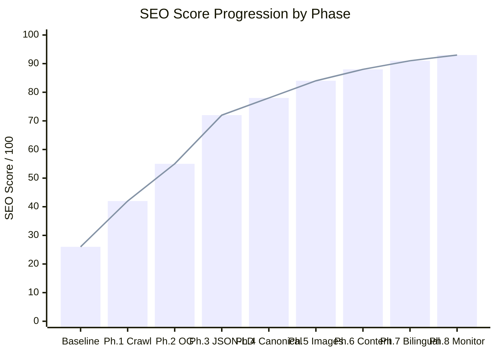
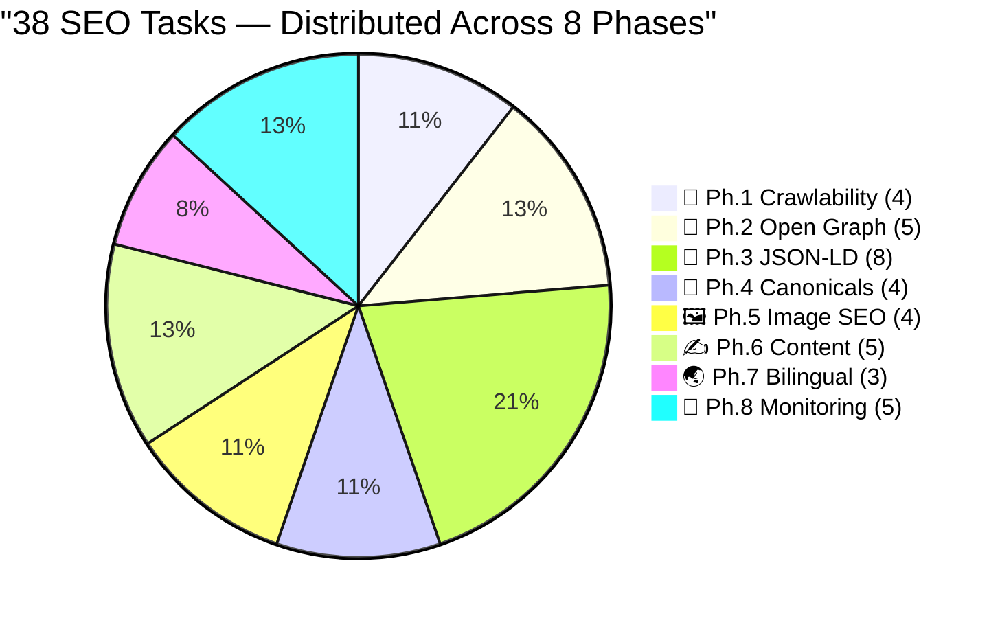
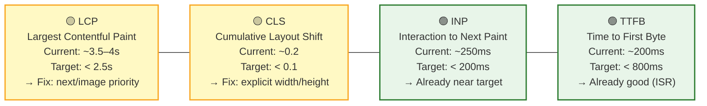
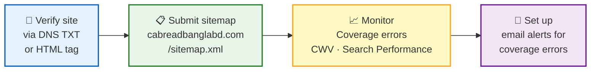
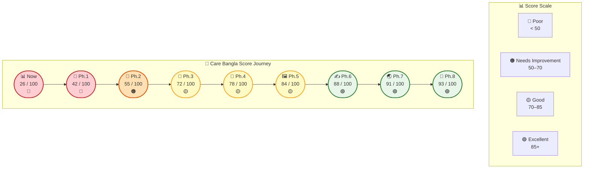
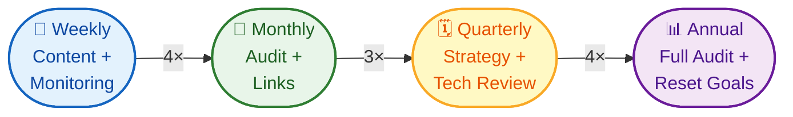
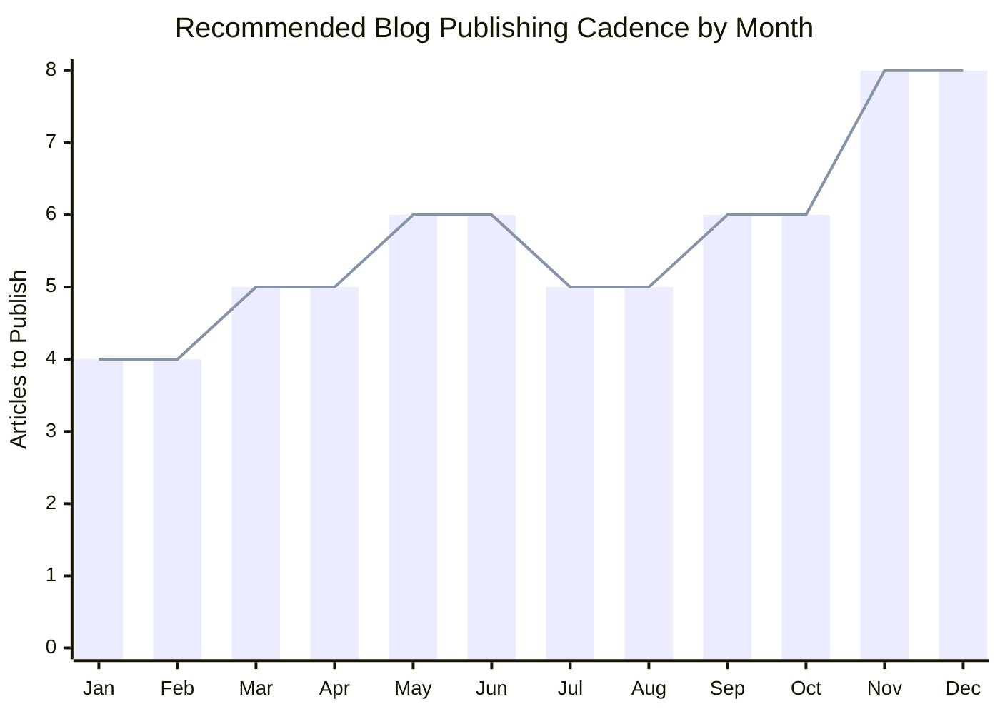

<div align="center">


# 🔍 SEO Optimization Roadmap

**Care Bangla — Medical & Home Healthcare Website**

[]()
[]()
[]()
[]()
[](https://nextjs.org/)
[](https://www.mongodb.com/)
[]()

**Audit Date:** June 2026 &nbsp;·&nbsp; **Status verified:** August 2026 &nbsp;·&nbsp; **Stack:** Next.js 16 App Router · MongoDB · ISR

</div>

---

## 📖 Table of Contents

1. [📊 Progress Tracker](#-progress-tracker)
2. [✅ Pre-Roadmap Baseline](#-pre-roadmap-baseline)
3. [🗺️ Roadmap Overview](#️-roadmap-overview)
4. [📋 Task Checklist](#-task-checklist)
5. [🔍 Executive Summary](#-executive-summary)
6. [📄 Page-by-Page SEO Baseline](#-page-by-page-seo-baseline)
7. [🔎 Phase 1 — Crawlability & Discovery](#phase-1--crawlability--discovery-critical-2-hours)
8. [📣 Phase 2 — Open Graph & Social Sharing](#phase-2--open-graph--social-sharing-3-hours)
9. [🧩 Phase 3 — JSON-LD Structured Data](#phase-3--json-ld-structured-data-4-hours)
10. [🔗 Phase 4 — Canonical URLs & Revalidation](#phase-4--canonical-urls--duplicate-content-1-hour)
11. [🖼️ Phase 5 — Image SEO & Core Web Vitals](#phase-5--image-seo--core-web-vitals-4-hours)
12. [✍️ Phase 6 — Content SEO & Keywords](#phase-6--content-seo--keyword-strategy-ongoing)
13. [🌏 Phase 7 — Bilingual SEO (EN/BN)](#phase-7--bilingual-seo-bengali--english-4-hours)
14. [📡 Phase 8 — Technical Audit & Monitoring](#phase-8--technical-audit--monitoring-ongoing)
15. [📊 Phase 9 — SEO Dashboard](#phase-9--seo-dashboard)
16. [⚡ Quick Wins Checklist](#-quick-wins-checklist-do-these-first)
17. [🎯 Implementation Priority Matrix](#-implementation-priority-matrix)
18. [📈 Expected Score Progression](#-expected-score-progression)

---

## 📊 Progress Tracker

> **Last updated:** 10 August 2026 — core phases 1–5 are implemented and Phase 7 is partially implemented; later URL-resilience and structured-content enhancements are documented below without changing the original 38-task denominator.

### Overall Completion

```text
Total Roadmap Tasks : 38
Completed           : 29
Remaining           : 9

Overall Progress  76%
[██████████████████████████████░░░░░░░░░░]  29 / 38
```

---

### Phase-by-Phase Progress

| # | Icon | Phase | Done | Total | Progress | % | Score After |
|:---:|:---:|---|:---:|:---:|---|:---:|:---:|
| 1 | 🔎 | Crawlability & Discovery | 4 | 4 | `██████████` | 100% | **42/100** |
| 2 | 📣 | Open Graph & Social Sharing | 5 | 5 | `██████████` | 100% | **55/100** |
| 3 | 🧩 | JSON-LD Structured Data | 8 | 8 | `██████████` | 100% | **72/100** |
| 4 | 🔗 | Canonical URLs & Revalidation | 4 | 4 | `██████████` | 100% | **78/100** |
| 5 | 🖼️ | Image SEO & Core Web Vitals | 4 | 4 | `██████████` | 100% | **84/100** |
| 6 | ✍️ | Content SEO & Keywords | 0 | 5 | `░░░░░░░░░░` | 0% | **88/100** |
| 7 | 🌏 | Bilingual SEO (EN/BN) | 1 | 3 | `███░░░░░░░` | 33% | **Partial** |
| 8 | 📡 | Technical Audit & Monitoring | 2 | 5 | `████░░░░░░` | 40% | **93/100** |
| — | — | **Total** | **29** | **38** | | **76%** | |

---

### 📈 Score Projection Chart



---

## ✅ Pre-Roadmap Baseline

> These were already in place before this roadmap was written. They are **not** counted in the 38 roadmap tasks but represent the foundation that earned the baseline **26/100** score.

<table>
<tr>
<td valign="top" width="50%">

### 🏗️ Technical Foundation
| Item | Status |
|---|:---:|
| `title.template` (`'%s \| Care Bangla'`) | ✅ |
| Static `metadata` on 13/16 public pages | ✅ |
| `generateMetadata()` on all 5 dynamic routes | ✅ |
| ISR `revalidate = 60` on list pages | ✅ |
| `loading.js` on 4 route segments | ✅ |

</td>
<td valign="top" width="50%">

### 🎨 UX & Accessibility Signals
| Item | Status |
|---|:---:|
| Google Fonts with `display: 'swap'` | ✅ |
| Web App Manifest | ✅ |
| Offline service worker | ⛔ Retired; `public/sw.js` unregisters the legacy worker |
| Hind Siliguri Bengali font subset | ✅ |
| EN/BN i18n translation system | ✅ |
| `404` / `not-found.js` on detail routes | ✅ |

</td>
</tr>
</table>

> 💡 **Baseline score contribution: ~26/100** — solid technical bones, but all the high-leverage SEO layers (robots, sitemap, OG, JSON-LD, canonicals) are still missing.

---

## 🗺️ Roadmap Overview

### Phase Flow & Score Jumps

```mermaid
flowchart LR
    B(["📊 Baseline\n26 / 100"])

    P1["🔎 Phase 1\nCrawlability\n+16 pts → 42"]
    P2["📣 Phase 2\nOpen Graph\n+13 pts → 55"]
    P3["🧩 Phase 3\nJSON-LD\n+17 pts → 72"]
    P4["🔗 Phase 4\nCanonicals\n+6 pts → 78"]
    P5["🖼️ Phase 5\nImages / CWV\n+6 pts → 84"]
    P6["✍️ Phase 6\nContent SEO\n+4 pts → 88"]
    P7["🌏 Phase 7\nBilingual\n+3 pts → 91"]
    P8["📡 Phase 8\nMonitoring\n+2 pts → 93"]

    B --> P1 --> P2 --> P3 --> P4 --> P5 --> P6 --> P7 --> P8

    style B  fill:#ffcdd2,stroke:#c62828,stroke-width:2px,color:#000
    style P1 fill:#fff9c4,stroke:#f9a825,stroke-width:2px,color:#000
    style P2 fill:#fff9c4,stroke:#f9a825,stroke-width:2px,color:#000
    style P3 fill:#ffe0b2,stroke:#e65100,stroke-width:2px,color:#000
    style P4 fill:#e8f5e9,stroke:#2e7d32,stroke-width:2px,color:#000
    style P5 fill:#e8f5e9,stroke:#2e7d32,stroke-width:2px,color:#000
    style P6 fill:#e3f2fd,stroke:#1565c0,stroke-width:2px,color:#000
    style P7 fill:#e3f2fd,stroke:#1565c0,stroke-width:2px,color:#000
    style P8 fill:#f3e5f5,stroke:#6a1b9a,stroke-width:2px,color:#000
```



### Task Distribution Across Phases



---

## 📋 Task Checklist

> Replace `- [ ]` with `- [x]` for each completed task.

#### 🔎 Phase 1 — Crawlability & Discovery

> **Why it matters:** This is the prerequisite for everything else. Without `robots.txt`, Google wastes crawl budget on `/admin` and `/api` routes, risking admin UI fragments appearing in search results. Without a `sitemap.xml`, new services, blog posts, and doctors added via the CMS are invisible to search engines until they happen to be discovered by following links — which can take weeks. Fixing the home page metadata replaces the generic template tagline (which can actively harm brand searches) with a real description.
>
> **How to implement:** Create two native Next.js App Router files — `src/app/robots.js` and `src/app/sitemap.js`. Next.js automatically serves them at `/robots.txt` and `/sitemap.xml`. The sitemap queries MongoDB directly (Service, BlogPost, TeamMember, Product) so it stays current with every publish. The home page metadata fix and cart noindex are single `export const metadata` changes — no UI touch needed.

- [x] **1.1** Create `src/app/robots.js` (disallow /admin, /api, /cart)
  - 📄 **File:** `src/app/robots.js`
- [x] **1.2** Create `src/app/sitemap.js` (dynamic DB-driven sitemap for all slugs)
  - 📄 **File:** `src/app/sitemap.js`
- [x] **1.3** Fix home page metadata — replace generic layout description with real tagline
  - 📄 **File:** `src/app/page.js`
- [x] **1.4** Add `robots: { index: false }` to `/medical-shop/cart` page
  - 📄 **File:** `src/app/medical-shop/cart/page.js`

#### 📣 Phase 2 — Open Graph & Social Sharing

> **Why it matters:** Every Care Bangla product, blog post, or service link shared on WhatsApp, Facebook, or Viber currently renders as a plain URL — no image, no headline, no description. Open Graph tags transform those shares into rich visual cards. For a healthcare business where referrals and social trust are central to conversion, this directly impacts click-through rates and brand credibility. Product pages in particular benefit the most: a WhatsApp share of a product with an image and price visible in the card drives direct purchase intent.
>
> **How to implement:** Add `metadataBase: new URL('https://carebanglabd.com')` once to the root `layout.js` — this is required for all OG image URLs to be absolute. Then add a default `openGraph` and `twitter` block to the root metadata as the global fallback. For each dynamic page, extend the existing `generateMetadata()` function with an `openGraph` object that pulls the entity's real image from MongoDB (service `bannerImage`, blog `thumbnail`, doctor `image`, product `image`). Create one branded `og-default.jpg` (1200×630px) to serve as the fallback for all static pages.

- [x] **2.1** Add `metadataBase`, default `openGraph`, and `twitter` block to root `layout.js`
  - 📄 **File:** `src/app/layout.js`
- [x] **2.2** OG tags on service detail pages (use `bannerImage` from DB)
  - 📄 **File:** `src/app/service/[serviceId]/page.js`
- [x] **2.3** OG tags on blog detail pages (use `thumbnail`, `author`, `date` from DB)
  - 📄 **File:** `src/app/blog/[blogId]/page.js`
- [x] **2.4** OG tags on doctor detail pages (use `image` from DB)
  - 📄 **File:** `src/app/doctors/doctor-details/[doctorId]/page.js`
- [x] **2.5** OG tags on product detail pages (use `image`, `price` from DB)
  - 📄 **File:** `src/app/medical-shop/product/[...slug]/page.js`

#### 🧩 Phase 3 — JSON-LD Structured Data

> **Why it matters:** JSON-LD is how Google understands the *meaning* of your content, not just the words. It unlocks rich results that competitors without structured data cannot show: product prices and star ratings directly in search results, FAQ accordion dropdowns that double SERP real estate, doctor knowledge panels, and article date/author lines in Google News. For a medical business, `Physician` and `MedicalBusiness` schemas also activate eligibility for Google's healthcare knowledge graph features. This phase alone is projected to add +17 points to the SEO score — the single largest gain in the entire roadmap.
>
> **How to implement:** Inject `<script type="application/ld+json">` tags inside Server Components — no library needed. The Organization schema goes once in root `layout.js`. Each detail page (service, blog, doctor, product, contact) gets its own schema object built from the MongoDB document already fetched for that page. BreadcrumbList and FAQPage schemas are additive — they layer on top of the entity schemas already in place. Validate each schema at `search.google.com/test/rich-results` immediately after implementation.

- [x] **3.1** `MedicalBusiness` / `Organization` schema in root `layout.js`
  - 📄 **File:** `src/app/layout.js` — `ORG_SCHEMA` constant injected via `<script type="application/ld+json">` in the root body
- [x] **3.2** `Service` schema on each service detail page
  - 📄 **File:** `src/app/service/[serviceId]/page.js` — `buildServiceSchemas()` → `serviceSchema`
- [x] **3.3** `BlogPosting` / `Article` schema on each blog detail page
  - 📄 **File:** `src/app/blog/[blogId]/page.js` — `blogSchema` with `datePublished`, `dateModified`, `publisher`
- [x] **3.4** `Physician` / `Person` schema on each doctor detail page
  - 📄 **File:** `src/app/doctors/doctor-details/[doctorId]/page.js`
- [x] **3.5** `Product` schema with price + rating on each product detail page
  - 📄 **File:** `src/app/medical-shop/product/[...slug]/page.js`
- [x] **3.6** `LocalBusiness` schema with address + hours on contact page
  - 📄 **File:** `src/app/contact/page.js`
- [x] **3.7** `BreadcrumbList` schema on all detail pages (service / blog / doctor / product)
  - 📄 **Files:** `src/app/service/[serviceId]/page.js` · `src/app/blog/[blogId]/page.js` · `src/app/doctors/doctor-details/[doctorId]/page.js` · `src/app/medical-shop/product/[...slug]/page.js`
- [x] **3.8** `FAQPage` schema on service detail pages and home page
  - 📄 **Files:** `src/app/service/[serviceId]/page.js` — `buildServiceSchemas()` → `faqSchema` · `src/app/page.js`

#### 🔗 Phase 4 — Canonical URLs & Revalidation

> **Why it matters:** Duplicate content dilutes ranking signals. Google may index `/service/doctor-consultation`, `/service/doctor-consultation/` (trailing slash), and any staging/preview URLs as separate pages competing against each other. Canonical tags consolidate those signals onto one authoritative URL. Separately, dynamic pages without `revalidate` are served from a stale static snapshot indefinitely after the first build — a new service added in the admin panel may not appear in search results for days. ISR `revalidate = 3600` ensures content freshness signals are updated hourly.
>
> **How to implement:** Add `metadataBase` once to root `layout.js` (shared with Phase 2). Add `alternates: { canonical: '...' }` to each `generateMetadata()` return — one line per dynamic page. Add `trailingSlash: false` to `next.config.mjs` to enforce canonical URL shape at the server level. Add `export const revalidate = 3600` to the five dynamic route `page.js` files (`service/[serviceId]`, `blog/[blogId]`, `doctors/doctor-details/[doctorId]`, `medical-shop/product/[...slug]`, `medical-shop/category/[categorySlug]`).

- [x] **4.1** Add `metadataBase: new URL('https://carebanglabd.com')` to root layout
  - 📄 **File:** `src/app/layout.js` — `metadata.metadataBase`
- [x] **4.2** Add `alternates.canonical` to every `generateMetadata()` return value
  - 📄 **Files:** `src/app/service/[serviceId]/page.js` · `src/app/blog/[blogId]/page.js` · `src/app/doctors/doctor-details/[doctorId]/page.js` · `src/app/medical-shop/product/[...slug]/page.js` · `src/app/medical-shop/category/[categorySlug]/page.js`
- [x] **4.3** Add `trailingSlash: false` to `next.config.mjs`
  - 📄 **File:** `next.config.mjs`
- [x] **4.4** Add `export const revalidate = 3600` to all 5 dynamic detail page routes
  - 📄 **Files:** `src/app/service/[serviceId]/page.js` · `src/app/blog/[blogId]/page.js` · `src/app/doctors/doctor-details/[doctorId]/page.js` · `src/app/medical-shop/product/[...slug]/page.js` · `src/app/medical-shop/category/[categorySlug]/page.js`

#### 🖼️ Phase 5 — Image SEO & Core Web Vitals

> **Why it matters:** Google uses Core Web Vitals — LCP (Largest Contentful Paint), CLS (Cumulative Layout Shift), and INP (Interaction to Next Paint) — as direct ranking signals. The site currently uses raw `` tags everywhere, which means: no automatic WebP/AVIF conversion (images are 2–5× larger than necessary), no responsive `srcset` (mobile users download desktop-sized images), no built-in lazy loading, and unsized images that cause layout shift as they load. The hero image alone likely accounts for most of the estimated LCP of 3.5–4s. Switching to Next.js `<Image>` fixes all of these automatically with no manual configuration.
>
> **How to implement:** Replace `` with `<Image>` from `next/image`, starting with the highest-impact components first: hero background, doctor card photos, blog thumbnails, product images. Add the `priority` prop to the hero image and the first visible doctor/product card (above-the-fold images should not be lazy-loaded). Set explicit `width` and `height` on all fixed-size images to eliminate CLS. Lock `remotePatterns` in `next.config.mjs` to `carebanglabd.com` and `localhost` to prevent image optimization abuse. Audit all `alt` attributes — every image must have a descriptive string matching its context (not "Image", not empty).

- [x] **5.1** Migrate hero, doctor cards, blog thumbnails, product images to `next/image`
  - 📄 **Files:**
    - `src/Components/MedicalTeamSection/index.jsx` — doctor card photos (`DoctorCard`)
    - `src/Components/DoctorDetailsSection/index.jsx` — doctor detail hero image
    - `src/Components/BlogsSection/BlogsSection1.jsx` — blog grid thumbnails (Server Component)
    - `src/Components/BlogsSection/index.jsx` — blog slider thumbnails (Client Component)
    - `src/Components/MedicalShop/ProductCard.jsx` — product card images
    - `src/views/MedicalShopPage/ShopProductPage.jsx` + `src/Components/MedicalShop/ProductImageSlider.jsx` — product detail gallery/hero image
- [x] **5.2** Lock `next.config.mjs` `remotePatterns` to known hostnames only
  - 📄 **File:** `next.config.mjs` — `images.remotePatterns` restricted to `carebanglabd.com` and `localhost`
- [x] **5.3** Audit and fix `alt` text on all images (descriptive, not empty or "Image")
  - 📄 **Files:** Same 6 files as 5.1 — `alt` updated to use entity name (doctor name, post title, product name) in each component
- [x] **5.4** Add `priority` prop to above-the-fold images (hero, first doctor card)
  - 📄 **Files:**
    - `src/Components/DoctorDetailsSection/index.jsx` — doctor detail hero (`priority` = LCP element)
    - `src/Components/MedicalShop/ProductImageSlider.jsx` — product detail hero (`priority` = LCP element)

#### ✍️ Phase 6 — Content SEO & Keywords

> **Why it matters:** Technical SEO without content strategy is a foundation with nothing built on it. Google ranks pages based on what they say, not just how they are built. Healthcare falls under Google's YMYL (Your Money or Your Life) category, where content quality and E-E-A-T signals (Experience, Expertise, Authoritativeness, Trustworthiness) are weighted more heavily than in most other industries. Bengali-language search queries like "ঘরে ডাক্তার ঢাকা" (home doctor Dhaka) have high commercial intent and relatively low competition — every new piece of well-optimised content is a compounding asset. The blog is the primary long-term SEO channel; each published article is a permanent ranking opportunity for a targeted long-tail query.
>
> **How to implement:** Publish blog articles targeting the keyword list in Phase 6.1 (prioritised by estimated monthly search volume). Each article must include the target keyword in the `<h1>`, first paragraph, and at least two subheadings, with an internal link to the related service page and a minimum of 600 words. Enrich service pages by adding FAQ sections (feeding directly into the Phase 3.8 `FAQPage` schema), geographic service areas, and patient-trust markers ("BMDC-certified", "BNMC-registered"). For doctor profiles, add BMDC registration numbers, medical school, and years of experience — these are the primary E-E-A-T signals Google looks for on medical professional pages.

- [ ] **6.1** Publish 5 blog articles targeting high-volume Bengali healthcare keywords
  - 📄 **File:** Published via `/admin/blog` CMS → stored in `BlogPost` MongoDB collection
- [ ] **6.2** Enhance service detail pages — 200+ words, FAQ section, internal links
  - 📄 **File:** Edited via `/admin/services/[id]` CMS → feeds `src/app/service/[serviceId]/page.js`
- [ ] **6.3** Enrich doctor profiles — BMDC number, bio, hospital affiliations
  - 📄 **File:** Edited via `/admin/team/[id]` CMS → feeds `src/app/doctors/doctor-details/[doctorId]/page.js`
- [ ] **6.4** Enhance product pages — detailed descriptions, specs, category breadcrumb
  - 📄 **File:** Edited via `/admin/shop/products` CMS → feeds `src/app/medical-shop/product/[...slug]/page.js`
- [ ] **6.5** Add service coverage areas and address to home page visible text
  - 📄 **File:** Edited via `/admin/content/home` CMS → feeds `src/app/page.js`

#### 🌏 Phase 7 — Bilingual SEO (EN/BN)

> **Why it matters:** The site already has a complete EN/BN translation system (`useLanguage()` context with full JSON translation files). This is a significant unrealised SEO asset. Without `hreflang` tags, Google does not know which language variant to serve to which user — it may index only the English version and ignore Bengali content entirely, or consolidate both into one URL as duplicate content. Bengali search queries such as "বাড়িতে নার্সিং সেবা ঢাকা" have almost no competition from properly optimised sites, representing a major early-mover advantage in the Bangladesh healthcare search landscape.
>
> **How to implement:** Add `alternates.languages` with `hreflang` values (`en-BD`, `bn-BD`) to the root `layout.js` metadata — this is a single object addition. For `generateMetadata()` on dynamic pages, extend the `alternates` block already added in Phase 4.2 to include language alternates. Optionally create `/bn/*` route prefixes for the five highest-traffic pages (home, services, blog, doctors, appointments) — each served with Bengali metadata and language-specific content for clean language separation. At minimum, generate Bengali `title` and `description` strings from the existing `t.home.*` and `t.nav.*` translation keys for pages where `lang === 'bn'`.

- [x] **7.1** Add `hreflang` alternates to root layout and all page metadata
  - 📄 **File:** `src/app/layout.js` — `metadata.alternates.languages` (`en-BD` / `bn-BD`)
- [ ] **7.2** Create `/bn/*` route variants for top 5 pages (partially implemented)
  - 📄 **Files:**
    - `src/app/bn/layout.js` — nested layout; forces `initialLang="bn"` via inner `LanguageProvider`
    - `src/app/bn/page.js` — Bengali homepage (`/bn`)
    - `src/app/bn/about/page.js` — Bengali about page (`/bn/about`)
    - `src/app/bn/service/page.js` — Bengali services page (`/bn/service`)
    - `/bn/doctors` is not currently implemented; add `src/app/bn/doctors/page.js` before advertising that alternate
    - `src/app/bn/contact/page.js` — Bengali contact page (`/bn/contact`)
    - `src/i18n/LanguageContext.jsx` — added `initialLang` prop for route-forced language
    - `src/app/sitemap.js` — Bengali `/bn/*` URLs added to sitemap static pages
- [ ] **7.3** Generate Bengali metadata (title, description) for all planned `/bn/*` pages (partially implemented)
  - 📄 **Current:** `/bn`, `/bn/about`, `/bn/service`, and `/bn/contact` export Bengali metadata. Complete the missing route(s), beginning with `/bn/doctors`, before marking this task finished.

#### 📡 Phase 8 — Technical Audit & Monitoring

> **Why it matters:** SEO is not a one-time task — it decays. Deployments break schemas, crawler errors accumulate silently, Core Web Vitals regress as new features are added, and manual penalties go unnoticed. Google Search Console is the only authoritative source of truth for how Google sees your site — it shows which pages are indexed, which have errors, which queries drive traffic, and which Core Web Vitals are failing in the field (real user data). Without a monitoring baseline set up before ranking gains are achieved, it is impossible to diagnose regressions or attribute traffic improvements to specific SEO changes. Lighthouse CI in the build pipeline turns SEO from a periodic audit into a continuous quality gate.
>
> **How to implement:** Verify site ownership in Google Search Console via DNS TXT record or HTML meta tag (the DNS method is more robust). Submit the sitemap URL (`https://carebanglabd.com/sitemap.xml`) manually. After completing Phase 3, run all schemas through `search.google.com/test/rich-results` and fix any validation errors before they prevent rich result eligibility. Run a full Lighthouse audit on the home page and a product detail page immediately after Phase 5 to establish LCP/CLS baselines. Install `@lhci/cli` and add a `lhci autorun` step to the Vercel build pipeline so future PRs are automatically blocked if SEO scores regress below the current baseline. Upgrade the PWA manifest with a proper 512×512 maskable icon so Android users see the branded icon instead of a white square.

- [ ] **8.1** Verify site in Google Search Console + submit sitemap URL
  - 📄 **File:** External — Google Search Console dashboard (no code file)
- [ ] **8.2** Run Lighthouse audit — achieve LCP < 2.5s, CLS < 0.1 on home and product pages
  - 📄 **File:** External — run `npx lhci autorun` or Chrome DevTools against the live site
- [x] **8.3** Upgrade `manifest.json` — separate 512×512 icon, `maskable`, update description
  - 📄 **File:** `public/manifest.json` — `icons[].purpose: "maskable any"`, `shortcuts[]`, updated `description`
- [ ] **8.4** Validate all JSON-LD schemas at `search.google.com/test/rich-results`
  - 📄 **Files to validate:** `src/app/layout.js` (MedicalBusiness) · `src/app/service/[serviceId]/page.js` (Service + FAQ + Breadcrumb) · `src/app/blog/[blogId]/page.js` (BlogPosting + Breadcrumb) · `src/app/doctors/doctor-details/[doctorId]/page.js` (Physician + Breadcrumb) · `src/app/medical-shop/product/[...slug]/page.js` (Product + Breadcrumb) · `src/app/contact/page.js` (LocalBusiness)
- [x] **8.5** Add Lighthouse CI to build pipeline to prevent SEO regressions
  - 📄 **File:** `.lighthouserc.js` — SEO score ≥ 0.9 as hard error; LCP/CLS/Accessibility as warnings

---

### Score Projection (update as phases complete)

```text
Phase     Tasks   Done   Score After Completion
───────────────────────────────────────────────
Baseline   —       —     26 / 100  ████████░░░░░░░░░░░░░░░░░░░░░░
Phase 1    4       0     42 / 100  █████████████░░░░░░░░░░░░░░░░░
Phase 2    5       0     55 / 100  █████████████████░░░░░░░░░░░░░
Phase 3    8       0     72 / 100  ██████████████████████░░░░░░░░
Phase 4    4       0     78 / 100  ████████████████████████░░░░░░
Phase 5    4       0     84 / 100  ██████████████████████████░░░░
Phase 6    5       0     88 / 100  ███████████████████████████░░░
Phase 7    3       0     91 / 100  ████████████████████████████░░
Phase 8    5       0     93 / 100  █████████████████████████████░
```

> **Current live score: 26 / 100**

---

## 🔍 Executive Summary

The original June 2026 audit found a technically solid Next.js 16 foundation but none of the high-leverage SEO layers: no robots/sitemap coverage, JSON-LD, Open Graph/Twitter metadata, canonical URLs, or focused `next/image` migration. Phases 1–5 have since addressed those items. Offline PWA caching was deliberately retired because the former worker was incompatible with the current App Router stack; the manifest remains. The roadmap below preserves the original rationale while its checkboxes and implementation notes record current status.

---

## 📄 Page-by-Page SEO Baseline

**Legend:** ✅ present · ⚠️ incomplete · ❌ missing

| Page | Title / Desc | OG / Twitter | JSON-LD | Canonical | ISR / Revalidate | Notes |
|---|:---:|:---:|:---:|:---:|:---:|---|
| `/` Home | ⚠️ | ❌ | ❌ | ❌ | ✅ 60s | Uses layout default description |
| `/about` | ✅ | ❌ | ❌ | ❌ | ✅ 60s | — |
| `/service` | ✅ | ❌ | ❌ | ❌ | ✅ 60s | — |
| `/service/[slug]` | ✅ dynamic | ❌ | ❌ | ❌ | ❌ none | Needs revalidate |
| `/blog` | ✅ | ❌ | ❌ | ❌ | ✅ 60s | — |
| `/blog/[slug]` | ✅ dynamic | ❌ | ❌ | ❌ | ❌ none | Needs revalidate |
| `/doctors` | ✅ | ❌ | ❌ | ❌ | ✅ 60s | — |
| `/doctors/doctor-details/[slug]` | ✅ dynamic | ❌ | ❌ | ❌ | ❌ none | Needs revalidate |
| `/appointments` | ✅ | ❌ | ❌ | ❌ | ❌ static | OK — no DB dependency |
| `/contact` | ✅ | ❌ | ❌ | ❌ | ✅ 60s | — |
| `/medical-shop` | ✅ | ❌ | ❌ | ❌ | ❌ static | Needs revalidate |
| `/medical-shop/product/[categorySlug]/[productSlug]` | ✅ dynamic | ❌ | ❌ | ❌ | ❌ none | Historical baseline; now served by `[...slug]` with revalidation, Product schema, and canonical redirects |
| `/medical-shop/category/[slug]` | ✅ dynamic | ❌ | ❌ | ❌ | ❌ none | Needs revalidate |
| `/medical-shop/cart` | ⚠️ | ❌ | ❌ | ❌ | static | Should be `noindex` |
| `/timetable` | ✅ | ❌ | ❌ | ❌ | ❌ static | — |
| `/portfolio` | ✅ | ❌ | ❌ | ❌ | ❌ static | — |
| `/admin/**` | partial | — | — | — | dynamic | Must be blocked in robots.txt |

---

## 🔎 Phase 1 — Crawlability & Discovery (Critical, ~2 hours)

These are the highest-ROI, lowest-effort items. Search engines cannot index the site properly without them.

### 1.1 `robots.js` — Crawl Rules

Create `src/app/robots.js`. This becomes `https://carebanglabd.com/robots.txt` automatically.

```js
// src/app/robots.js
export default function robots() {
  return {
    rules: [
      {
        userAgent: '*',
        allow: '/',
        disallow: ['/admin/', '/api/', '/medical-shop/cart'],
      },
    ],
    sitemap: 'https://carebanglabd.com/sitemap.xml',
  };
}
```

**Why:** Without this, Google crawls `/admin/login`, `/api/admin/*`, and the cart — wasting crawl budget and risking indexing admin UI fragments. The `disallow` list also prevents accidental leakage of internal tooling in search results.

---

### 1.2 `sitemap.js` — Dynamic XML Sitemap

Create `src/app/sitemap.js`. Next.js serves it at `/sitemap.xml`.

```js
// src/app/sitemap.js
import connectDB from '@/lib/mongodb';
import Service    from '@/models/Service';
import BlogPost   from '@/models/BlogPost';
import TeamMember from '@/models/TeamMember';
import Product    from '@/models/Product';

const BASE = 'https://carebanglabd.com';

export default async function sitemap() {
  // Static pages
  const staticPages = [
    { url: BASE,                   priority: 1.0, changeFrequency: 'weekly'  },
    { url: `${BASE}/about`,        priority: 0.8, changeFrequency: 'monthly' },
    { url: `${BASE}/service`,      priority: 0.9, changeFrequency: 'weekly'  },
    { url: `${BASE}/doctors`,      priority: 0.9, changeFrequency: 'weekly'  },
    { url: `${BASE}/blog`,         priority: 0.8, changeFrequency: 'daily'   },
    { url: `${BASE}/appointments`, priority: 0.9, changeFrequency: 'monthly' },
    { url: `${BASE}/contact`,      priority: 0.7, changeFrequency: 'monthly' },
    { url: `${BASE}/medical-shop`, priority: 0.8, changeFrequency: 'weekly'  },
    { url: `${BASE}/timetable`,    priority: 0.6, changeFrequency: 'weekly'  },
  ];

  try {
    await connectDB();
    const [services, posts, doctors, products] = await Promise.all([
      Service.find({ published: true }).select('slug updatedAt').lean(),
      BlogPost.find({ published: true }).select('slug updatedAt').lean(),
      TeamMember.find({ published: true }).select('slug updatedAt').lean(),
      Product.find({ published: true }).select('_id updatedAt').lean(),
    ]);

    const servicePgs = services
      .filter(s => s.slug)
      .map(s => ({ url: `${BASE}/service/${s.slug}`, lastModified: s.updatedAt, priority: 0.8, changeFrequency: 'monthly' }));

    const blogPgs = posts
      .filter(p => p.slug)
      .map(p => ({ url: `${BASE}/blog/${p.slug}`, lastModified: p.updatedAt, priority: 0.7, changeFrequency: 'monthly' }));

    const doctorPgs = doctors
      .filter(d => d.slug)
      .map(d => ({ url: `${BASE}/doctors/doctor-details/${d.slug}`, lastModified: d.updatedAt, priority: 0.7, changeFrequency: 'monthly' }));

    const productPgs = products
      .filter(p => p.slug && p.categorySlug)
      .map(p => ({ url: `${BASE}${productUrl(p)}`, lastModified: p.updatedAt, priority: 0.6, changeFrequency: 'weekly' }));

    return [...staticPages, ...servicePgs, ...blogPgs, ...doctorPgs, ...productPgs];
  } catch {
    return staticPages;
  }
}
```

**Why:** Google uses the sitemap for initial discovery and re-crawl scheduling. Dynamic DB entries (new blog posts, new services, new doctors) will automatically appear in the sitemap on next build or revalidation — no manual updates needed.

---

### 1.3 Fix Home Page Metadata

The home page currently falls back to the layout's generic description. Add a dedicated metadata export:

```js
// src/app/page.js — add before the default export
export const metadata = {
  title: 'Care Bangla — Medical & Home Healthcare Services Across Bangladesh',
  description: 'Expert doctor consultations, 24/7 ambulance, home nursing, baby care, and medical equipment — trusted by 50,000+ patients across all 64 districts.',
  keywords: ['home healthcare Bangladesh', 'doctor consultation Dhaka', 'ambulance service Bangladesh', 'home nursing BD', 'medical equipment rental'],
};
```

---

### 1.4 Noindex Cart & Admin Pages

The cart should never appear in search results. Update the cart page:

```js
// src/app/medical-shop/cart/page.js
export const metadata = {
  title: 'Your Cart',
  description: 'Review your selected medical products and services.',
  robots: { index: false, follow: false },
};
```

---

## 📣 Phase 2 — Open Graph & Social Sharing (~3 hours)

Every page share on Facebook, WhatsApp, LinkedIn, or Twitter currently shows a blank card with no image. OG tags fix this and measurably improve click-through rates from social traffic.

### 2.1 Root Layout — Global OG Defaults

Add a `default` Open Graph block and Twitter card to `src/app/layout.js`:

```js
// src/app/layout.js — inside the metadata export
export const metadata = {
  title: {
    template: '%s | Care Bangla',
    default: 'Care Bangla — Medical & Home Healthcare Services',
  },
  description: 'Expert doctor consultations, ambulance, home nursing, baby care and medical equipment across all 64 districts of Bangladesh.',
  metadataBase: new URL('https://carebanglabd.com'),   // Required for absolute OG image URLs
  openGraph: {
    type: 'website',
    siteName: 'Care Bangla',
    locale: 'en_BD',
    images: [{ url: '/assets/img/og-default.jpg', width: 1200, height: 630, alt: 'Care Bangla Healthcare' }],
  },
  twitter: {
    card: 'summary_large_image',
    site: '@CareBanglaBD',   // update with actual Twitter handle
    images: ['/assets/img/og-default.jpg'],
  },
};
```

> 📸 **Action required:** Create `/public/assets/img/og-default.jpg` — a 1200×630 branded image. This single asset alone improves social shares across every page that doesn't specify its own OG image.

---

### 2.2 Service Detail Pages — OG with Banner Image

```js
// src/app/service/[serviceId]/page.js — inside generateMetadata
export async function generateMetadata({ params }) {
  // ... existing title/description fetch ...
  return {
    title: svc.title,
    description: svc.description,
    openGraph: {
      title: svc.title,
      description: svc.description,
      images: svc.bannerImage ? [{ url: svc.bannerImage, width: 1200, height: 630 }] : undefined,
      type: 'article',
    },
    twitter: {
      card: 'summary_large_image',
      title: svc.title,
      description: svc.description,
      images: svc.bannerImage ? [svc.bannerImage] : undefined,
    },
    alternates: { canonical: `https://carebanglabd.com/service/${params.serviceId}` },
  };
}
```

---

### 2.3 Blog Detail Pages — OG with Thumbnail

```js
// src/app/blog/[blogId]/page.js — inside generateMetadata
return {
  title: post.title,
  description: post.excerpt?.slice(0, 160),
  openGraph: {
    type: 'article',
    title: post.title,
    description: post.excerpt?.slice(0, 160),
    images: post.thumbnail ? [{ url: post.thumbnail, width: 1200, height: 630 }] : undefined,
    publishedTime: post.date,
    authors: [post.author || 'Care Bangla Team'],
    tags: post.category ? [post.category] : [],
  },
  twitter: {
    card: 'summary_large_image',
    title: post.title,
    description: post.excerpt?.slice(0, 160),
    images: post.thumbnail ? [post.thumbnail] : undefined,
  },
  alternates: { canonical: `https://carebanglabd.com/blog/${params.blogId}` },
};
```

---

### 2.4 Doctor Detail Pages — OG with Photo

```js
// src/app/doctors/doctor-details/[doctorId]/page.js — generateMetadata
return {
  title: `${member.name} — ${member.designation}`,
  description: bio,
  openGraph: {
    type: 'profile',
    title: `${member.name} | Care Bangla`,
    description: bio,
    images: member.image ? [{ url: member.image, width: 800, height: 800 }] : undefined,
  },
  twitter: { card: 'summary', title: `${member.name}`, description: bio, images: member.image ? [member.image] : undefined },
  alternates: { canonical: `https://carebanglabd.com/doctors/doctor-details/${params.doctorId}` },
};
```

---

### 2.5 Product Detail Pages — OG with Price

Product pages are the single most valuable for rich social cards because WhatsApp shares of product links drive direct purchases:

```js
// src/app/medical-shop/product/[...slug]/page.js — generateMetadata
return {
  title: product.name,
  description: product.shortDesc || `Buy or rent ${product.name} from Care Bangla.`,
  openGraph: {
    type: 'website',
    title: product.name,
    description: product.shortDesc,
    images: product.image ? [{ url: product.image, width: 1200, height: 630 }] : undefined,
  },
  twitter: {
    card: 'summary_large_image',
    title: product.name,
    description: product.shortDesc,
    images: product.image ? [product.image] : undefined,
  },
  alternates: { canonical: `https://carebanglabd.com${productUrl(product)}` },
};
```

---

## 🧩 Phase 3 — JSON-LD Structured Data (~4 hours)

Structured data (JSON-LD) is the most impactful SEO work remaining. It enables Google **rich snippets** — star ratings, breadcrumbs, FAQ accordions, "site links" search boxes, knowledge panels for doctors, and product prices in SERPs. None of this is possible without it.

<table>
<tr>
<td valign="top" width="50%">

**What JSON-LD unlocks per page type:**

| Page | Rich Result Type |
|---|---|
| 🏥 Root layout | Organization knowledge panel |
| 🩺 Service detail | Service description card |
| 📰 Blog detail | Article + author + date in News |
| 👨‍⚕️ Doctor detail | Physician knowledge panel |
| 🛒 Product detail | ⭐ Price + rating in SERPs |
| 📍 Contact page | Map + hours in local pack |
| 🔗 All detail pages | Breadcrumb trail in SERPs |
| ❓ Service + Home | FAQ accordion in SERPs |

</td>
<td valign="top" width="50%">

**Validation tools:**

| Tool | Purpose |
|---|---|
| [Rich Results Test](https://search.google.com/test/rich-results) | Validate each schema |
| [Schema Validator](https://validator.schema.org/) | Deeper schema linting |
| Google Search Console | Monitor rich result impressions |
| [JSON-LD Playground](https://json-ld.org/playground/) | Explore & debug schemas |

</td>
</tr>
</table>

---

### 3.1 Global Organization Schema — Root Layout

Add this once to `src/app/layout.js` inside the `<body>` as a server component script. This tells Google who you are:

```jsx
// src/app/layout.js — inside <body>, before {children}
const orgSchema = {
  "@context": "https://schema.org",
  "@type": "MedicalBusiness",
  "@id": "https://carebanglabd.com/#organization",
  "name": "Care Bangla",
  "url": "https://carebanglabd.com",
  "logo": "https://carebanglabd.com/assets/icons/care-bangla-bd-tab-icon.png",
  "description": "Bangladesh's trusted network for doctor consultations, ambulance, home nursing, baby care, and medical equipment.",
  "telephone": "+880-1719661366",
  "email": "info@carebanglabd.com",
  "address": {
    "@type": "PostalAddress",
    "addressCountry": "BD",
    "addressLocality": "Dhaka"
  },
  "areaServed": { "@type": "Country", "name": "Bangladesh" },
  "sameAs": [
    "https://www.facebook.com/carebanglabd",
    "https://twitter.com/CareBanglaBD"
  ],
  "medicalSpecialty": ["General Practice", "Pediatrics", "Physiotherapy", "Emergency Medicine"]
};

// In the JSX:
<script type="application/ld+json" dangerouslySetInnerHTML={{ __html: JSON.stringify(orgSchema) }} />
```

---

### 3.2 Service Detail Pages — MedicalProcedure / Service Schema

```js
// Inside the Service detail page component (server component)
const schema = {
  "@context": "https://schema.org",
  "@type": "Service",
  "name": svc.title,
  "description": svc.description,
  "provider": {
    "@type": "MedicalBusiness",
    "name": "Care Bangla",
    "@id": "https://carebanglabd.com/#organization"
  },
  "url": `https://carebanglabd.com/service/${svc.slug}`,
  "image": svc.bannerImage || svc.mainImage,
  "areaServed": { "@type": "Country", "name": "Bangladesh" },
  "serviceType": svc.title
};
```

---

### 3.3 Blog Detail Pages — BlogPosting / Article Schema

This enables **article rich snippets** including author name, publish date, and thumbnail in Google News and Discover:

```js
const schema = {
  "@context": "https://schema.org",
  "@type": "BlogPosting",
  "headline": post.title,
  "description": post.excerpt,
  "image": post.thumbnail,
  "author": {
    "@type": "Organization",
    "name": post.author || "Care Bangla Team",
    "url": "https://carebanglabd.com/about"
  },
  "publisher": {
    "@type": "Organization",
    "name": "Care Bangla",
    "logo": { "@type": "ImageObject", "url": "https://carebanglabd.com/assets/icons/care-bangla-bd-tab-icon.png" }
  },
  "datePublished": post.date,
  "dateModified": post.updatedAt || post.date,
  "url": `https://carebanglabd.com/blog/${post.slug}`,
  "mainEntityOfPage": { "@type": "WebPage", "@id": `https://carebanglabd.com/blog/${post.slug}` },
  "articleSection": post.category || "Healthcare",
  "keywords": [post.category, "healthcare Bangladesh", "Care Bangla"].filter(Boolean).join(', ')
};
```

---

### 3.4 Doctor Detail Pages — Person / Physician Schema

Doctor pages with this schema can appear in Google's **People Also Search For** and local knowledge panels:

```js
const schema = {
  "@context": "https://schema.org",
  "@type": "Physician",
  "name": member.name,
  "description": member.bio || member.description?.[0],
  "image": member.image,
  "jobTitle": member.designation || member.specialization,
  "url": `https://carebanglabd.com/doctors/doctor-details/${member.slug}`,
  "worksFor": {
    "@type": "MedicalBusiness",
    "name": "Care Bangla",
    "@id": "https://carebanglabd.com/#organization"
  },
  "medicalSpecialty": member.specialization || member.designation,
  "telephone": "+880-1719661366",
  "address": { "@type": "PostalAddress", "addressCountry": "BD", "addressLocality": "Dhaka" },
  "sameAs": [
    member.socialLinks?.facebook,
    member.socialLinks?.twitter,
    member.socialLinks?.instagram
  ].filter(Boolean)
};
```

---

### 3.5 Product Detail Pages — Product Schema with Price

**This is the single highest-value schema** — Google shows price, rating, and availability directly in search results as a rich snippet, dramatically improving CTR for purchase-intent queries:

```js
const schema = {
  "@context": "https://schema.org",
  "@type": "Product",
  "name": product.name,
  "description": product.shortDesc,
  "image": product.image,
  "sku": product._id?.toString(),
  "brand": { "@type": "Brand", "name": "Care Bangla" },
  "offers": [
    product.price && {
      "@type": "Offer",
      "priceCurrency": "BDT",
      "price": product.price,
      "priceValidUntil": new Date(Date.now() + 30 * 24 * 60 * 60 * 1000).toISOString().split('T')[0],
      "availability": "https://schema.org/InStock",
      "seller": { "@type": "Organization", "name": "Care Bangla" },
      "name": "Purchase"
    },
    product.rentalPrice && {
      "@type": "Offer",
      "priceCurrency": "BDT",
      "price": product.rentalPrice,
      "availability": "https://schema.org/InStock",
      "seller": { "@type": "Organization", "name": "Care Bangla" },
      "name": "Rental"
    }
  ].filter(Boolean),
  "aggregateRating": product.rating ? {
    "@type": "AggregateRating",
    "ratingValue": product.rating,
    "reviewCount": product.reviews?.length || 1,
    "bestRating": 5,
    "worstRating": 1
  } : undefined,
  "url": `https://carebanglabd.com${productUrl(product)}`
};
```

---

### 3.6 Contact Page — LocalBusiness with Address

```js
const schema = {
  "@context": "https://schema.org",
  "@type": "MedicalBusiness",
  "name": "Care Bangla",
  "telephone": "+880-1719661366",
  "email": "info@carebanglabd.com",
  "url": "https://carebanglabd.com",
  "address": {
    "@type": "PostalAddress",
    "streetAddress": cms.address || "Your Street Address",
    "addressLocality": "Dhaka",
    "addressCountry": "BD"
  },
  "openingHoursSpecification": [
    { "@type": "OpeningHoursSpecification", "dayOfWeek": ["Monday","Tuesday","Wednesday","Thursday","Friday"], "opens": "09:00", "closes": "22:00" },
    { "@type": "OpeningHoursSpecification", "dayOfWeek": ["Saturday","Sunday"], "opens": "10:00", "closes": "20:00" }
  ],
  "geo": { "@type": "GeoCoordinates", "latitude": "23.8103", "longitude": "90.4125" },
  "hasMap": "https://maps.google.com/?q=Care+Bangla+Dhaka"
};
```

---

### 3.7 Breadcrumb Schema — All Deep Pages

Add to every detail page (service, blog, doctor, product). Google shows breadcrumbs directly in search results:

```js
// Example for /service/doctor-consultation
const breadcrumb = {
  "@context": "https://schema.org",
  "@type": "BreadcrumbList",
  "itemListElement": [
    { "@type": "ListItem", "position": 1, "name": "Home",     "item": "https://carebanglabd.com" },
    { "@type": "ListItem", "position": 2, "name": "Services", "item": "https://carebanglabd.com/service" },
    { "@type": "ListItem", "position": 3, "name": svc.title,  "item": `https://carebanglabd.com/service/${svc.slug}` }
  ]
};
```

---

### 3.8 FAQ Schema — Service & Home Pages

Add a curated FAQ section to key service pages. Google displays these as expandable accordions directly in SERPs, taking up significantly more real estate:

```js
const faqSchema = {
  "@context": "https://schema.org",
  "@type": "FAQPage",
  "mainEntity": [
    {
      "@type": "Question",
      "name": "How do I book a home doctor visit in Dhaka?",
      "acceptedAnswer": { "@type": "Answer", "text": "You can book a home doctor visit through our website at carebanglabd.com/appointments or call +880-1719661366. We serve all areas of Dhaka and other districts." }
    },
    // ... add 3-5 more Q&As per service page
  ]
};
```

---

## 🔗 Phase 4 — Canonical URLs & Duplicate Content (~1 hour)

### 4.1 Set `metadataBase` in Root Layout

The single most important change for canonical handling. Without this, Next.js generates relative OG image paths which break. Add to `src/app/layout.js`:

```js
export const metadata = {
  metadataBase: new URL('https://carebanglabd.com'),
  // ... rest of metadata
};
```

### 4.2 Canonical on Every Dynamic Page

Each `generateMetadata` function should return an `alternates.canonical`:

```js
// Pattern for all dynamic pages
alternates: {
  canonical: `https://carebanglabd.com/${segment}/${slug}`,
  languages: {
    'bn-BD': `https://carebanglabd.com/bn/${segment}/${slug}`, // future bilingual support
  }
}
```

### 4.3 Prevent Trailing Slash Duplicates

Add to `next.config.mjs`:

```js
trailingSlash: false,    // enforce no trailing slash — /service not /service/
```

### 4.4 Add ISR Revalidation to All Dynamic Pages

Pages without `revalidate` may serve indefinitely stale content, which harms freshness signals:

```js
// Add to each of these files:
// src/app/service/[serviceId]/page.js
// src/app/blog/[blogId]/page.js
// src/app/doctors/doctor-details/[doctorId]/page.js
// src/app/medical-shop/product/[...slug]/page.js
// src/app/medical-shop/category/[categorySlug]/page.js
// src/app/medical-shop/page.js

export const revalidate = 3600; // 1 hour — appropriate for detail pages
```

### 4.5 Durable Slug History and Missing-Content Recovery — Implemented August 2026

Product and blog URLs now remain useful after renames, unpublishing, deletion, or malformed category segments:

- `Product.previousSlugs` and `BlogPost.previousSlugs` retain former public slugs;
- live former slugs permanently redirect (`308`) to the current canonical URL;
- products canonicalize to `/medical-shop/product/<categorySlug>/<productSlug>` through `productUrl()`;
- product URLs with a wrong category segment redirect to the stored category;
- admins may rank up to three published replacement products/posts;
- `RedirectRule` preserves those preferences before source deletion;
- unavailable pages are `noindex` and redirect to the first live replacement or the relevant listing;
- `MissingEntityNotice` explains the redirect, then removes its transient parameters.

Implementation: `src/lib/redirectTargets.js`, `src/models/RedirectRule.js`, product/blog admin editors and APIs, `src/app/medical-shop/product/[...slug]/page.js`, `src/app/blog/[blogId]/page.js`, and `src/Components/Common/MissingEntityNotice.jsx`.

---

## 🖼️ Phase 5 — Image SEO & Core Web Vitals (~4 hours)

Google uses **Core Web Vitals** (LCP, CLS, FID/INP) as ranking signals. The site currently uses raw `` tags everywhere — this means no WebP conversion, no responsive sizes, no lazy loading hints, and no CLS prevention. Switching to Next.js `<Image>` fixes all of these automatically.

### Core Web Vitals Targets



### 5.1 Migrate Key Components to `next/image`

Priority order (by visibility and impact on LCP):

1. **Hero background** — Currently a CSS `backgroundImage`. Use `<Image fill priority>` for above-the-fold LCP optimization.
2. **Service card icons** — Use `<Image width={53} height={53}>` to prevent layout shift.
3. **Doctor photos** — `<Image fill object-fit="cover">` in team slider cards.
4. **Blog thumbnails** — `<Image width={800} height={450} sizes="(max-width: 768px) 100vw, 50vw">`.
5. **Product images** — `<Image fill object-fit="contain" sizes="(max-width: 768px) 100vw, 33vw">`.
6. **About section photo** — `<Image fill object-fit="cover" priority>`.

### 5.2 `next.config.mjs` — Restrict Remote Patterns

The current config allows any HTTPS hostname. Lock it to GridFS:

```js
images: {
  remotePatterns: [
    { protocol: 'https', hostname: 'carebanglabd.com' },
    { protocol: 'http',  hostname: 'localhost'        },
  ],
  formats: ['image/avif', 'image/webp'],  // serve AVIF (smaller than WebP) when supported
},
```

### 5.3 Add `alt` Text Standards

Every image must have descriptive `alt` text — not empty, not "Image", not filenames:

| Context | Good `alt` text example |
|---|---|
| 👨‍⚕️ Doctor photo | `"Dr. Md. Rafiqul Islam — Cardiologist, Care Bangla"` |
| 🩺 Service icon | `"Doctor consultation service icon"` |
| 📰 Blog thumbnail | Match the blog post title |
| 🛒 Product image | `"${product.name} — ${product.category}"` |
| 🦸 Hero section | `"Care Bangla medical team serving patients across Bangladesh"` |

**Implemented authoring support (August 2026):** image fields across the admin CMS now accept either the legacy URL string or `{ src, alt, title, fileName }`. `ImageMetaFields` supplies guidance and completeness feedback; `imageAttrs()` and `imageSrc()` safely project the value into HTML, metadata, Open Graph, email, and JSON-LD. For GridFS images, the descriptive file name becomes an optional SEO URL suffix without changing the stored file ID. See `src/lib/imageMeta.js` and [FEATURES_AND_CONTENT_ARCHITECTURE.md](FEATURES_AND_CONTENT_ARCHITECTURE.md).

### 5.4 Lazy Loading Strategy

- `priority` attribute on hero image and first visible doctor/service card image (above the fold)
- Default lazy loading for all below-fold images (Next.js `<Image>` does this automatically)
- Do **NOT** add `loading="eager"` to any below-fold images

---

## ✍️ Phase 6 — Content SEO & Keyword Strategy (~ongoing)

Technical SEO without content strategy is a foundation with no building. These are content-level recommendations that compound over time.

### 6.1 Blog — Primary SEO Content Channel

The blog is the highest-leverage content asset. Each article is a potential long-tail ranking opportunity.

**Priority topics to publish (high search volume in Bangladesh):**

| Topic | Target Keyword | Est. Monthly Searches |
|---|---|:---:|
| 🏠 Home nursing in Dhaka | `"home nursing care Dhaka"` | 1,200+ |
| 🫁 Rent oxygen cylinder in BD | `"oxygen cylinder rent Dhaka"` | 900+ |
| 👶 Baby care nurse at home | `"baby nurse at home Bangladesh"` | 700+ |
| 🚑 Ambulance service in Dhaka | `"ambulance service Dhaka"` | 2,000+ |
| 🦵 Physiotherapy at home | `"physiotherapy home service Dhaka"` | 500+ |
| 🩺 Medical equipment rental | `"medical equipment rental Bangladesh"` | 800+ |
| 🏡 Doctor home visit Dhaka | `"doctor home visit Dhaka"` | 1,500+ |

**Each article must have:**
- Target keyword in `<h1>`, first paragraph, and at least two `<h2>` subheadings
- Internal links to the corresponding service page
- Word count: minimum 600 words for informational articles
- `BlogPosting` JSON-LD schema (Phase 3.3)
- Proper `og:image` using a real thumbnail (Phase 2.3)

### 6.2 Service Pages — Long-Tail SEO Depth

Each service detail page should be enhanced with:

1. **Location qualifiers** — "...across Dhaka, Chittagong, Sylhet, and all 64 districts"
2. **FAQ section** — 4–6 questions per service with JSON-LD (Phase 3.8)
3. **Internal links** — Link to related services and the appointments page
4. **Content paragraphs** — Minimum 200 words per service detail page
5. **Patient-trust signals** — "Registered with BNMC", "BMDC-certified doctors" in content

### 6.3 Doctor Pages — E-E-A-T Signals

Google's medical content quality standards (E-E-A-T: Experience, Expertise, Authoritativeness, Trustworthiness) are especially strict for medical sites. Each doctor profile should include:

- Full name with professional suffix (Dr./Prof.)
- BMDC registration number
- Medical school and graduation year
- Specialization with recognized medical terminology
- Published research or hospital affiliations
- Patient consultation count or years of experience
- Photo — professional headshot (better alt text, better schema)

### 6.4 Product Pages — E-commerce SEO

For each product, add to the DB and render:

- Detailed `shortDesc` (100–150 words) with spec keywords
- Feature bullet points (`specs` field already exists in Product model)
- Price clearly visible in the page `<h1>` vicinity
- Product category breadcrumb
- "Related products" section (internal links = crawl equity distribution)
- Review/rating count (even a single verified review activates star ratings in SERPs via Product schema)

### 6.5 Home Page — Brand + Local SEO

The home page competes for branded queries ("Care Bangla") and local intent queries ("home healthcare Bangladesh"):

- Add the company's full registered address with district
- Embed a Google Maps iframe on the contact/home page
- Add `LocalBusiness` schema to home page (in addition to Organization schema)
- Include service coverage areas in visible text: "Serving Dhaka, Chittagong, Sylhet, Rajshahi..."

---

## 🌏 Phase 7 — Bilingual SEO (Bengali / English) (~4 hours)

The site already has a full EN/BN translation system (`useLanguage()` context). This is a significant SEO advantage for **Bengali-language** search queries that competitors are missing.

### 7.1 `hreflang` Tags

Inform Google which URL serves which language. Add to `src/app/layout.js`:

```js
export const metadata = {
  alternates: {
    canonical: 'https://carebanglabd.com',
    languages: {
      'en-BD': 'https://carebanglabd.com',
      'bn-BD': 'https://carebanglabd.com/bn',  // if implementing /bn prefix route
    },
  },
};
```

### 7.2 Language-Specific Routes (Optional but High-Value)

Consider creating `/bn/*` route variants that serve the Bangla content server-side with Bangla metadata. Bengali search queries like "বাড়িতে নার্সিং সেবা ঢাকা" (home nursing service Dhaka) have almost no competition in SERPs — an early mover advantage.

### 7.3 Bengali Metadata

For pages with Bengali content, the metadata title/description should also be in Bengali:

```js
// When lang = 'bn', generate Bengali metadata
title: 'কেয়ারবাংলা — চিকিৎসা ও স্বাস্থ্যসেবা',
description: 'বাংলাদেশের সকল ৬৪ জেলায় বিশেষজ্ঞ চিকিৎসক, অ্যাম্বুলেন্স, হোম নার্সিং ও চিকিৎসা সরঞ্জাম সেবা।',
```

---

## 📡 Phase 8 — Technical Audit & Monitoring (~ongoing)

### 8.1 Google Search Console Setup



### 8.2 Core Web Vitals Targets

| Metric | Target | Current Estimate | Fix |
|---|:---:|:---:|---|
| 🖼️ LCP (Largest Contentful Paint) | **< 2.5s** | ~3.5–4s | Phase 5 image migration |
| 📐 CLS (Cumulative Layout Shift) | **< 0.1** | ~0.2 | Phase 5 image sizing |
| ⚡ INP (Interaction to Next Paint) | **< 200ms** | ~250ms | Already near target |
| 🚀 TTFB (Time to First Byte) | **< 800ms** | ~200ms | Already good (ISR) |

### 8.3 Manifest Quality

- Create a dedicated 512×512 PNG icon (not upscaled from 192×192)
- Add `maskable` icon for Android adaptive icons
- Update manifest `description` from generic template text to real brand description
- Add `shortcuts` for deep-linking to Appointments and Medical Shop

### 8.4 Structured Data Testing

After implementing Phase 3, validate all schemas at:
- `https://search.google.com/test/rich-results`
- `https://validator.schema.org/`

**Schemas to test:** `Product`, `BlogPosting`, `Physician`, `FAQPage`, `BreadcrumbList`, `MedicalBusiness`

### 8.5 Lighthouse CI Integration

Add to your CI pipeline to prevent SEO regressions:

```bash
npm install -g @lhci/cli
lhci autorun --collect.url=https://carebanglabd.com --assert.preset=lighthouse:recommended
```

---

## ⚡ Quick Wins Checklist (Do These First)

> 🏃 These 10 items take under 4 hours combined and account for the majority of the Phase 1–3 score jump. Do them in order.

- [ ] 🕷️ Create `src/app/robots.js` — blocks `/admin`, `/api` from crawling
- [ ] 🗺️ Create `src/app/sitemap.js` — dynamic DB-driven sitemap
- [ ] 🌐 Add `metadataBase: new URL('https://carebanglabd.com')` to root layout
- [ ] 📣 Add default `openGraph` and `twitter` to root layout metadata
- [ ] 📸 Create `/public/assets/img/og-default.jpg` (1200×630 branded image)
- [ ] ⏱️ Add `export const revalidate = 3600` to all 5 dynamic page routes
- [ ] 🚫 Add `robots: { index: false }` to the cart page
- [ ] ✏️ Fix home page metadata description (remove "ReactJs Template")
- [ ] 🏢 Add `Organization` JSON-LD script to root layout
- [ ] 💰 Add `Product` JSON-LD to product detail pages (highest e-commerce ROI)

---

## 🎯 Implementation Priority Matrix

<table>
<tr>
<td valign="top" width="50%">

### 🔴 Critical — Week 1

| Task | Effort | Impact |
|---|:---:|:---:|
| `robots.js` + `sitemap.js` | 2h | 🔴 Critical |
| Home page metadata fix | 30m | 🔴 Critical |
| `Organization` JSON-LD in layout | 30m | 🔴 Critical |
| `Product` JSON-LD schema | 1h | 🔴 Critical |
| `metadataBase` + OG defaults | 1h | 🟠 High |
| OG for all dynamic pages | 2h | 🟠 High |

</td>
<td valign="top" width="50%">

### 🟠 High — Week 2–3

| Task | Effort | Impact |
|---|:---:|:---:|
| Add revalidate to dynamic pages | 30m | 🟠 High |
| Noindex cart & admin | 15m | 🟠 High |
| `BlogPosting` JSON-LD | 1h | 🟠 High |
| `Physician` JSON-LD | 1h | 🟠 High |
| Service + LocalBusiness JSON-LD | 1.5h | 🟠 High |
| Canonical URLs + trailingSlash | 1h | 🟠 High |
| `next/image` migration | 4h | 🟠 High |

</td>
</tr>
<tr>
<td valign="top" width="50%">

### 🟡 Medium — Week 3–4

| Task | Effort | Impact |
|---|:---:|:---:|
| BreadcrumbList + FAQ schemas | 2h | 🟡 Medium |
| 5 blog articles (keywords) | 5h | 🟡 Medium |
| Doctor profile enrichment | 2h | 🟡 Medium |

</td>
<td valign="top" width="50%">

### 🌏 Ongoing — Week 4–5

| Task | Effort | Impact |
|---|:---:|:---:|
| Bengali metadata + hreflang | 2h | 🟡 Medium |
| GSC setup + Lighthouse CI | 1h | 📊 Monitoring |
| `/bn/*` route variants | 4h | 🟡 Medium |

</td>
</tr>
</table>

---

## 📈 Expected Score Progression



| After Phase | Score | Key Unlocks |
|---|:---:|---|
| 📊 Baseline (now) | **26/100** | — |
| 🔎 After Phase 1 | **42/100** | Crawlability, indexability, home metadata |
| 📣 After Phase 2 | **55/100** | Social shares, all pages shareable with images |
| 🧩 After Phase 3 | **72/100** | Rich snippets, knowledge panels, FAQ accordions |
| 🔗 After Phase 4 | **78/100** | Canonical trust, fresh dynamic content |
| 🖼️ After Phase 5 | **84/100** | Core Web Vitals pass, LCP improvement |
| ✍️ After Phase 6–8 | **90+/100** | Content authority, Bengali SEO, monitoring |

---

## 🔄 Ongoing SEO Maintenance — The Living Rhythm

> **The core truth:** Google rewards consistency over perfection. A site that publishes one genuinely helpful article per week and monitors its health monthly will outrank a site that had a perfect technical setup two years ago and was never touched since. Healthcare SEO decays faster than most niches — medical guidelines change, competitors publish fresh content, and Google's quality algorithms update quarterly. The work below is what keeps Care Bangla's hard-earned rankings from eroding.



---

### 📅 Weekly Tasks (~2–3 hours/week)

These are the high-frequency activities that compound over time. Missing one week is fine — missing a month creates a gap Google notices.

#### ✍️ 1. Publish or Update One Piece of Content

The single most impactful ongoing SEO action. Every published article is a permanent ranking asset.

| Content type | Target | Example Bengali keyword |
| --- | --- | --- |
| 📝 Blog article | 1× per week | `ঘরে নার্সিং সেবা ঢাকা খরচ` |
| 🔄 Service page refresh | 1× per month | Add new FAQ or local area to existing service |
| 👨‍⚕️ Doctor profile update | As needed | Add BMDC number, new qualification |
| 🛒 Product description | 2× per month | Add specs, care instructions, related items |

**For each article, the minimum viable structure:**

```text
H1: [Primary keyword in Bengali]
  → Introduction (100 words, keyword in first sentence)
  H2: [Related question / subheading]
    → Body (150–200 words)
  H2: [Another angle or FAQ]
    → Body (150–200 words)
  H2: প্রায়শই জিজ্ঞাসিত প্রশ্নাবলী (FAQs — 3–4 questions)
    → Triggers FAQ rich snippets in SERPs
  Internal links: at least 2 → service page, appointment page
```

#### 📊 2. Check Google Search Console (10 minutes)

Log into [search.google.com/search-console](https://search.google.com/search-console), check:

- **Coverage → Errors**: any new "Not Found" or "Server Error" pages?
- **Enhancements → Core Web Vitals**: any new URLs in "Poor" status?
- **Performance → Queries**: which Bengali keywords are gaining impressions?
- **Index → Sitemaps**: last fetch date still recent?

**Action threshold:** If you see > 5 new coverage errors, investigate before publishing new content.

#### 🔗 3. Share New Content (5 minutes)

Post every new blog article and doctor profile to:

- Facebook: `facebook.com/carebanglabd` with Bengali copy + image
- WhatsApp Business broadcast list
- LinkedIn (for E-E-A-T credibility — Google monitors brand mentions)

Social signals are not a direct ranking factor, but they accelerate indexing and drive initial traffic that generates real user engagement signals Google does measure.

---

### 📆 Monthly Tasks (~4–6 hours/month)

#### 🕷️ 1. Crawl Health Check

Run a crawl of the site (free tools: Screaming Frog free tier up to 500 URLs, or Ahrefs Webmaster Tools):

- [ ] No 404 errors on indexed pages
- [ ] No duplicate `<title>` tags across pages
- [ ] No missing `<meta description>` on public pages
- [ ] All canonical URLs are self-referencing (no chain redirects)
- [ ] No `noindex` accidentally left on public pages
- [ ] Image `alt` attributes present on all non-decorative images

**Quick CLI check (run locally):**

```bash
# Check for pages missing metadata in the codebase
grep -r "export const metadata" src/app --include="*.js" -l
# Any page.js NOT in this list is missing metadata
```

#### 📈 2. Rank Tracking — Bengali Keyword Set

Track these specific queries in Google Search Console's Performance tab (filter by query):

```text
Bengali queries to monitor monthly:
─────────────────────────────────────────────────────
ঘরে ডাক্তার ঢাকা          → should rank /service or /doctors
হোম নার্সিং সেবা বাংলাদেশ  → should rank /service/home-nursing
অ্যাম্বুলেন্স সেবা ঢাকা    → should rank /service/ambulance
শিশু সেবা বাড়িতে           → should rank /service/baby-care
অক্সিজেন সিলিন্ডার ভাড়া   → should rank /medical-shop
বাড়িতে ফিজিওথেরাপি সেবা   → should rank /service/physiotherapy
ডাক্তার অ্যাপয়েন্টমেন্ট    → should rank /appointments

English queries to monitor:
─────────────────────────────────────────────────────
home healthcare Bangladesh
doctor consultation Dhaka
ambulance service Bangladesh
home nursing service Dhaka
medical equipment rental Bangladesh
```

**Record clicks, impressions, and average position each month** in a simple spreadsheet. A rising impression count with flat clicks = title/description needs rewriting. A falling position = competitor published fresher content on that topic.

#### 🔗 3. Local Citations & Backlink Building

Backlinks from authoritative sites remain the strongest off-page signal. For a Bangladeshi healthcare brand, target these monthly:

##### 🇧🇩 Bangladesh-specific directories

- [Yellow Pages BD](https://yellowpages.com.bd) — free listing
- [Bikroy.com](https://bikroy.com) — services category
- [Shohoz.com](https://shohoz.com) — health services
- Local chamber of commerce listing
- BMDC / BNMC member directory (if applicable)

##### 🌐 International health directories

- Healthgrades (if Bangladesh supported)
- Google Business Profile — **most important**
- Bing Places for Business
- Apple Maps Connect
- Foursquare / Swarm

**Monthly backlink action:** Reach out to one local journalist, health blogger, or NGO with genuinely useful data (e.g., "ambulance response time comparison in Dhaka districts") — earn one editorial mention per month.

#### 🗂️ 4. Content Gap Analysis

Monthly 30-minute review using Google Search Console's "Queries" report:

1. Filter queries where **impressions > 100** but **clicks < 5** (high potential, low CTR)
2. For each: is there a page on the site targeting that query directly?
3. If not → add to next month's content calendar
4. If yes → rewrite the `<title>` and `<meta description>` to be more click-worthy

**CTR formula for titles:** `[Bengali keyword] + [specific benefit/number] + [urgency or differentiation]`

```text
❌ Weak:   হোম নার্সিং সেবা
✅ Strong: ঢাকায় বাড়িতে নার্সিং সেবা — ২৪ ঘণ্টা, অভিজ্ঞ নার্স
```

#### 🩺 5. E-E-A-T Signal Audit

Google's healthcare content quality standards evolve. Monthly check:

- [ ] Every published doctor profile has: full name, BMDC/BNMC number, specialization, photo
- [ ] Every service page has: at least one named specialist associated with it
- [ ] Blog articles: byline with author name, date, and "Reviewed by Dr. [Name]" where possible
- [ ] Contact page: physical address, phone, and map visible (NAP consistency)
- [ ] About page: company registration, year founded, mission statement present

---

### 🗓️ Quarterly Tasks (~1 day/quarter)

#### 🔍 1. Full Technical SEO Audit

Run Lighthouse on the 5 most important pages and compare against previous quarter:

```bash
# Install LHCI globally (one-time)
npm install -g @lhci/cli

# Run against production (after deployment)
lhci autorun

# Or run manually against specific URLs:
npx lighthouse https://carebanglabd.com --output=json --output-path=./lh-home.json
npx lighthouse https://carebanglabd.com/service --output=json --output-path=./lh-service.json
```

**Targets to maintain each quarter:**

| Metric | Target | Action if failing |
|---|:---:|---|
| 🖼️ LCP | **< 2.5s** | Check which image is LCP, add `priority` prop |
| 📐 CLS | **< 0.1** | Check image/font layout shifts, add `width`/`height` |
| ⚡ INP | **< 200ms** | Profile heavy client components, defer non-critical JS |
| 🔍 SEO score | **≥ 90** | Fix any flagged meta/crawl issues |
| ♿ Accessibility | **≥ 80** | Fix `aria-label`, colour contrast, heading order |

#### 🧩 2. Schema Validation Pass

Validate every schema type at [search.google.com/test/rich-results](https://search.google.com/test/rich-results):

```text
URLs to test quarterly:
─────────────────────────────────────────
/                          → MedicalBusiness, Organization
/service/[any-slug]        → MedicalService, BreadcrumbList, FAQPage
/blog/[any-slug]           → BlogPosting, BreadcrumbList
/doctors/doctor-details/[slug] → Physician, BreadcrumbList
/medical-shop/product/[categorySlug]/[productSlug] → Product (with Offers), AggregateRating, BreadcrumbList
/contact                   → MedicalBusiness (LocalBusiness)
```

**Common schema failures to watch for:**

- `image` field missing or using a relative URL (must be absolute with `metadataBase`)
- `dateModified` on BlogPosting older than 6 months triggers freshness penalty — update the date when you revise content
- `offers.availability` on products that go out of stock — update via admin panel

#### 🏆 3. Competitor Gap Analysis

Once per quarter, search the top 5 Bengali healthcare queries and record who ranks #1–5. For each competitor:

- Which pages do they have that Care Bangla doesn't?
- Which keywords are they ranking for that Care Bangla isn't targeting?
- What's their content length on key service pages vs Care Bangla's?

Free tools: [Ahrefs Webmaster Tools](https://ahrefs.com/webmaster-tools) (own-site data), Google Search Console "Queries" export, manual SERPs.

#### 🌏 4. Bengali Content Expansion

The `/bn/*` routes created in Phase 7 are the foundation. Quarterly, extend them:

- Add Bengali versions of new service detail pages when added to the DB
- Translate the 3 highest-traffic blog articles into Bengali (post at `/bn/blog/[slug]`)
- Expand Bengali keyword targeting based on GSC query data (what Bengali terms are bringing impressions?)

**High-value Bengali keywords for 2026 BD market** (add one article per quarter per cluster):

```text
Cluster 1 — Doctor at home:
  ঘরে ডাক্তার পাঠানোর সেবা ঢাকা
  বাসায় ডাক্তার ডাকার নিয়ম বাংলাদেশ

Cluster 2 — Nursing care:
  বাড়িতে নার্স সেবা খরচ ঢাকা
  হোম কেয়ার নার্সিং বাংলাদেশ

Cluster 3 — Equipment rental:
  হুইলচেয়ার ভাড়া ঢাকা
  অক্সিজেন সিলিন্ডার ভাড়া বাংলাদেশ দাম

Cluster 4 — Ambulance:
  ঢাকায় অ্যাম্বুলেন্স ভাড়া নম্বর
  ২৪ ঘণ্টা অ্যাম্বুলেন্স সেবা বাংলাদেশ
```

#### ⚙️ 5. Dependency & Config Review

- Update Next.js to latest stable (SEO improvements ship in minor versions)
- Review `next.config.mjs` `remotePatterns` — remove any domains no longer in use
- Check `robots.js` — any new routes that should be blocked (new auth pages, API routes)?
- Review `revalidate` values — are ISR cache times still appropriate for how often content changes?

---

### 📊 Annual Tasks (~2 days/year)

#### 🎯 1. Full Strategy Reset

Revisit the entire roadmap once a year with fresh data:

- Pull 12-month GSC data: which queries drove the most clicks? Which pages convert?
- Identify the 10 highest-traffic blog posts — update them with 2026 data, refresh dates
- Review schema types — have any new Schema.org types become eligible for rich results? (e.g., `HealthTopicContent`, `MedicalCondition`)
- Audit all 64-district coverage language on service pages — has Care Bangla expanded? Update the copy.

#### 🔒 2. Security & Compliance Audit (Affects SEO)

Google demotes sites with security issues:

- [ ] SSL certificate renewed (auto-managed if using Vercel/Cloudflare, but verify)
- [ ] No mixed-content warnings (`http://` assets on `https://` pages)
- [ ] CSP headers still effective — review `src/proxy.js` if new third-party scripts are added (the Next.js 16 proxy convention replaced `middleware.js`)
- [ ] Privacy policy and terms of service pages exist and are linked from footer
- [ ] Cookie consent compliant with Bangladesh data regulations

#### 📐 3. Core Web Vitals — Field Data Review

Lab data (Lighthouse) and field data (real users) can diverge. Annually check:

- Google Search Console → **Core Web Vitals** report → "Good URLs" vs "Poor URLs" by device
- PageSpeed Insights [pagespeed.web.dev](https://pagespeed.web.dev) → enter top 5 URLs → compare Field Data (CrUX) vs Lab Data
- If field LCP is worse than lab LCP: likely a server response time or font-loading issue in production that doesn't appear locally

#### 🗺️ 4. Sitemap Audit

- Confirm sitemap.xml is being fetched monthly in GSC
- Check for any URLs in the sitemap returning 404 (deleted content)
- Verify that newly added service/product/blog slugs appear within 24h of publishing
- Confirm `/bn/*` URLs are included and being indexed

---

### 🛠️ Recommended Tools Stack

| Category | Tool | Cost | What to use it for |
| --- | --- | --- | --- |
| 📡 Indexing & Crawl | **Google Search Console** | Free | Coverage errors, query data, CWV field data, sitemap submission |
| ⚡ Performance | **Lighthouse CI** (`.lighthouserc.js`) | Free | Automated SEO/performance regression gate on every deploy |
| ⚡ Performance | **PageSpeed Insights** | Free | Real-user (CrUX) field data for production URLs |
| 🕷️ Technical Audit | **Screaming Frog SEO Spider** | Free up to 500 URLs | Monthly crawl for broken links, missing meta, duplicate titles |
| 🩺 Schema Testing | **Rich Results Test** | Free | Validate JSON-LD schemas after any content changes |
| 🔗 Backlinks | **Ahrefs Webmaster Tools** | Free (own site) | Monitor backlink profile, find broken backlinks, track keywords |
| 🌐 Rank Tracking | **GSC Queries report** | Free | Primary rank tracking for all Bengali + English queries |
| 🔍 Keyword Research | **Google Keyword Planner** | Free with Ads account | Monthly search volume for new Bengali keyword targets |
| 🔍 Keyword Research | **Ahrefs / Semrush** | Paid (~$99/mo) | Competitor gap analysis, SERP difficulty scoring (quarterly only) |

---

### 📋 Ongoing SEO Maintenance Checklist

Copy this checklist into your team's task manager (Notion, Trello, Linear) and tick off each frequency:

#### ✅ Every Week

- [ ] Publish or meaningfully update 1 piece of content (blog / service / doctor / product)
- [ ] Check GSC for new coverage errors
- [ ] Share new content on Facebook + WhatsApp Business

#### ✅ Every Month

- [ ] Run Screaming Frog crawl → fix any 404s or missing metadata
- [ ] Review GSC Performance → top 10 Bengali queries → any CTR below 2%? Rewrite titles
- [ ] Submit one new citation or backlink request (Google Business Profile, BD directory)
- [ ] E-E-A-T check: every doctor profile has BMDC number + photo?
- [ ] Review GSC "Enhancements" → any schema errors?

#### ✅ Every Quarter

- [ ] Run full Lighthouse audit on 5 key pages, compare to previous quarter
- [ ] Validate all JSON-LD schemas at Rich Results Test
- [ ] Competitor analysis: which Bengali healthcare terms did competitors start ranking for?
- [ ] Publish at least 2 Bengali blog articles targeting cluster keywords above
- [ ] Review `next.config.mjs`, `robots.js`, and `proxy.js` for stale config
- [ ] Add Bengali versions of any new high-traffic service or blog pages

#### ✅ Every Year

- [ ] Full strategy reset with 12-month GSC data
- [ ] Refresh the top 10 blog articles (updated date = freshness signal)
- [ ] SSL, mixed content, and privacy compliance audit
- [ ] Compare Lighthouse field data (CrUX) vs lab data — close any gap
- [ ] Review new Schema.org types eligible for healthcare rich results

---

### 📉 Warning Signs — When SEO Is Breaking Down

If you see any of these, address before the next content cycle:

| Signal | Likely cause | Fix |
| --- | --- | --- |
| 🔴 GSC impressions drop > 20% in one week | Algorithm update or site error | Check GSC coverage errors; inspect affected pages in "URL Inspection" |
| 🔴 Crawl errors spike in GSC | Deployment broke a route or slug | Check Next.js build output; verify `sitemap.js` output |
| 🟠 LCP regresses > 0.5s in Lighthouse CI | New large image or third-party script | Check `next/image` usage on the affected page; audit new scripts |
| 🟠 Rich results disappear from SERPs | Schema broke in a recent deploy | Run Rich Results Test on the affected page immediately |
| 🟡 Bengali keywords losing position | Competitor published fresher content | Refresh the corresponding Bengali service/blog page |
| 🟡 CTR below 1.5% on high-impression queries | Title/description not compelling | Rewrite metadata; A/B test two versions over 4 weeks |
| 🟡 Organic traffic plateau for 3+ months | Content gap — no new indexed pages | Resume weekly publishing cadence |

---

### 🗓️ Suggested Annual Content Calendar (Bangladesh Healthcare)



> Higher cadence in **Nov–Dec** targets: winter illness (শীতকালীন রোগ), year-end health checkup season, and Eid healthcare searches (people travelling home to rural areas, need remote consultation). **May–Jun** targets: heat illness, Ramadan health, school medical checkup season.

**Content themes by month:**

| Month | Bengali Theme | English Angle |
| --- | --- | --- |
| January | শীতকালীন শিশু সেবা (Winter baby care) | Cold-weather home nursing tips |
| February | হৃদরোগ সচেতনতা (Heart disease awareness) | World Heart Day content |
| March–April | রমজান স্বাস্থ্যসেবা (Ramadan healthcare) | Fasting + diabetes management at home |
| May | গরমে স্বাস্থ্য সুরক্ষা (Heat health protection) | Summer heatstroke prevention |
| June | বর্ষায় রোগ প্রতিরোধ (Monsoon disease prevention) | Dengue, cholera home care |
| July–August | ডায়াবেটিস ব্যবস্থাপনা (Diabetes management) | Equipment rental for diabetic patients |
| September | শিশুর টিকা সূচি (Child vaccination schedule) | Paediatric home visit services |
| October | বয়স্ক সেবা (Elderly care) | Physiotherapy and home nursing for seniors |
| November–December | ঠান্ডা ও ফ্লু মৌসুম (Cold & flu season) | Ambulance readiness, home doctor visits |

---

## Phase 9 — SEO Dashboard

> **What it is:** A world-class, real-time SEO monitoring dashboard built directly into the `/admin` portal. No third-party logins needed — your client sees everything inside their existing admin panel.

### Routes

| Route | Description |
| --- | --- |
| `/admin/seo` | Overview — content score, GSC snapshot, top issues, section scores |
| `/admin/seo/content` | Content Health — full issue table, per-entity audit, score ring |
| `/admin/seo/search` | Search Performance — GSC clicks, impressions, CTR, top queries/pages |
| `/admin/seo/vitals` | Core Web Vitals — PageSpeed Insights LCP/CLS/INP/FCP/TTFB with history |

### Panels implemented

| Panel | Data source | External dep? |
| --- | --- | --- |
| Content Health Score (0–100) | MongoDB audit | None — works immediately |
| Per-entity issues (services, blog, doctors, products) | MongoDB | None |
| Issue severity table with Fix links | MongoDB | None |
| Search clicks/impressions/CTR/position | Google Search Console API | OAuth (one-time setup) |
| Top queries + top pages tables | GSC API | OAuth |
| Clicks/impressions area chart (28d trend) | GSC API | OAuth |
| LCP / CLS / INP / FCP / TTFB gauges | PageSpeed Insights API | Free API key |
| Score history line chart per URL | PSI API + MongoDB | Free API key |
| Improvement opportunities list | PSI Lighthouse result | Free API key |

### New files

**Models:**

- `src/models/SeoSettings.js` — Stores PSI API key, GSC OAuth tokens, and vitals history

**API routes:**

- `src/app/api/admin/seo/audit/route.js` — Internal content health audit (MongoDB scan)
- `src/app/api/admin/seo/settings/route.js` — Read/write PSI key and GSC site URL
- `src/app/api/admin/seo/vitals/route.js` — PageSpeed Insights proxy + history store
- `src/app/api/admin/seo/search/route.js` — Google Search Console data proxy (4 views)
- `src/app/api/admin/seo/gsc/auth/route.js` — Initiates GSC OAuth flow
- `src/app/api/admin/seo/gsc/callback/route.js` — Exchanges code for tokens, auto-selects site
- `src/app/api/admin/seo/gsc/sites/route.js` — Lists and selects GSC properties
- `src/app/api/admin/seo/gsc/disconnect/route.js` — Clears stored GSC tokens

**Admin pages:**

- `src/app/admin/seo/page.js` — Overview dashboard
- `src/app/admin/seo/content/page.js` — Content health detail with filterable table
- `src/app/admin/seo/search/page.js` — GSC search performance with OAuth setup flow
- `src/app/admin/seo/vitals/page.js` — Core Web Vitals audit with history chart

**Updated:**

- `src/Components/Admin/AdminClientLayout.jsx` — Added SEO Dashboard submenu to sidebar

### Setup checklist

- [ ] Add `GOOGLE_CLIENT_ID` to `.env.local` (for GSC OAuth)
- [ ] Add `GOOGLE_CLIENT_SECRET` to `.env.local`
- [ ] Add `NEXT_PUBLIC_SITE_URL=https://carebanglabd.com` to `.env.local`
- [ ] Register redirect URI in Google Cloud Console: `https://carebanglabd.com/api/admin/seo/gsc/callback`
- [ ] Get a free PageSpeed Insights API key and enter it in `/admin/seo/vitals`
- [ ] Log into `/admin/seo/search` and click "Connect with Google" to link GSC

---
